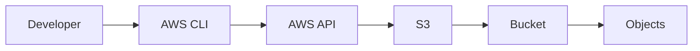
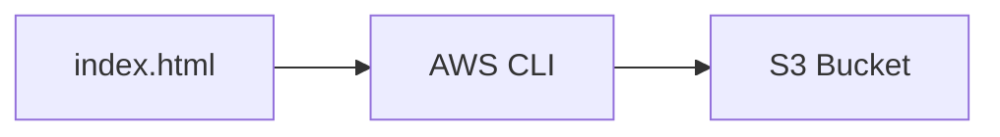
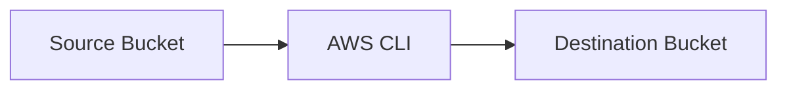
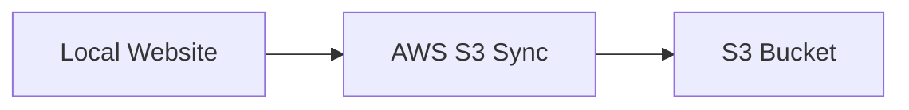
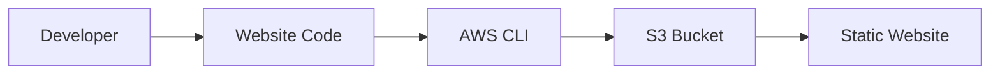
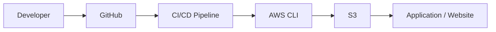
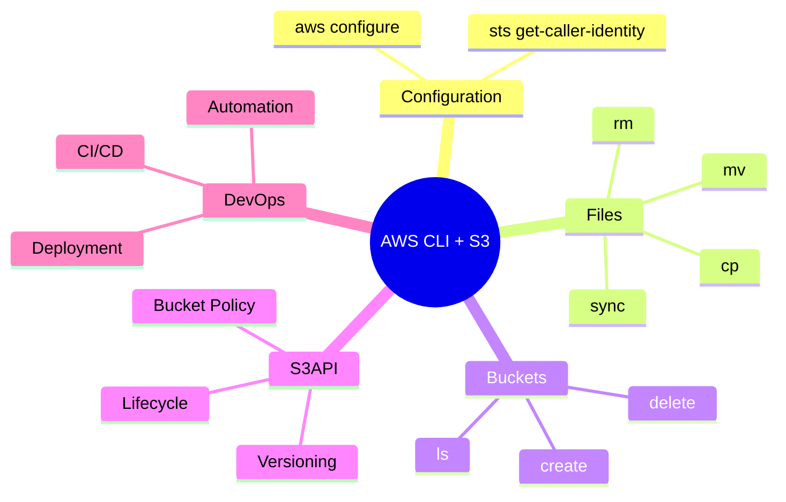

# AWS S3 – AWS CLI

## Introduction

AWS CLI (Command Line Interface) allows us to manage AWS services from the terminal.

With AWS CLI, we can:

* Create S3 buckets
* Upload files
* Download files
* Copy objects
* Move objects
* Delete objects
* List buckets and objects
* Synchronize folders
* Manage S3 configuration

---

# Basic Architecture

```text
Developer
    |
    v
Terminal / AWS CLI
    |
    v
AWS API
    |
    v
Amazon S3
    |
    v
Bucket → Objects
```

---

# AWS CLI + S3 Flow



---

# Prerequisites

Before using S3 commands:

```text
1. AWS CLI installed
2. AWS credentials configured
3. IAM permissions available
```

Check AWS CLI:

```bash
aws --version
```

---

# Configure AWS CLI

```bash
aws configure
```

Enter:

```text
AWS Access Key ID
AWS Secret Access Key
Default Region
Output Format
```

Example:

```text
Default region:
ap-south-1

Output format:
json
```

---

# Verify Identity

```bash
aws sts get-caller-identity
```

This shows the AWS account and identity being used by the CLI.

---

# List S3 Buckets

```bash
aws s3 ls
```

Architecture:

```text
AWS CLI
   |
   v
aws s3 ls
   |
   v
List S3 Buckets
```

---

# Create S3 Bucket

For a region such as `ap-south-1`:

```bash
aws s3api create-bucket \
--bucket my-devops-s3-bucket \
--region ap-south-1 \
--create-bucket-configuration LocationConstraint=ap-south-1
```

> Bucket names must be globally unique.

---

# Upload One File

```bash
aws s3 cp index.html s3://my-devops-s3-bucket/
```

Flow:



---

# Upload Folder

```bash
aws s3 cp ./website s3://my-devops-s3-bucket/ --recursive
```

Example:

```text
website/
├── index.html
├── style.css
└── script.js
```

becomes:

```text
S3 Bucket
├── index.html
├── style.css
└── script.js
```

---

# List Objects

```bash
aws s3 ls s3://my-devops-s3-bucket/
```

List a specific folder:

```bash
aws s3 ls s3://my-devops-s3-bucket/logs/
```

---

# Download File

```bash
aws s3 cp s3://my-devops-s3-bucket/index.html .
```

Flow:

```text
S3
 ↓
AWS CLI
 ↓
Local Machine
```

---

# Download Folder

```bash
aws s3 cp s3://my-devops-s3-bucket/website ./website --recursive
```

---

# Copy Object

Copy within S3:

```bash
aws s3 cp \
s3://my-devops-s3-bucket/file.txt \
s3://my-devops-s3-bucket/backup/file.txt
```

---

# Copy Between Buckets

```bash
aws s3 cp \
s3://source-bucket/file.txt \
s3://destination-bucket/file.txt
```

Architecture:



---

# Move Object

```bash
aws s3 mv \
s3://my-devops-s3-bucket/file.txt \
s3://my-devops-s3-bucket/archive/file.txt
```

---

# Delete Object

```bash
aws s3 rm s3://my-devops-s3-bucket/file.txt
```

---

# Delete Folder / Prefix

```bash
aws s3 rm s3://my-devops-s3-bucket/logs/ --recursive
```

Use carefully because this removes matching objects.

---

# Sync Local Folder to S3

```bash
aws s3 sync ./website s3://my-devops-s3-bucket
```

This is commonly used for website and deployment automation.

Architecture:



---

# Sync S3 to Local

```bash
aws s3 sync s3://my-devops-s3-bucket ./backup
```

---

# Sync Between S3 Buckets

```bash
aws s3 sync \
s3://source-bucket \
s3://destination-bucket
```

---

# `cp` vs `sync`

| Command | Purpose                            |
| ------- | ---------------------------------- |
| `cp`    | Copy specific files/folders        |
| `sync`  | Synchronize source and destination |

Example:

```bash
aws s3 cp file.txt s3://my-bucket/
```

```bash
aws s3 sync ./website s3://my-bucket/
```

---

# S3 API Commands

AWS CLI also provides low-level S3 API commands using:

```bash
aws s3api
```

Example:

```bash
aws s3api list-buckets
```

Get bucket location:

```bash
aws s3api get-bucket-location \
--bucket my-devops-s3-bucket
```

---

# S3 CLI vs S3API

```text
aws s3
   ↓
High-level S3 commands
   ↓
cp / mv / sync / ls / rm
```

```text
aws s3api
   ↓
Low-level API operations
   ↓
Detailed bucket/object configuration
```

---

# Check Bucket Versioning

```bash
aws s3api get-bucket-versioning \
--bucket my-devops-s3-bucket
```

Enable Versioning:

```bash
aws s3api put-bucket-versioning \
--bucket my-devops-s3-bucket \
--versioning-configuration Status=Enabled
```

---

# Check Lifecycle Configuration

```bash
aws s3api get-bucket-lifecycle-configuration \
--bucket my-devops-s3-bucket
```

---

# Check Bucket Policy

```bash
aws s3api get-bucket-policy \
--bucket my-devops-s3-bucket
```

---

# Delete Bucket

Bucket must generally be empty before deletion:

```bash
aws s3 rb s3://my-devops-s3-bucket
```

Force delete objects and bucket:

```bash
aws s3 rb s3://my-devops-s3-bucket --force
```

Use `--force` carefully.

---

# Practical Website Deployment

Suppose the project contains:

```text
website/
├── index.html
├── style.css
├── script.js
└── images/
```

Deploy:

```bash
aws s3 sync ./website s3://my-devops-s3-bucket
```

Architecture:



---

# CI/CD Use Case

AWS CLI can be used inside CI/CD pipelines.



Example deployment command:

```bash
aws s3 sync ./build s3://my-devops-s3-bucket
```

This is a common DevOps automation pattern.

---

# AWS CLI with IAM Role

In CI/CD environments, prefer temporary credentials through an IAM role or the CI/CD platform's supported identity mechanism instead of storing long-term AWS access keys.

```text
CI/CD
   |
   v
IAM Role / Temporary Credentials
   |
   v
AWS CLI
   |
   v
S3
```

---

# Common Errors

## AccessDenied

Check:

```text
IAM permissions
Bucket Policy
Object permissions
Bucket name
AWS credentials
```

---

## NoSuchBucket

Check:

```text
Bucket name
AWS account
AWS region
```

---

## Unable to Locate Credentials

Run:

```bash
aws configure
```

Or verify that the environment/role supplying credentials is correctly configured.

---

## Wrong Region

Check:

```bash
aws s3api get-bucket-location \
--bucket my-devops-s3-bucket
```

---

# Useful Commands – Quick Reference

```bash
# Check CLI
aws --version

# Configure
aws configure

# Check identity
aws sts get-caller-identity

# List buckets
aws s3 ls

# List objects
aws s3 ls s3://my-bucket/

# Upload
aws s3 cp file.txt s3://my-bucket/

# Download
aws s3 cp s3://my-bucket/file.txt .

# Upload folder
aws s3 cp ./folder s3://my-bucket/ --recursive

# Sync
aws s3 sync ./folder s3://my-bucket/

# Delete object
aws s3 rm s3://my-bucket/file.txt

# Delete bucket
aws s3 rb s3://my-bucket
```

---

# Important Interview Questions

## 1. What is AWS CLI?

AWS CLI is a command-line tool used to interact with AWS services.

---

## 2. How do you configure AWS CLI?

```bash
aws configure
```

---

## 3. How do you verify the configured AWS identity?

```bash
aws sts get-caller-identity
```

---

## 4. How do you upload a file to S3?

```bash
aws s3 cp file.txt s3://my-bucket/
```

---

## 5. How do you upload an entire folder?

```bash
aws s3 cp ./folder s3://my-bucket/ --recursive
```

---

## 6. Difference between `cp` and `sync`?

`cp` copies specified files or folders.

`sync` synchronizes files between two locations based on differences.

---

## 7. How do you delete an S3 object?

```bash
aws s3 rm s3://my-bucket/file.txt
```

---

## 8. How do you list S3 buckets?

```bash
aws s3 ls
```

---

## 9. How do you list objects inside a bucket?

```bash
aws s3 ls s3://my-bucket/
```

---

## 10. What is `aws s3api`?

`aws s3api` provides lower-level S3 API operations for detailed bucket and object configuration.

---

## 11. How is AWS CLI useful in DevOps?

It can automate AWS operations and is commonly used in scripts and CI/CD pipelines.

---

# Quick Revision



---

# Practical Outcome

After completing this topic, I should be able to:

* Configure AWS CLI.
* Verify AWS identity.
* Manage S3 buckets from the terminal.
* Upload and download objects.
* Use `cp`, `mv`, `rm`, and `sync`.
* Use `aws s3api` for advanced operations.
* Deploy static website files using CLI.
* Use S3 commands in CI/CD pipelines.
* Troubleshoot common S3 CLI errors.

---

# Key Takeaway

```text
Developer
   ↓
AWS CLI
   ↓
AWS API
   ↓
S3
   ↓
Bucket
   ↓
Objects
```

> **AWS CLI allows S3 operations to be automated from the command line, making it especially useful for scripting, deployments, and DevOps CI/CD workflows.**
