# AWS S3 – Bucket Creation and Configuration

## Introduction

An S3 bucket is a container used to store objects in Amazon S3.

Before uploading files to S3, we need to create a bucket and configure important settings such as:

* AWS Region
* Object Ownership
* Block Public Access
* Bucket Versioning
* Tags
* Default Encryption
* Bucket configuration

This file covers the complete practical process of creating and configuring an S3 bucket using the AWS Console and AWS CLI.

---

# S3 Bucket Creation Architecture

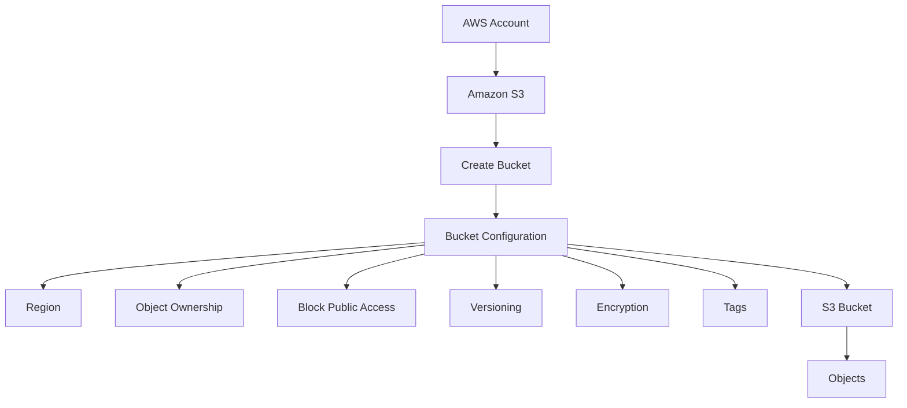

---

# Prerequisites

Before creating the bucket, make sure:

* AWS account is available.
* You have permission to create S3 buckets.
* You know the required AWS Region.
* AWS CLI is configured if using CLI.

For CLI:

```bash
aws configure
```

Enter:

```text
AWS Access Key ID
AWS Secret Access Key
Default region
Output format
```

For AWS workloads such as EC2, prefer **IAM Roles** instead of storing long-term access keys.

---

# Step 1 – Open Amazon S3

Login to the AWS Management Console.

Go to:

```text
AWS Console
→ S3
→ General purpose buckets
→ Create bucket
```

---

# Step 2 – Choose AWS Region

Select the Region where the bucket should be created.

Example:

```text
ap-south-1
Mumbai
```

Architecture:

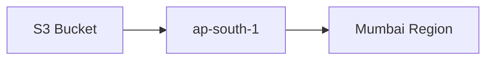

### Region Selection Factors

Choose the Region based on:

* Application location
* User location
* Latency
* Compliance
* Data residency
* Cost
* Existing AWS architecture

For an application mainly serving users in India, `ap-south-1` can be considered.

---

# Step 3 – Enter Bucket Name

Provide a globally unique bucket name.

Example:

```text
bindhusree-devops-s3-practice-2026
```

### Bucket Naming Rules

Bucket names should:

* Be globally unique.
* Use lowercase letters.
* Use numbers when required.
* Use hyphens for separation.
* Avoid spaces.
* Follow S3 bucket naming requirements.

Example:

```text
my-company-backup-2026
```

Avoid:

```text
My Company Backup
```

---

# Bucket Name Architecture

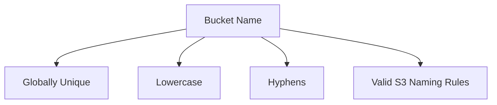

---

# Step 4 – Object Ownership

Object Ownership controls ownership of objects uploaded to the bucket.

The recommended modern configuration for most use cases is:

**Bucket owner enforced**

This disables ACLs and makes the bucket owner automatically own objects in the bucket.

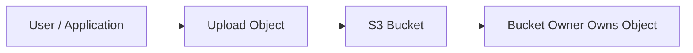

### Why is this useful?

It simplifies access management by using IAM and bucket policies instead of managing object ACLs.

---

# Step 5 – Block Public Access

S3 provides **Block Public Access** settings to help prevent accidental public exposure.

For a normal private bucket:

**Keep all Block Public Access settings enabled.**

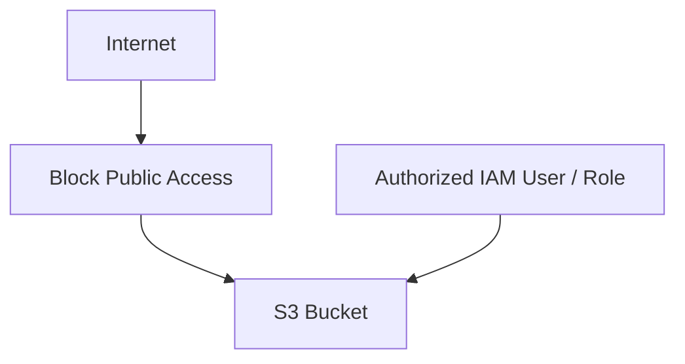

The goal is to prevent accidental public access.

### Important

Do not disable Block Public Access simply because a tutorial says to make the bucket public.

Only configure public access when the architecture specifically requires it.

---

# Public vs Private Bucket

## Private Bucket

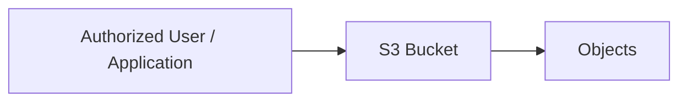

## Public Bucket

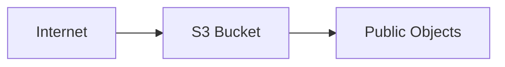

For production workloads, keep S3 private whenever possible.

---

# Step 6 – Bucket Versioning

Versioning allows multiple versions of objects to be maintained.

Enable versioning when object recovery is required.

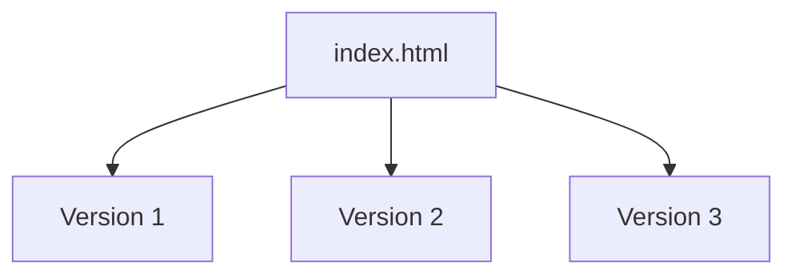

### Example

A user uploads:

```text
index.html
```

Later, the same file is uploaded again.

With versioning enabled:

```text
index.html
├── Version 1
├── Version 2
└── Version 3
```

This can help recover from accidental overwrites or deletions.

---

# Step 7 – Tags

Tags are key-value pairs used to organize and identify AWS resources.

Example:

```text
Environment = Dev
Project     = AWS-DevOps
Owner       = Bindhusree
Purpose     = Learning
```

Architecture:

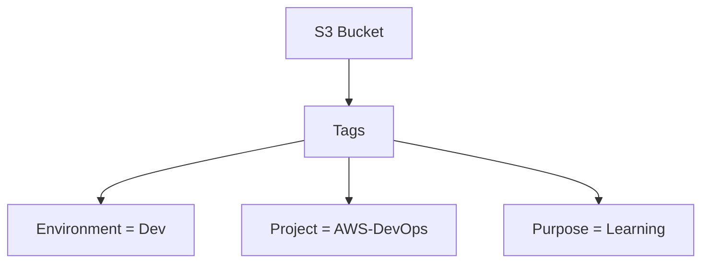

Tags are useful for:

* Resource organization
* Cost allocation
* Automation
* Environment identification
* Resource management

---

# Step 8 – Default Encryption

S3 supports encryption of objects at rest.

Common server-side encryption options include:

* SSE-S3
* SSE-KMS

For many workloads, S3-managed encryption using **SSE-S3** is sufficient.

For workloads requiring centralized key management and additional control, **SSE-KMS** can be used.

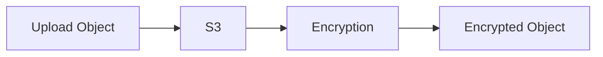

---

# SSE-S3

With SSE-S3:

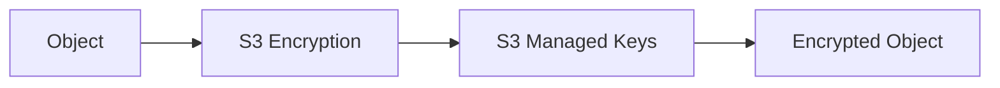

AWS manages the encryption keys used by the service.

---

# SSE-KMS

With SSE-KMS:

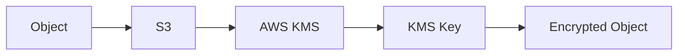

SSE-KMS provides additional key management and control through AWS KMS.

---

# Step 9 – Create the Bucket

After configuring the required settings:

```text
Review Configuration
        ↓
Create Bucket
```

The bucket is now available in the selected AWS Region.

---

# Complete Bucket Creation Flow

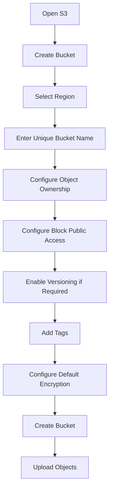

---

# Step 10 – Upload an Object

Open the created bucket.

Go to:

```text
Bucket
→ Upload
→ Add files
→ Select File
→ Upload
```

Example:

```text
index.html
```

Architecture:

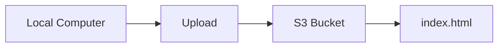

---

# Step 11 – Verify the Object

Open:

```text
S3
→ Bucket
→ Objects
```

Verify:

```text
index.html
```

is present.

---

# AWS CLI – Create Bucket

A bucket can also be created using AWS CLI.

For `ap-south-1`:

```bash
aws s3 mb s3://bindhusree-devops-s3-practice-2026 --region ap-south-1
```

Expected result:

```text
make_bucket: bindhusree-devops-s3-practice-2026
```

---

# AWS CLI – List Buckets

```bash
aws s3 ls
```

This displays buckets accessible to the configured AWS identity.

---

# AWS CLI – Verify Bucket

```bash
aws s3 ls s3://bindhusree-devops-s3-practice-2026
```

If the bucket is empty, no objects will be listed.

---

# AWS CLI – Upload Object

```bash
aws s3 cp index.html s3://bindhusree-devops-s3-practice-2026/
```

Verify:

```bash
aws s3 ls s3://bindhusree-devops-s3-practice-2026/
```

---

# AWS CLI – Upload Directory

```bash
aws s3 cp ./website s3://bindhusree-devops-s3-practice-2026/ --recursive
```

Architecture:

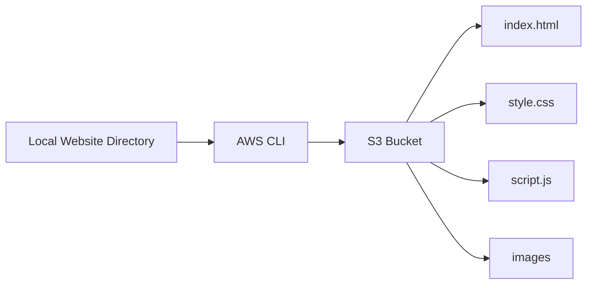

---

# AWS CLI – Sync Directory

`sync` is useful for synchronizing a local directory with an S3 location.

```bash
aws s3 sync ./website s3://bindhusree-devops-s3-practice-2026/
```

Example:

```text
Local Website
      ↓
   AWS CLI
      ↓
S3 Bucket
```

---

# AWS CLI – Delete Object

```bash
aws s3 rm s3://bindhusree-devops-s3-practice-2026/index.html
```

---

# AWS CLI – Delete Bucket

The bucket must be empty before deleting it.

```bash
aws s3 rb s3://bindhusree-devops-s3-practice-2026
```

For a bucket containing objects:

```bash
aws s3 rb s3://bindhusree-devops-s3-practice-2026 --force
```

### Important

Do not use `--force` on production buckets without understanding its impact because it can delete objects before removing the bucket.

---

# Verify Bucket Configuration

AWS CLI can be used to check important configurations.

## Check Region

```bash
aws s3api get-bucket-location \
--bucket bindhusree-devops-s3-practice-2026
```

---

## Check Versioning

```bash
aws s3api get-bucket-versioning \
--bucket bindhusree-devops-s3-practice-2026
```

Example output:

```json
{
    "Status": "Enabled"
}
```

---

## Check Encryption

```bash
aws s3api get-bucket-encryption \
--bucket bindhusree-devops-s3-practice-2026
```

---

## Check Tags

```bash
aws s3api get-bucket-tagging \
--bucket bindhusree-devops-s3-practice-2026
```

---

# Bucket Configuration Overview

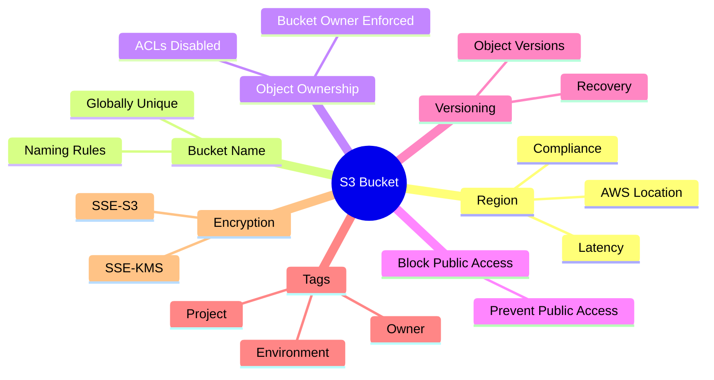

---

# Private S3 Bucket Architecture

A typical secure bucket architecture:

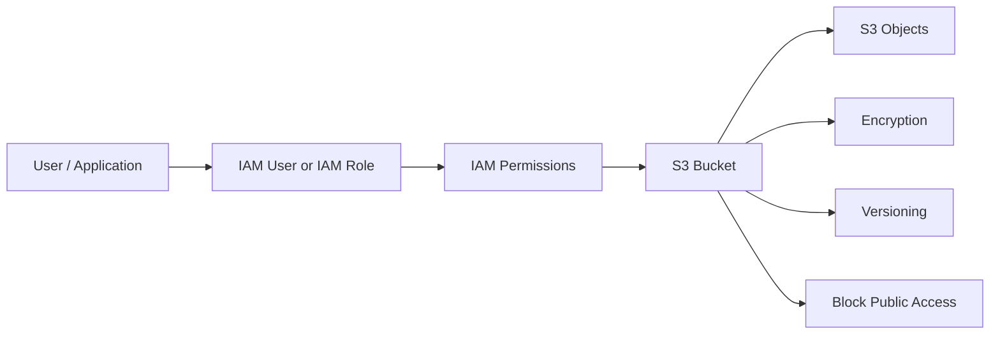

---

# Production-Oriented S3 Architecture

For a real application:

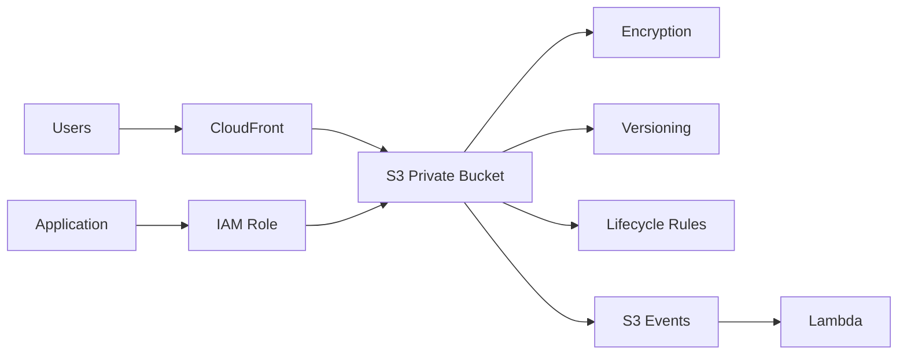

### Flow

1. Users access content through CloudFront.
2. S3 stores application objects.
3. Applications access S3 using IAM Roles.
4. Objects are encrypted.
5. Versioning protects against accidental changes.
6. Lifecycle rules manage old objects.
7. S3 events can trigger Lambda.

---

# Practical Example

## Requirement

Create an S3 bucket for storing application backups.

### Configuration

```text
Bucket Name:
company-application-backup-2026

Region:
ap-south-1

Object Ownership:
Bucket owner enforced

Block Public Access:
Enabled

Versioning:
Enabled

Encryption:
SSE-S3

Environment:
Production
```

Architecture:

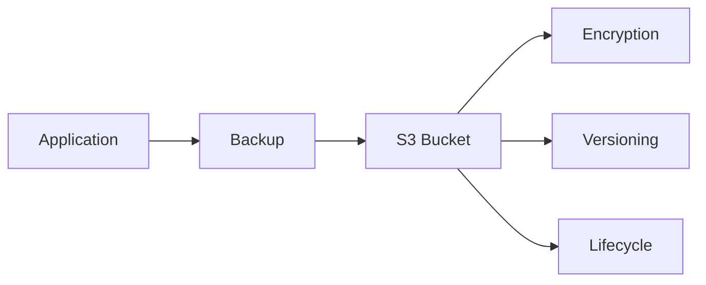

---

# Common Errors

## 1. BucketAlreadyExists

### Cause

The bucket name is already being used globally.

### Solution

Choose another unique bucket name.

```text
my-company-backup-2026
```

instead of:

```text
backup
```

---

# 2. AccessDenied

### Possible Causes

* IAM permission is missing.
* Bucket policy denies the action.
* Wrong AWS account is being used.
* Wrong IAM Role/User is being used.
* Organization/SCP restrictions may exist.

### Troubleshooting

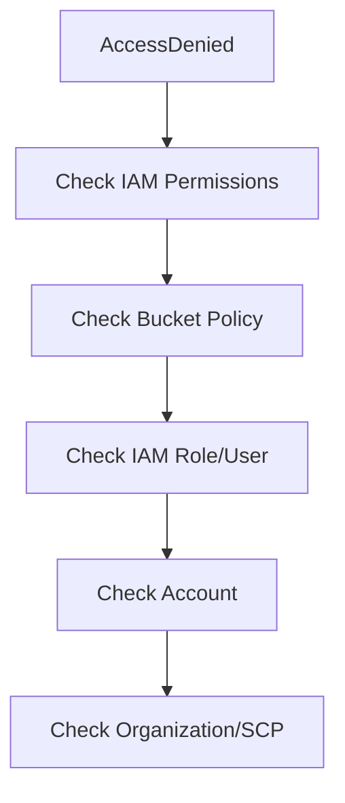

---

# 3. InvalidBucketName

### Cause

The bucket name does not follow S3 naming requirements.

### Solution

Use a valid lowercase bucket name.

Example:

```text
my-devops-project-2026
```

---

# 4. Bucket Not Found

### Check

* Bucket name
* AWS account
* AWS Region
* CLI configuration
* IAM permissions

---

# 5. Object Upload Failed

Check:

```text
IAM permissions
Bucket policy
Bucket name
Object path
AWS CLI configuration
Network connectivity
```

---

# Best Practices

### 1. Use Unique Bucket Names

```text
company-backup-2026
```

instead of generic names.

### 2. Keep Public Access Blocked

Keep S3 buckets private unless public access is specifically required.

### 3. Use IAM Roles

For EC2, Lambda, ECS and other AWS services, prefer IAM Roles.

### 4. Enable Encryption

Use SSE-S3 or SSE-KMS according to security requirements.

### 5. Enable Versioning

Use versioning for important business data.

### 6. Use Tags

Example:

```text
Environment = Dev
Project = DevOps
Owner = Team
```

### 7. Use Lifecycle Rules

Move old objects to cheaper storage classes or delete expired objects.

### 8. Follow Least Privilege

Give only the required permissions.

---

# Console vs CLI

| Method         | Use                                               |
| -------------- | ------------------------------------------------- |
| AWS Console    | Learning, manual configuration, visual management |
| AWS CLI        | Automation, scripting, DevOps workflows           |
| Terraform      | Infrastructure as Code                            |
| CloudFormation | AWS Infrastructure as Code                        |

### DevOps Perspective

Manual creation is useful for learning, but production environments should increasingly use **Infrastructure as Code**.

```mermaid
flowchart LR
    A[Developer] --> B[GitHub]
    B --> C[Terraform / CloudFormation]
    C --> D[AWS]
    D --> E[S3 Bucket]
```

---

# Important Interview Questions

## 1. How do you create an S3 bucket?

I can create an S3 bucket through the AWS Console or AWS CLI by selecting a Region, providing a globally unique bucket name, configuring security and encryption settings, and creating the bucket.

---

## 2. Why should an S3 bucket name be unique?

S3 bucket names must be globally unique within the S3 namespace.

---

## 3. What is Object Ownership?

Object Ownership controls ownership of objects uploaded to the bucket. **Bucket owner enforced** is the recommended configuration for many modern use cases and disables ACL-based access control.

---

## 4. What is Block Public Access?

Block Public Access is a set of S3 security controls designed to prevent buckets and objects from becoming publicly accessible.

---

## 5. Should Block Public Access always be enabled?

For private buckets, yes. It should only be relaxed when a specific architecture requires public access and the security implications are understood.

---

## 6. Why enable S3 Versioning?

Versioning helps maintain previous object versions and can protect against accidental deletion or overwriting.

---

## 7. What is SSE-S3?

SSE-S3 is server-side encryption where S3 manages the encryption keys.

---

## 8. What is SSE-KMS?

SSE-KMS uses AWS Key Management Service for encryption key management and provides additional control over keys and access.

---

## 9. How can you create an S3 bucket using AWS CLI?

```bash
aws s3 mb s3://my-unique-bucket-name --region ap-south-1
```

---

## 10. What is the difference between `aws s3 cp` and `aws s3 sync`?

`cp` copies files or directories between locations.

`sync` compares source and destination and transfers files needed to synchronize them.

---

## 11. How can you securely access S3 from EC2?

Attach an IAM Role to the EC2 instance and grant the required S3 permissions to that role.

---

## 12. Why are tags used on S3 buckets?

Tags help with resource organization, environment identification, cost allocation, automation, and management.

---

# Quick Revision

```mermaid
flowchart TD
    A[Create S3 Bucket] --> B[Choose Region]
    B --> C[Unique Bucket Name]
    C --> D[Object Ownership]
    D --> E[Block Public Access]
    E --> F[Versioning]
    F --> G[Tags]
    G --> H[Encryption]
    H --> I[Create Bucket]
    I --> J[Upload Objects]
```

---

# Practical Outcome

After completing this topic, I should be able to:

* Create an S3 bucket using AWS Console.
* Create an S3 bucket using AWS CLI.
* Select the appropriate Region.
* Understand S3 bucket naming rules.
* Configure Object Ownership.
* Configure Block Public Access.
* Enable Versioning.
* Add bucket tags.
* Configure default encryption.
* Upload objects using Console and CLI.
* Verify bucket configuration using AWS CLI.
* Troubleshoot common S3 bucket errors.
* Explain S3 security settings in interviews.
* Understand how S3 fits into a DevOps architecture.
* Understand why Infrastructure as Code is useful for S3 automation.

---

# Key Takeaway

```mermaid
mindmap
    root((S3 Bucket Creation))
        Region
        Unique Name
        Object Ownership
        Block Public Access
        Versioning
        Tags
        Encryption
        Objects
        CLI
        Security
        Best Practices
        DevOps Automation
```

* Architecture diagrams
* Interview questions
