# AWS S3 – Bucket Policy

## Introduction

An Amazon S3 Bucket Policy is a **resource-based JSON policy** attached directly to an S3 bucket.

It controls **who can access the bucket and what actions they can perform**.

Bucket policies are commonly used to:

* Allow or deny access to S3 buckets
* Allow specific AWS accounts to access a bucket
* Allow applications or AWS services to access objects
* Control object read/write permissions
* Restrict access using conditions
* Configure controlled public access when required
* Enforce security requirements

---

# Bucket Policy Architecture

```text
User / Application
        |
        v
    S3 Request
        |
        v
   Bucket Policy
        |
   +----+----+
   |         |
 Allow      Deny
   |         |
   v         v
Access     Access
Granted    Denied
```

---

# How Bucket Policy Works

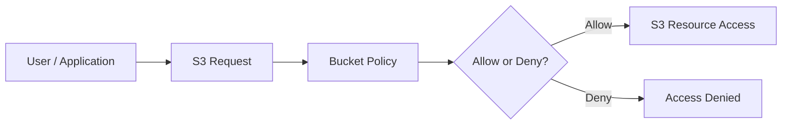

---

# Bucket Policy is Resource-Based

S3 Bucket Policy is a **resource-based policy**.

It is attached to:

```text
S3 Bucket
```

Example:

```text
my-bucket
    |
    └── Bucket Policy
```

Unlike an IAM identity policy, the policy is attached to the AWS resource itself.

---

# Basic Bucket Policy Structure

A bucket policy is written in JSON.

Basic structure:

```json
{
  "Version": "2012-10-17",
  "Statement": [
    {
      "Effect": "Allow",
      "Principal": "*",
      "Action": "s3:GetObject",
      "Resource": "arn:aws:s3:::my-bucket/*"
    }
  ]
}
```

---

# Important Bucket Policy Elements

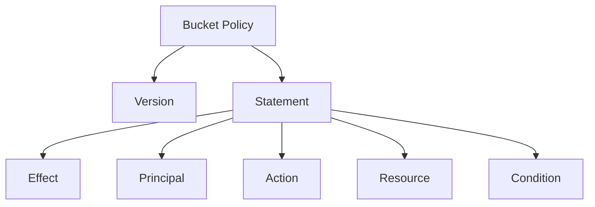

The main elements are:

```text
Version
Statement
Effect
Principal
Action
Resource
Condition
```

---

# 1. Version

Example:

```json
"Version": "2012-10-17"
```

This specifies the policy language version.

It does **not** mean the policy was created in 2012.

---

# 2. Statement

The `Statement` contains the actual permission rules.

Example:

```json
"Statement": [
  {
    "Effect": "Allow",
    "Principal": "*",
    "Action": "s3:GetObject",
    "Resource": "arn:aws:s3:::my-bucket/*"
  }
]
```

A policy can contain multiple statements.

---

# 3. Effect

The Effect determines whether the request is:

```text
Allow
```

or

```text
Deny
```

Example:

```json
"Effect": "Allow"
```

or:

```json
"Effect": "Deny"
```

---

# Allow

```json
{
  "Effect": "Allow",
  "Principal": "arn:aws:iam::123456789012:user/devuser",
  "Action": "s3:GetObject",
  "Resource": "arn:aws:s3:::my-bucket/*"
}
```

This allows the specified principal to read objects.

---

# Deny

```json
{
  "Effect": "Deny",
  "Principal": "*",
  "Action": "s3:DeleteObject",
  "Resource": "arn:aws:s3:::my-bucket/*"
}
```

This explicitly denies object deletion.

---

# Explicit Deny

An important AWS IAM principle:

```text
Explicit Deny
      ↓
Overrides Allow
```

Example:

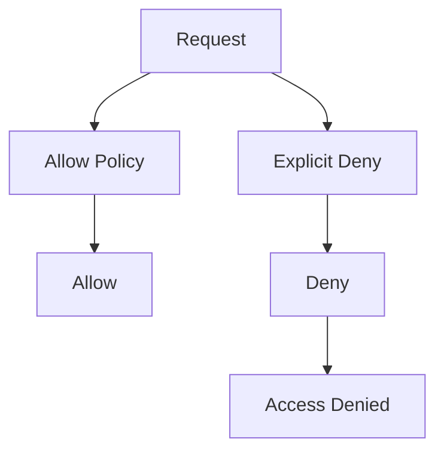

Even if another policy allows the action, an explicit deny can block it.

---

# 4. Principal

`Principal` specifies **who is allowed or denied**.

Examples:

```text
AWS Account
IAM User
IAM Role
AWS Service
Everyone
```

---

# Specific AWS Account

Example:

```json
"Principal": {
  "AWS": "arn:aws:iam::123456789012:root"
}
```

This can represent the specified AWS account as the principal.

---

# Specific IAM Role

```json
"Principal": {
  "AWS": "arn:aws:iam::123456789012:role/MyApplicationRole"
}
```

This allows the specified role to access the bucket when the other policy conditions also permit it.

---

# Everyone

```json
"Principal": "*"
```

This means any principal can match the statement, subject to the rest of the policy and AWS access controls.

Using `*` in an Allow statement can make a resource publicly accessible, so it must be used carefully.

---

# 5. Action

`Action` defines what operation is allowed or denied.

Common S3 actions:

```text
s3:ListBucket
s3:GetObject
s3:PutObject
s3:DeleteObject
s3:GetBucketLocation
```

---

# Common S3 Actions

| Action                 | Purpose                    |
| ---------------------- | -------------------------- |
| `s3:ListBucket`        | List objects in a bucket   |
| `s3:GetObject`         | Read/download an object    |
| `s3:PutObject`         | Upload an object           |
| `s3:DeleteObject`      | Delete an object           |
| `s3:GetBucketLocation` | Get bucket region/location |

---

# Bucket-Level vs Object-Level Actions

This is very important.

## Bucket-Level

```text
s3:ListBucket
```

Resource:

```text
arn:aws:s3:::my-bucket
```

## Object-Level

```text
s3:GetObject
s3:PutObject
s3:DeleteObject
```

Resource:

```text
arn:aws:s3:::my-bucket/*
```

Architecture:

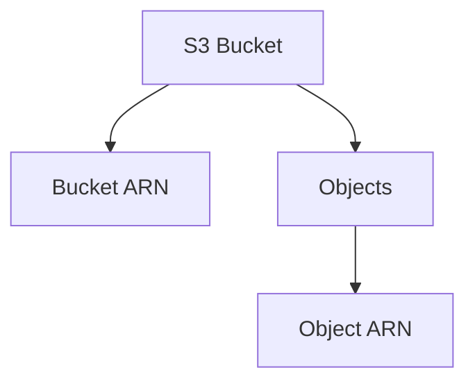

---

# Bucket ARN

```text
arn:aws:s3:::my-bucket
```

This refers to the bucket itself.

Used for actions such as:

```text
s3:ListBucket
```

---

# Object ARN

```text
arn:aws:s3:::my-bucket/*
```

This refers to objects inside the bucket.

Used for actions such as:

```text
s3:GetObject
s3:PutObject
s3:DeleteObject
```

---

# Important Difference

```text
Bucket:
arn:aws:s3:::my-bucket

Objects:
arn:aws:s3:::my-bucket/*
```

A common mistake is using the object ARN for `s3:ListBucket`.

---

# 6. Resource

`Resource` specifies **which S3 resource the policy applies to**.

Example bucket:

```json
"Resource": "arn:aws:s3:::my-bucket"
```

Example objects:

```json
"Resource": "arn:aws:s3:::my-bucket/*"
```

---

# 7. Condition

`Condition` allows access to be controlled based on additional requirements.

Examples:

```text
IP Address
HTTPS
Source VPC Endpoint
Object tags
Encryption
AWS account conditions
```

Architecture:

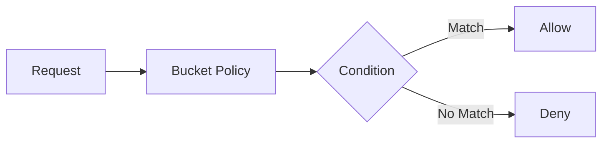

---

# Example: HTTPS Only

A bucket can be configured to deny requests that are not using secure transport.

```json
{
  "Version": "2012-10-17",
  "Statement": [
    {
      "Sid": "DenyInsecureTransport",
      "Effect": "Deny",
      "Principal": "*",
      "Action": "s3:*",
      "Resource": [
        "arn:aws:s3:::my-bucket",
        "arn:aws:s3:::my-bucket/*"
      ],
      "Condition": {
        "Bool": {
          "aws:SecureTransport": "false"
        }
      }
    }
  ]
}
```

Architecture:

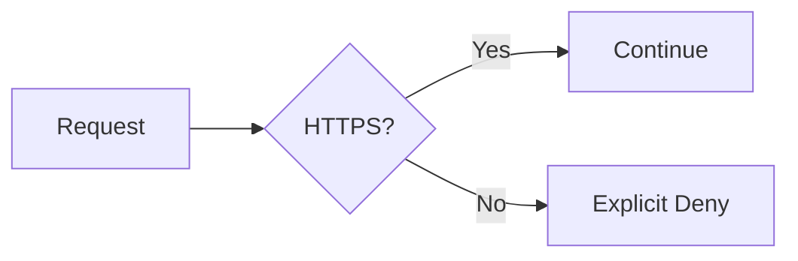

---

# Cross-Account Access

Bucket Policies are commonly used for cross-account S3 access.

Example:

```text
Account A
   |
   | Bucket Policy
   v
S3 Bucket in Account A
   ^
   |
Account B User / Role
```

Architecture:

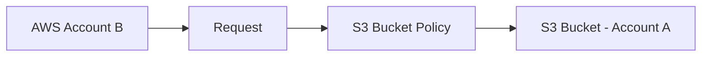

The permissions on both sides must be configured appropriately for the requested access.

---

# Cross-Account Read Example

Suppose:

```text
Account A
→ Owns S3 Bucket

Account B
→ Needs read access
```

Bucket policy in Account A can grant the required S3 permissions to a principal from Account B.

Example:

```json
{
  "Version": "2012-10-17",
  "Statement": [
    {
      "Sid": "AllowAccountBRead",
      "Effect": "Allow",
      "Principal": {
        "AWS": "arn:aws:iam::222222222222:root"
      },
      "Action": "s3:GetObject",
      "Resource": "arn:aws:s3:::my-bucket/*"
    }
  ]
}
```

For production environments, granting access to a specific role is generally preferable to broadly trusting an entire account when possible.

---

# Public Read Bucket Policy

A bucket policy can be used to grant public read access to objects.

Example:

```json
{
  "Version": "2012-10-17",
  "Statement": [
    {
      "Sid": "PublicRead",
      "Effect": "Allow",
      "Principal": "*",
      "Action": "s3:GetObject",
      "Resource": "arn:aws:s3:::my-public-bucket/*"
    }
  ]
}
```

This means:

```text
Anyone
   ↓
GetObject
   ↓
Objects in bucket
```

---

# Public Access Warning

Public bucket policies should be used only when public access is actually required.

Examples:

```text
Public static website
Public assets
Public downloadable files
```

Do not make private or sensitive data public.

---

# S3 Block Public Access

AWS provides **S3 Block Public Access** controls to help prevent unintended public exposure.

Architecture:

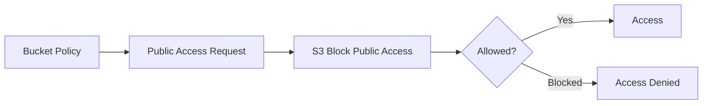

Block Public Access can override attempts to expose S3 resources publicly depending on the configured settings.

---

# Bucket Policy vs IAM Policy

This is an important interview topic.

| Feature              | IAM Policy           | S3 Bucket Policy                              |
| -------------------- | -------------------- | --------------------------------------------- |
| Type                 | Identity-based       | Resource-based                                |
| Attached to          | User / Group / Role  | S3 Bucket                                     |
| Controls             | Identity permissions | Resource access                               |
| Cross-account access | Possible             | Common use case                               |
| Principal field      | Not required         | Required in normal resource policy statements |

---

# IAM Policy + Bucket Policy

S3 access can involve both identity-based and resource-based policies.

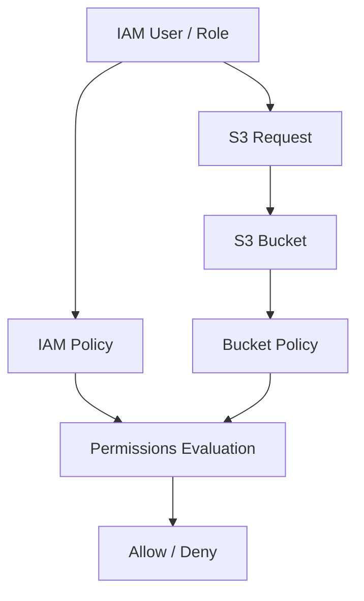

---

# Example

IAM policy:

```text
User
↓
s3:GetObject
↓
Allowed
```

Bucket policy:

```text
Bucket
↓
User
↓
s3:GetObject
↓
Allowed
```

Both policies can participate in the authorization decision.

---

# S3 Access Evaluation

A simplified view:

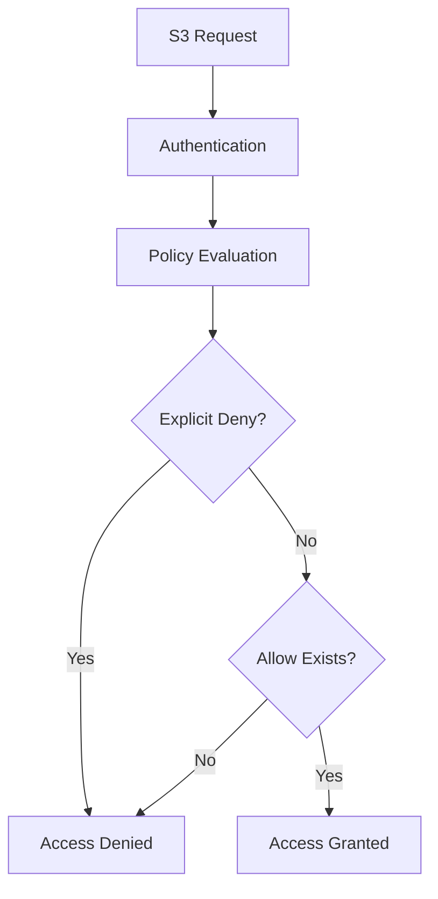

---

# Practical Scenario 1 – Allow Read Access

Requirement:

```text
User / Role
    ↓
Read objects
    ↓
S3 Bucket
```

Bucket policy:

```json
{
  "Version": "2012-10-17",
  "Statement": [
    {
      "Sid": "AllowRead",
      "Effect": "Allow",
      "Principal": {
        "AWS": "arn:aws:iam::123456789012:role/MyApplicationRole"
      },
      "Action": "s3:GetObject",
      "Resource": "arn:aws:s3:::my-bucket/*"
    }
  ]
}
```

---

# Practical Scenario 2 – Allow Upload

Requirement:

```text
Application
     |
     v
S3 Bucket
     |
     v
Upload objects
```

Policy:

```json
{
  "Version": "2012-10-17",
  "Statement": [
    {
      "Sid": "AllowUpload",
      "Effect": "Allow",
      "Principal": {
        "AWS": "arn:aws:iam::123456789012:role/MyApplicationRole"
      },
      "Action": "s3:PutObject",
      "Resource": "arn:aws:s3:::my-bucket/*"
    }
  ]
}
```

---

# Practical Scenario 3 – Read and Write

```json
{
  "Version": "2012-10-17",
  "Statement": [
    {
      "Sid": "AllowReadWrite",
      "Effect": "Allow",
      "Principal": {
        "AWS": "arn:aws:iam::123456789012:role/MyApplicationRole"
      },
      "Action": [
        "s3:GetObject",
        "s3:PutObject"
      ],
      "Resource": "arn:aws:s3:::my-bucket/*"
    }
  ]
}
```

---

# Practical Scenario 4 – Deny Delete

Requirement:

```text
Application
   ↓
Can Read
Can Upload
Cannot Delete
```

Example:

```json
{
  "Version": "2012-10-17",
  "Statement": [
    {
      "Sid": "DenyDelete",
      "Effect": "Deny",
      "Principal": "*",
      "Action": "s3:DeleteObject",
      "Resource": "arn:aws:s3:::my-bucket/*"
    }
  ]
}
```

Because this is an explicit Deny, it can override an Allow.

---

# Practical Scenario 5 – Restrict to Specific Prefix

Suppose:

```text
my-bucket/

public/
private/
```

We want a principal to access only:

```text
public/
```

Resource:

```text
arn:aws:s3:::my-bucket/public/*
```

Example:

```json
{
  "Version": "2012-10-17",
  "Statement": [
    {
      "Sid": "AllowPublicFolderRead",
      "Effect": "Allow",
      "Principal": {
        "AWS": "arn:aws:iam::123456789012:role/MyApplicationRole"
      },
      "Action": "s3:GetObject",
      "Resource": "arn:aws:s3:::my-bucket/public/*"
    }
  ]
}
```

---

# Prefix-Based Access Architecture

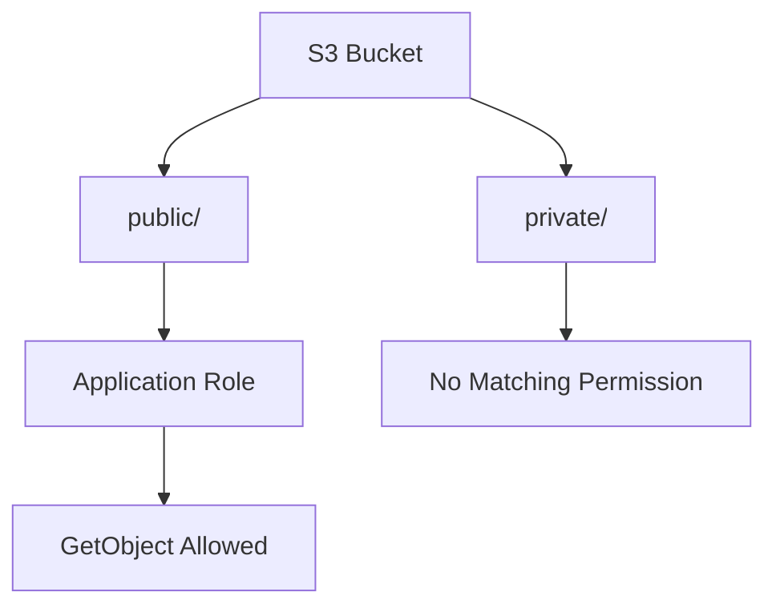

---

# Practical Scenario 6 – Deny Non-HTTPS Requests

```json
{
  "Version": "2012-10-17",
  "Statement": [
    {
      "Sid": "DenyHTTP",
      "Effect": "Deny",
      "Principal": "*",
      "Action": "s3:*",
      "Resource": [
        "arn:aws:s3:::my-bucket",
        "arn:aws:s3:::my-bucket/*"
      ],
      "Condition": {
        "Bool": {
          "aws:SecureTransport": "false"
        }
      }
    }
  ]
}
```

This provides an additional transport-security control.

---

# Create Bucket Policy Using AWS Console

Steps:

```text
S3
→ Select Bucket
→ Permissions
→ Bucket Policy
→ Edit
→ Paste JSON Policy
→ Save Changes
```

---

# Practical Implementation

## Step 1 – Create Bucket

Example:

```text
my-devops-s3-bucket
```

---

## Step 2 – Upload Test Object

```text
test.txt
```

---

## Step 3 – Open Bucket Policy

```text
S3
→ Bucket
→ Permissions
→ Bucket Policy
```

---

## Step 4 – Add Policy

Example read policy:

```json
{
  "Version": "2012-10-17",
  "Statement": [
    {
      "Sid": "AllowRead",
      "Effect": "Allow",
      "Principal": "*",
      "Action": "s3:GetObject",
      "Resource": "arn:aws:s3:::my-devops-s3-bucket/*"
    }
  ]
}
```

Use this only for a bucket where public read access is intentionally required, and ensure S3 Block Public Access settings allow the intended configuration.

---

# Test Object Access

Object URL format:

```text
https://BUCKET-NAME.s3.REGION.amazonaws.com/OBJECT-KEY
```

Example:

```text
https://my-devops-s3-bucket.s3.ap-south-1.amazonaws.com/test.txt
```

If the object is intentionally public and the account/bucket settings allow public access, the object can be accessed through its URL.

---

# Bucket Policy with AWS CLI

Bucket policies can also be applied using:

```bash
aws s3api put-bucket-policy \
--bucket my-devops-s3-bucket \
--policy file://bucket-policy.json
```

---

# Check Bucket Policy

```bash
aws s3api get-bucket-policy \
--bucket my-devops-s3-bucket
```

---

# Delete Bucket Policy

```bash
aws s3api delete-bucket-policy \
--bucket my-devops-s3-bucket
```

Use this carefully because it removes the bucket's resource policy.

---

# Complete Practical Flow

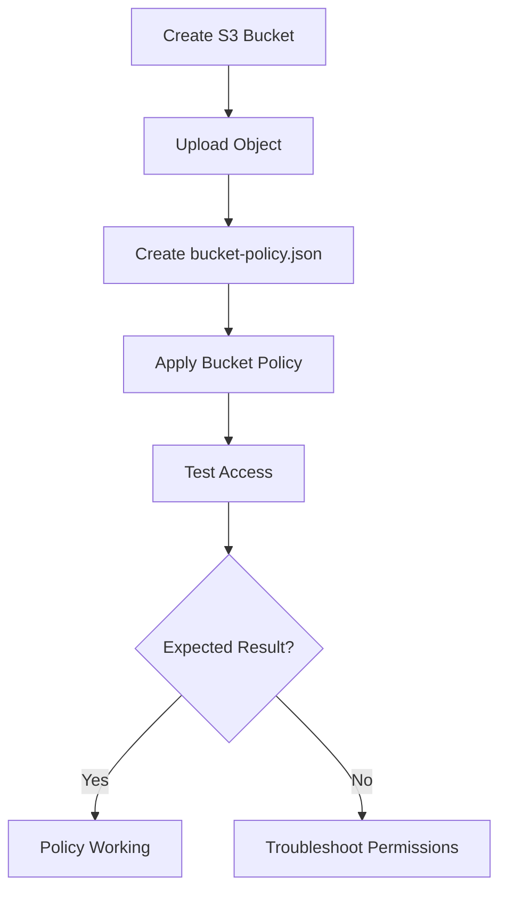

---

# Bucket Policy JSON – Complete Example

```json
{
  "Version": "2012-10-17",
  "Statement": [
    {
      "Sid": "AllowApplicationReadWrite",
      "Effect": "Allow",
      "Principal": {
        "AWS": "arn:aws:iam::123456789012:role/MyApplicationRole"
      },
      "Action": [
        "s3:GetObject",
        "s3:PutObject"
      ],
      "Resource": "arn:aws:s3:::my-bucket/*"
    },
    {
      "Sid": "DenyInsecureTransport",
      "Effect": "Deny",
      "Principal": "*",
      "Action": "s3:*",
      "Resource": [
        "arn:aws:s3:::my-bucket",
        "arn:aws:s3:::my-bucket/*"
      ],
      "Condition": {
        "Bool": {
          "aws:SecureTransport": "false"
        }
      }
    }
  ]
}
```

---

# DevOps Use Case

In a DevOps environment, an application may need access to S3 without giving the application full AWS permissions.

Example:

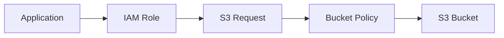

Example permissions:

```text
Application Role
├── GetObject
└── PutObject
```

No unnecessary permissions such as:

```text
DeleteBucket
ListAllMyBuckets
```

This follows the **principle of least privilege**.

---

# CI/CD Use Case

A CI/CD pipeline may deploy static website files to S3.

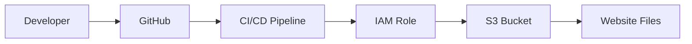

The role can be restricted to required actions:

```text
s3:ListBucket
s3:PutObject
s3:DeleteObject
```

The exact permissions depend on the deployment workflow.

---

# Static Website Use Case

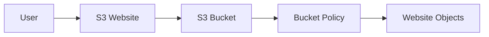

For a public website, public read access may be required, but the bucket should contain only content that is intentionally public.

---

# S3 Bucket Policy Security

A secure policy should follow:

```text
Least Privilege
      ↓
Specific Principal
      ↓
Specific Actions
      ↓
Specific Resources
      ↓
Conditions Where Required
```

Avoid unnecessarily broad policies.

---

# `*` vs Specific Principal

Broad:

```json
"Principal": "*"
```

Specific:

```json
"Principal": {
  "AWS": "arn:aws:iam::123456789012:role/MyApplicationRole"
}
```

For private application access, prefer the most specific principal that satisfies the requirement.

---

# `s3:*` vs Specific Actions

Broad:

```json
"Action": "s3:*"
```

Specific:

```json
"Action": [
  "s3:GetObject",
  "s3:PutObject"
]
```

Specific actions are preferred because they reduce unnecessary permissions.

---

# Resource Specificity

Broad:

```text
arn:aws:s3:::my-bucket/*
```

More restricted:

```text
arn:aws:s3:::my-bucket/uploads/*
```

The second option limits object access to the `uploads/` prefix.

---

# Common Mistakes

## 1. Wrong ARN

Incorrect for bucket-level action:

```text
arn:aws:s3:::my-bucket/*
```

For:

```text
s3:ListBucket
```

Use:

```text
arn:aws:s3:::my-bucket
```

---

## 2. Forgetting `/*`

For object actions such as:

```text
s3:GetObject
```

use:

```text
arn:aws:s3:::my-bucket/*
```

---

## 3. Using `Principal: "*"` Unnecessarily

This can expose data publicly.

Use a specific principal when public access is not required.

---

## 4. Ignoring Block Public Access

A public bucket policy may not produce public access if S3 Block Public Access settings prevent it.

---

## 5. Giving `s3:*`

Avoid granting all S3 actions when the application needs only a few operations.

---

## 6. Forgetting Explicit Deny

An explicit Deny can override an Allow.

Always check for Deny statements when troubleshooting.

---

# Troubleshooting AccessDenied

If you receive:

```text
AccessDenied
```

check:

```text
1. IAM permissions
2. Bucket Policy
3. Principal
4. Action
5. Resource ARN
6. S3 Block Public Access
7. Object ownership / ACL configuration
8. KMS permissions if SSE-KMS is involved
9. VPC endpoint policy if using an S3 VPC endpoint
10. Explicit Deny statements
```

---

# Troubleshooting Architecture

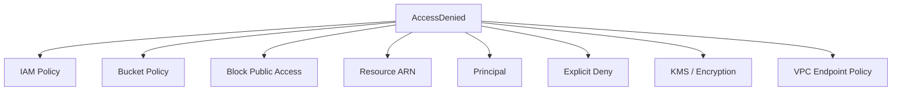

---

# Bucket Policy vs ACL

S3 Access Control Lists are an older access-control mechanism.

Modern S3 designs generally prefer:

```text
IAM Policies
+
Bucket Policies
+
S3 Block Public Access
+
Object Ownership
```

rather than relying heavily on ACLs.

---

# Bucket Policy vs S3 Access Point

A Bucket Policy controls access to the bucket.

An S3 Access Point provides a dedicated access endpoint with its own policy for a specific application or use case.

Example:

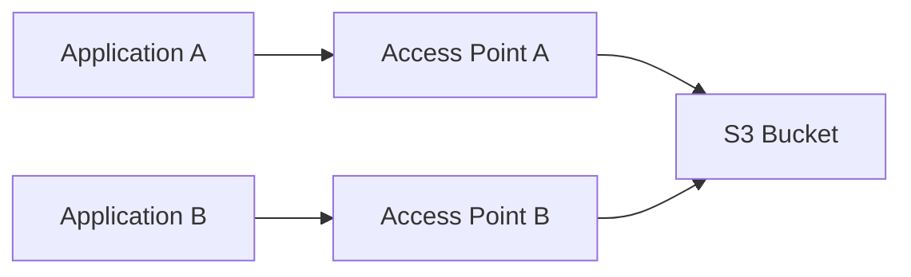

This can help manage access for different applications at scale.

---

# Best Practices

* Follow least privilege.
* Use specific principals.
* Use specific S3 actions.
* Use specific resource ARNs.
* Avoid unnecessary public access.
* Keep S3 Block Public Access enabled unless public access is intentionally required.
* Use HTTPS-only policies.
* Review explicit Deny statements.
* Use IAM Roles for applications instead of long-term access keys.
* Use conditions where additional restrictions are needed.
* Regularly review bucket policies.
* Avoid `s3:*` unless there is a strong reason.
* Avoid `Principal: "*"` for private data.
* Test policies before production use.

---

# Important Interview Questions

## 1. What is an S3 Bucket Policy?

An S3 Bucket Policy is a resource-based JSON policy attached to an S3 bucket to control access to the bucket and its objects.

---

## 2. Is a Bucket Policy identity-based or resource-based?

It is a **resource-based policy**.

---

## 3. What is the difference between IAM Policy and Bucket Policy?

IAM policies are identity-based policies attached to users, groups, or roles.

Bucket policies are resource-based policies attached directly to an S3 bucket.

---

## 4. What is Principal?

Principal specifies who the policy statement applies to.

Examples include:

```text
IAM Role
AWS Account
AWS Service
Everyone
```

---

## 5. What is Effect?

Effect specifies:

```text
Allow
```

or:

```text
Deny
```

---

## 6. What is an explicit Deny?

An explicit Deny directly blocks an action and can override an Allow.

---

## 7. What is the difference between bucket ARN and object ARN?

Bucket:

```text
arn:aws:s3:::my-bucket
```

Object:

```text
arn:aws:s3:::my-bucket/*
```

---

## 8. Which ARN is used for `s3:ListBucket`?

The bucket ARN:

```text
arn:aws:s3:::my-bucket
```

---

## 9. Which ARN is generally used for `s3:GetObject`?

The object ARN:

```text
arn:aws:s3:::my-bucket/*
```

---

## 10. What does `Principal: "*"` mean?

It means the statement can apply to any principal, subject to other access controls and policy conditions.

In an Allow statement, this can create public access.

---

## 11. Can Bucket Policies provide cross-account access?

Yes. Bucket policies are commonly used to grant controlled access to principals from another AWS account.

---

## 12. Can Bucket Policies restrict access by IP?

Yes, using policy conditions such as `aws:SourceIp` where appropriate.

---

## 13. Can we enforce HTTPS using a Bucket Policy?

Yes. A Deny statement using the `aws:SecureTransport` condition can deny non-TLS requests.

---

## 14. What is S3 Block Public Access?

It is a set of S3 controls designed to prevent unintended public access to buckets and objects.

---

## 15. Why should we avoid `s3:*`?

Because it grants broad S3 permissions. Least-privilege policies should allow only the required actions.

---

## 16. What should you check when S3 returns AccessDenied?

Check:

```text
IAM Policy
Bucket Policy
Principal
Action
Resource
Explicit Deny
Block Public Access
KMS Permissions
VPC Endpoint Policy
```

---

## 17. Can a bucket policy allow access to a specific folder?

Yes.

For example:

```text
arn:aws:s3:::my-bucket/uploads/*
```

can target objects under the `uploads/` prefix.

---

## 18. Why is Bucket Policy important in DevOps?

It allows applications, CI/CD pipelines, AWS services, and cross-account systems to access S3 with controlled permissions.

---

# Quick Revision

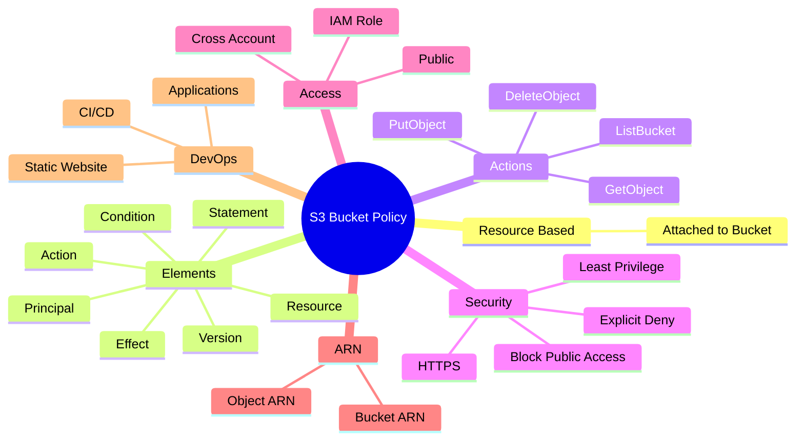

---

# Complete Bucket Policy Architecture

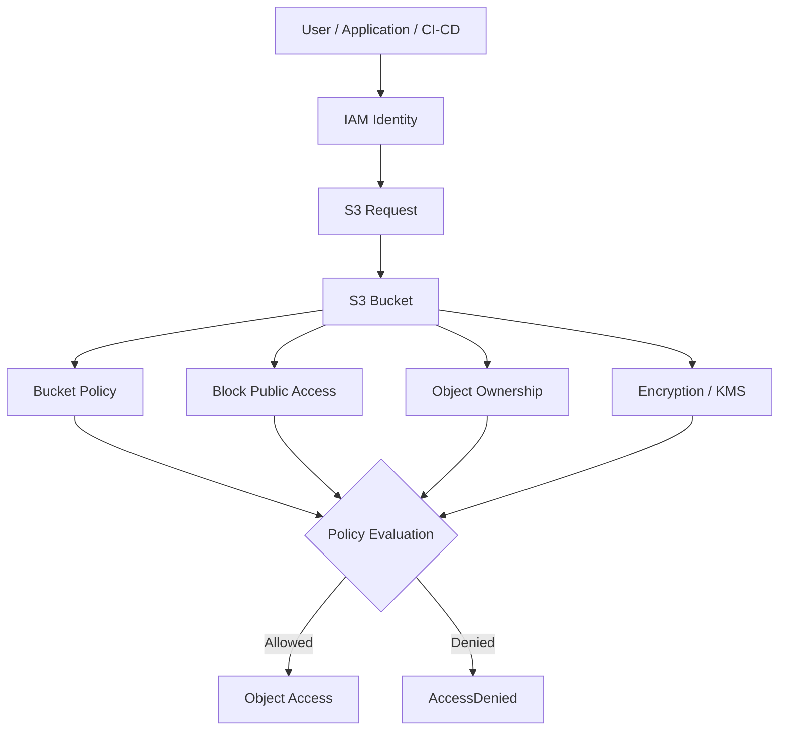


---

