# AWS S3 – Lifecycle Rules

## Introduction

Amazon S3 Lifecycle Rules are used to **automatically manage objects throughout their lifecycle**.

Lifecycle Rules can automatically:

* Transition objects to different storage classes
* Delete objects after a specific period
* Delete old object versions
* Delete expired delete markers
* Reduce storage costs
* Automate data retention

Instead of manually managing old objects, we can define rules and let S3 manage them automatically.

---

# S3 Lifecycle Architecture

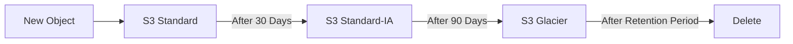

---

# Why Lifecycle Rules?

Suppose a company stores daily application backups.

Initially:

```text
Day 0
↓
Backup is frequently accessed
↓
S3 Standard
```

After some time:

```text
Day 30
↓
Backup is rarely accessed
↓
Standard-IA
```

Later:

```text
Day 90
↓
Backup becomes archive data
↓
Glacier
```

Finally:

```text
Retention period completed
↓
Delete
```

This can be automated using Lifecycle Rules.

---

# Lifecycle Rule Architecture

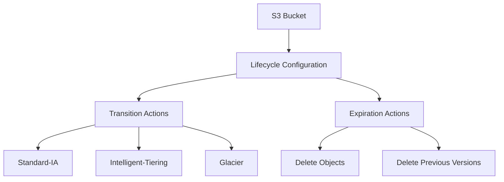

---

# Lifecycle Rule Components

A Lifecycle Rule mainly contains:

```text
Rule
├── Status
├── Filter
├── Transition
└── Expiration
```

Architecture:

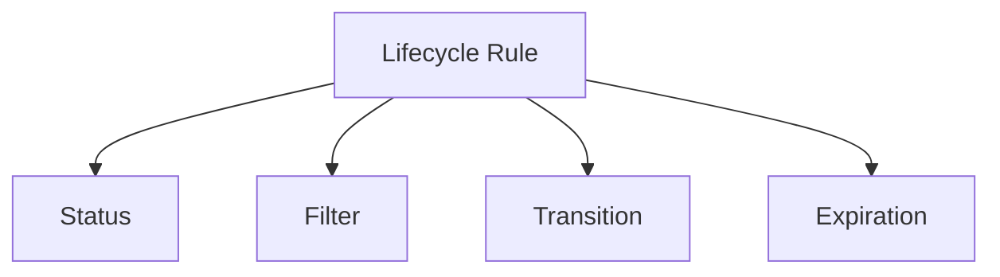

---

# 1. Rule Status

A Lifecycle Rule can be:

```text
Enabled
Disabled
```

When a rule is disabled, S3 does not perform the actions defined by that rule.

---

# 2. Lifecycle Filter

A filter determines **which objects the rule applies to**.

Objects can be filtered using:

* Prefix
* Object tags
* Object size conditions
* Combined filters

Example:

```text
logs/
```

The lifecycle rule can be applied only to objects under:

```text
logs/
```

---

# Prefix-Based Lifecycle Rule

Example bucket:

```text
my-bucket/

├── logs/
│   ├── app.log
│   └── error.log
│
├── images/
│   ├── logo.png
│   └── banner.jpg
│
└── backups/
    └── database.zip
```

Lifecycle rule:

```text
Prefix = logs/
```

The rule applies to:

```text
logs/app.log
logs/error.log
```

but not:

```text
images/logo.png
backups/database.zip
```

---

# Prefix Architecture

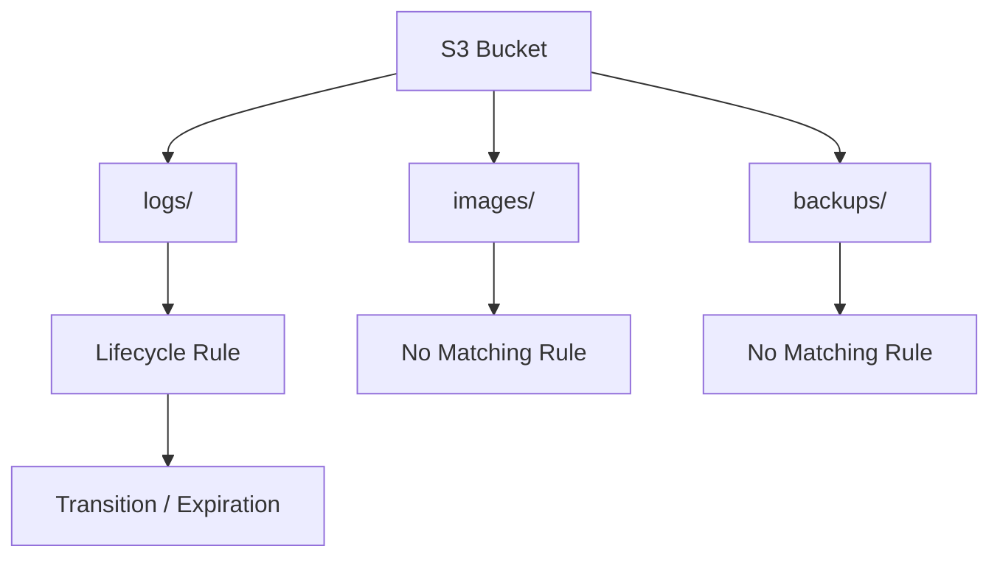

---

# Tag-Based Lifecycle Rule

Objects can also be filtered using tags.

Example:

```text
Environment = Dev
```

A lifecycle rule can target objects with:

```text
Environment=Dev
```

Architecture:

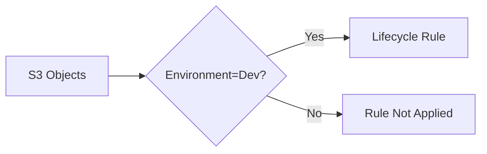

---

# 3. Transition Action

Transition means automatically moving an object from one storage class to another.

Example:

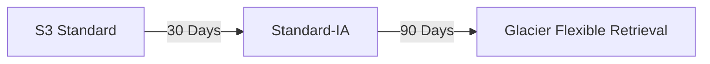

This helps optimize storage costs as objects become less frequently accessed.

---

# Common Transition Flow

```text
New Object
    ↓
S3 Standard
    ↓
Standard-IA
    ↓
Glacier
    ↓
Deep Archive
```

Architecture:

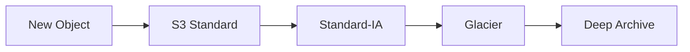

The actual transition schedule should be based on the application's access and retention requirements.

---

# 4. Expiration Action

Expiration automatically removes objects after a defined period.

Example:

```text
Object Created
      ↓
30 Days
      ↓
Delete
```

Architecture:

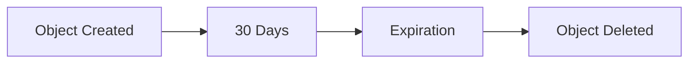

---

# Transition vs Expiration

| Feature        | Transition           | Expiration                |
| -------------- | -------------------- | ------------------------- |
| Purpose        | Change storage class | Remove object             |
| Example        | Standard → Glacier   | Delete after 365 days     |
| Data retained? | Yes                  | No                        |
| Main Benefit   | Cost optimization    | Data retention management |

---

# Lifecycle Rule Example

Suppose:

```text
Application logs
```

Requirements:

```text
0–30 days   → S3 Standard
31–90 days  → Standard-IA
91+ days    → Glacier
365 days    → Delete
```

Architecture:

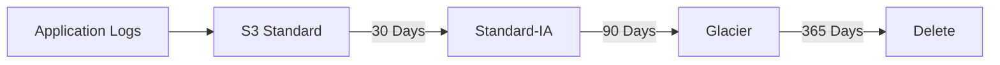

---

# Lifecycle Rules with Object Prefix

Suppose the bucket contains:

```text
my-bucket/

logs/
backups/
images/
```

We can create separate lifecycle rules:

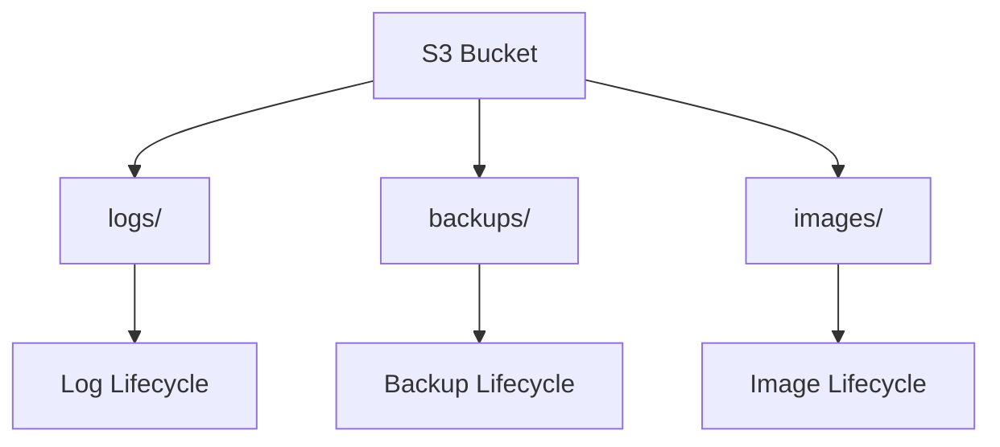

Example:

```text
logs/
→ Delete after 30 days

backups/
→ Glacier after 90 days

images/
→ Keep in Standard
```

---

# Lifecycle Rules with Tags

Example object tags:

```text
Type=Temporary
```

Lifecycle rule:

```text
Type=Temporary
→ Delete after 7 days
```

Architecture:

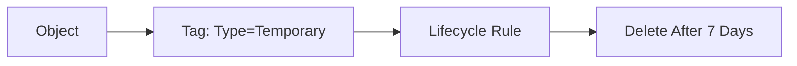

---

# Lifecycle Rules and Versioning

When Versioning is enabled, lifecycle rules can also manage **noncurrent object versions**.

Example:

```text
Current Version
       ↓
Old Version
       ↓
Noncurrent Version
       ↓
Lifecycle Rule
       ↓
Delete / Transition
```

Architecture:

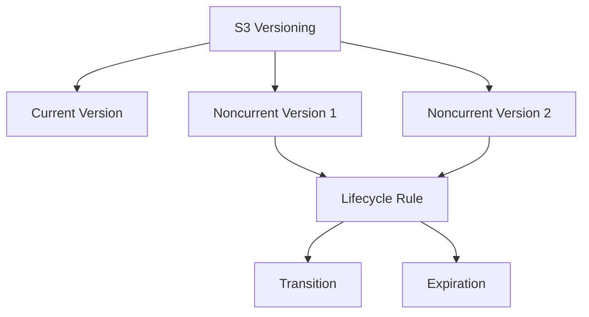

---

# Why Noncurrent Version Management Is Important

Suppose a 100 MB file is uploaded 20 times.

```text
Version 1 → 100 MB
Version 2 → 100 MB
Version 3 → 100 MB
...
Version 20 → 100 MB
```

Multiple versions can consume significant storage.

Lifecycle rules can automatically manage old versions.

---

# Noncurrent Version Expiration

Example:

```text
Current Version
↓
Previous Version
↓
After 30 Days
↓
Delete Noncurrent Version
```

This helps reduce unnecessary storage consumption.

---

# Delete Marker Management

Versioned buckets can contain delete markers.

Lifecycle configuration can be used to clean up expired delete markers where appropriate.

Architecture:

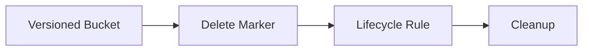

---

# Lifecycle Rule Practical Example

## Requirement

Create a rule for application logs:

```text
logs/
```

Requirements:

```text
After 30 days
→ Standard-IA

After 90 days
→ Glacier Flexible Retrieval

After 365 days
→ Delete
```

Architecture:

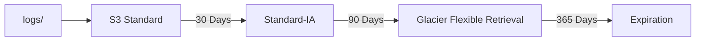

---

# Create Lifecycle Rule Using AWS Console

Steps:

```text
S3
→ Select Bucket
→ Management
→ Lifecycle Rules
→ Create lifecycle rule
```

Then:

```text
1. Enter Rule Name
2. Select Filter
3. Choose Prefix or Tags
4. Select Transition Actions
5. Configure Expiration
6. Review
7. Create Rule
```

---

# Example Console Configuration

```text
Rule Name:
application-logs-lifecycle

Filter:
Prefix = logs/

Transitions:
30 days → Standard-IA
90 days → Glacier Flexible Retrieval

Expiration:
365 days → Delete
```

---

# Lifecycle Configuration Using AWS CLI

Lifecycle configurations can be applied using:

```bash
aws s3api put-bucket-lifecycle-configuration
```

Example:

```bash
aws s3api put-bucket-lifecycle-configuration \
--bucket my-bucket \
--lifecycle-configuration file://lifecycle.json
```

---

# Lifecycle JSON Example

Create:

```text
lifecycle.json
```

Example:

```json
{
  "Rules": [
    {
      "ID": "logs-lifecycle",
      "Status": "Enabled",
      "Filter": {
        "Prefix": "logs/"
      },
      "Transitions": [
        {
          "Days": 30,
          "StorageClass": "STANDARD_IA"
        },
        {
          "Days": 90,
          "StorageClass": "GLACIER"
        }
      ],
      "Expiration": {
        "Days": 365
      }
    }
  ]
}
```

Apply it:

```bash
aws s3api put-bucket-lifecycle-configuration \
--bucket my-bucket \
--lifecycle-configuration file://lifecycle.json
```

---

# Check Lifecycle Configuration

```bash
aws s3api get-bucket-lifecycle-configuration \
--bucket my-bucket
```

---

# Delete Lifecycle Configuration

```bash
aws s3api delete-bucket-lifecycle \
--bucket my-bucket
```

Use this carefully because it removes the bucket's lifecycle configuration.

---

# Practical CLI Flow

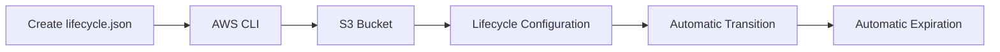

---

# Real-World DevOps Use Case

A DevOps team stores:

```text
Application Logs
Build Artifacts
Backups
Reports
```

A lifecycle strategy can be:

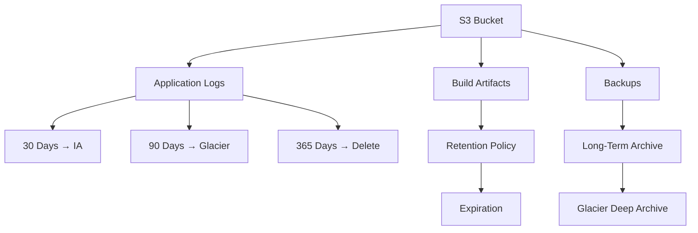

This reduces manual operations and helps control storage costs.

---

# CI/CD Artifact Example

Suppose a CI/CD pipeline uploads build artifacts:

```text
build/
├── app-v1.zip
├── app-v2.zip
├── app-v3.zip
```

Older artifacts may not be needed forever.

Lifecycle:

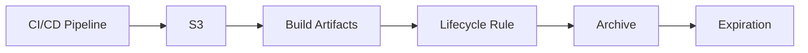

This prevents unlimited accumulation of old artifacts.

---

# Backup Lifecycle Example

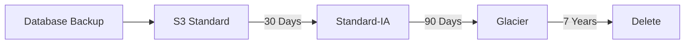

The exact retention period should be based on business and compliance requirements.

---

# Lifecycle Rules and Cost Optimization

Without Lifecycle Rules:

```text
New Data
   ↓
S3 Standard
   ↓
Old Data
   ↓
Still S3 Standard
   ↓
Increasing Cost
```

With Lifecycle Rules:

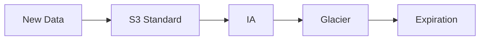

This allows storage class selection to change automatically as data ages.

---

# Important: Lifecycle Transition Is Not Instant

Lifecycle actions are performed by S3 according to the lifecycle configuration.

Do not design a system assuming an exact second or minute of transition.

Lifecycle rules are intended for automated object management rather than precise real-time scheduling.

---

# Important: Lifecycle Rules Are Object-Based

Lifecycle rules operate on objects matching the configured filters.

For example:

```text
Prefix = logs/
```

means the rule targets objects whose keys begin with:

```text
logs/
```

---

# Important: Multiple Lifecycle Rules

A bucket can have multiple lifecycle rules for different object groups.

Example:

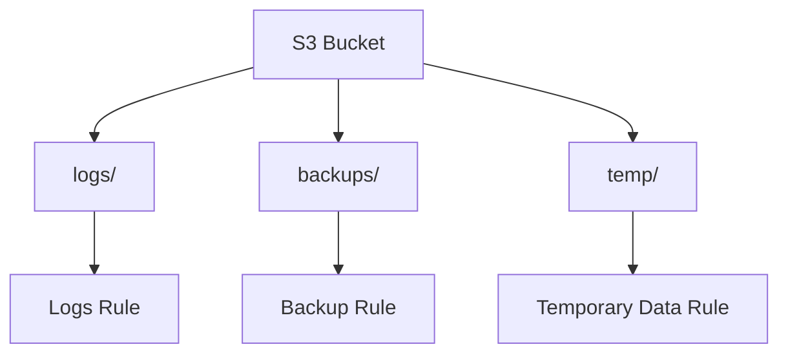

This allows different retention strategies for different types of data.

---

# Lifecycle Rule Design Example

| Object Type     | Filter     | Transition   | Expiration           |
| --------------- | ---------- | ------------ | -------------------- |
| Logs            | `logs/`    | IA → Glacier | 365 days             |
| Backups         | `backups/` | IA → Glacier | Business requirement |
| Temporary files | `temp/`    | None         | 7 days               |
| Build artifacts | `build/`   | Optional     | Retention policy     |

---

# Common Mistakes

## 1. Applying One Rule to Everything

Different data types may have different retention requirements.

Better:

```text
logs/
backups/
build/
temp/
```

Use separate rules where required.

---

## 2. Ignoring Retrieval Costs

Moving everything to an archive class can reduce storage cost but may increase retrieval costs when data is frequently accessed.

---

## 3. Ignoring Minimum Storage Duration

Some storage classes have minimum storage duration considerations.

Lifecycle transitions should account for these requirements.

---

## 4. Deleting Data Too Early

Expiration rules permanently remove objects according to the configured lifecycle behavior.

Always verify retention requirements before creating expiration rules.

---

## 5. Ignoring Noncurrent Versions

Versioned buckets can accumulate old versions.

Configure appropriate noncurrent version lifecycle management when required.

---

## 6. Assuming Lifecycle Rules Are a Backup

Lifecycle Rules automate storage management.

They are **not a replacement for a complete backup or disaster recovery strategy**.

---

# Troubleshooting

## Lifecycle Rule Is Not Applying

Check:

```text
Bucket name
Rule status
Prefix
Object tags
Object age
Storage class
Lifecycle configuration
```

---

## Wrong Objects Are Being Transitioned

Check the rule filter.

Example:

```text
Prefix = logs/
```

Only matching object keys should be targeted.

---

## Old Versions Are Still Consuming Storage

If Versioning is enabled, check whether the lifecycle configuration manages:

```text
Noncurrent versions
Delete markers
```

---

## Objects Are Deleted Earlier Than Expected

Check:

```text
Expiration days
Object creation date
Rule filters
Retention requirements
```

Never configure expiration without understanding the required data retention period.

---

# Best Practices

* Use Lifecycle Rules to automate object management.
* Design rules based on real access patterns.
* Use prefixes or tags to target specific objects.
* Use transitions to optimize storage costs.
* Use expiration for temporary data.
* Manage noncurrent versions when Versioning is enabled.
* Review lifecycle rules regularly.
* Avoid deleting important data accidentally.
* Consider retrieval costs before archival transitions.
* Consider minimum storage duration requirements.
* Use lifecycle rules together with Versioning where appropriate.
* Do not treat Lifecycle Rules as a backup solution.

---

# Important Interview Questions

## 1. What is an S3 Lifecycle Rule?

An S3 Lifecycle Rule automatically manages objects by transitioning them between storage classes or expiring them after a specified period.

---

## 2. Why do we use Lifecycle Rules?

They help automate data management, reduce storage costs, and enforce retention policies.

---

## 3. What is a Lifecycle Transition?

A transition automatically moves an object from one S3 storage class to another.

Example:

```text
Standard → Standard-IA → Glacier
```

---

## 4. What is Lifecycle Expiration?

Expiration automatically removes objects after a configured period.

---

## 5. Can Lifecycle Rules be applied to specific objects?

Yes.

Rules can use filters such as prefixes and object tags.

---

## 6. Can we have multiple Lifecycle Rules?

Yes.

Different rules can be created for different object groups.

---

## 7. Can Lifecycle Rules manage old object versions?

Yes.

Lifecycle configurations can manage noncurrent object versions when Versioning is enabled.

---

## 8. What is the difference between Transition and Expiration?

Transition changes the object's storage class.

Expiration removes the object according to the configured lifecycle policy.

---

## 9. Can Lifecycle Rules reduce S3 costs?

Yes.

They can automatically move older, less frequently accessed data to lower-cost storage classes and delete data that is no longer required.

---

## 10. Are Lifecycle Rules a backup solution?

No.

Lifecycle Rules automate object management and retention. They are not a complete backup or disaster recovery solution.

---

## 11. How do you configure Lifecycle Rules using CLI?

Create a lifecycle JSON configuration and use:

```bash
aws s3api put-bucket-lifecycle-configuration \
--bucket my-bucket \
--lifecycle-configuration file://lifecycle.json
```

---

## 12. What happens if a Lifecycle Rule has a prefix filter?

The rule applies only to objects whose keys match the configured prefix.

Example:

```text
logs/
```

targets objects such as:

```text
logs/app.log
logs/error.log
```

---

## 13. Why should we manage noncurrent versions?

When Versioning is enabled, previous versions consume storage. Lifecycle rules can transition or expire old versions to control storage usage.

---

## 14. Can Lifecycle Rules be used with Versioning?

Yes.

Lifecycle Rules can manage both current objects and noncurrent object versions depending on the configured actions.

---

## 15. What should you consider before creating an expiration rule?

Consider:

* Business retention requirements
* Compliance requirements
* Object access pattern
* Versioning
* Backup requirements
* Recovery requirements
* Storage costs

---

# Quick Revision

```mermaid
mindmap
    root((S3 Lifecycle Rules))
        Rule
            Status
            Filter
            Actions
        Filters
            Prefix
            Tags
            Object Size
        Transition
            Standard
            IA
            Glacier
        Expiration
            Delete Objects
            Retention
        Versioning
            Noncurrent Versions
            Delete Markers
        Benefits
            Automation
            Cost Optimization
            Data Retention
        DevOps
            Logs
            Backups
            Build Artifacts
            CI/CD
```

---

# Complete Lifecycle Architecture

```mermaid
flowchart TD
    A[Application / User] --> B[S3 Bucket]

    B --> C[New Objects]

    C --> D{Lifecycle Filter}

    D -->|logs/| E[Logs Lifecycle]
    D -->|backups/| F[Backup Lifecycle]
    D -->|temp/| G[Temporary Data Lifecycle]

    E --> H[S3 Standard]
    H -->|30 Days| I[Standard-IA]
    I -->|90 Days| J[Glacier]
    J -->|365 Days| K[Expiration]

    F --> L[S3 Standard]
    L -->|Older Data| M[Archive Storage]

    G -->|7 Days| N[Expiration]

    B --> O[Versioning]
    O --> P[Noncurrent Versions]
    P --> Q[Lifecycle Management]
```

---

# Practical Implementation

## Step 1 – Create Test Prefix

Use:

```text
logs/
```

Upload test files:

```bash
aws s3 cp app.log s3://my-bucket/logs/
```

---

## Step 2 – Create Lifecycle JSON

Create:

```text
lifecycle.json
```

Use:

```json
{
  "Rules": [
    {
      "ID": "logs-lifecycle",
      "Status": "Enabled",
      "Filter": {
        "Prefix": "logs/"
      },
      "Transitions": [
        {
          "Days": 30,
          "StorageClass": "STANDARD_IA"
        },
        {
          "Days": 90,
          "StorageClass": "GLACIER"
        }
      ],
      "Expiration": {
        "Days": 365
      }
    }
  ]
}
```

---

## Step 3 – Apply Lifecycle Configuration

```bash
aws s3api put-bucket-lifecycle-configuration \
--bucket my-bucket \
--lifecycle-configuration file://lifecycle.json
```

---

## Step 4 – Verify

```bash
aws s3api get-bucket-lifecycle-configuration \
--bucket my-bucket
```

---

## Step 5 – Check in AWS Console

```text
S3
→ Bucket
→ Management
→ Lifecycle Rules
```

Verify:

```text
Rule Status
Filter
Transitions
Expiration
```

---


