# AWS S3 – Object Operations

## Introduction

An **S3 Object** is the actual data stored inside an S3 bucket.

Common object operations include:

* Uploading objects
* Downloading objects
* Listing objects
* Copying objects
* Moving objects
* Deleting objects
* Restoring objects
* Managing metadata
* Managing object tags
* Generating presigned URLs
* Multipart uploads

These operations can be performed using:

* AWS Management Console
* AWS CLI
* AWS SDKs
* Applications and AWS services

---

# S3 Object Architecture

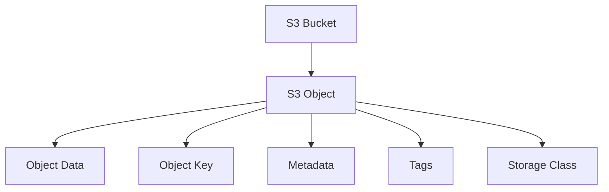

---

# Object Key

The **object key** is the unique name used to identify an object inside a bucket.

Example:

```text
website/index.html
```

Here:

```text
website/
    ↓
Prefix

index.html
    ↓
Object name
```

Full object key:

```text
website/index.html
```

### Important

S3 does not use traditional folders internally.

The `/` is part of the object key.

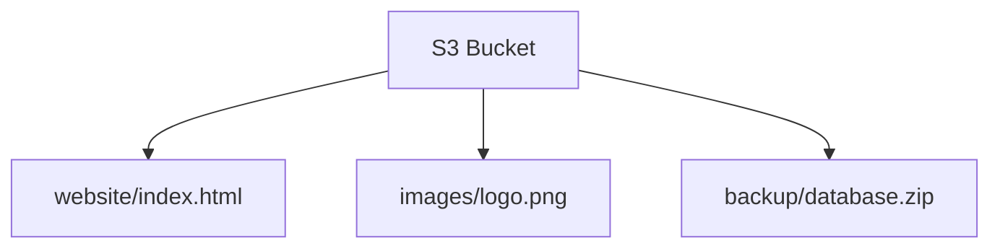

---

# Object Structure

An S3 object can be represented as:

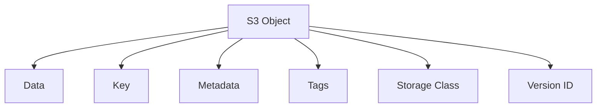

---

# 1. Upload an Object

Uploading means transferring a file from your local system or application to an S3 bucket.

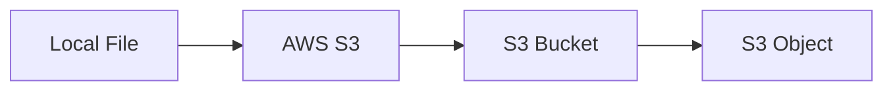

---

# Upload Using AWS Console

### Steps

```text
S3
→ Open Bucket
→ Upload
→ Add files
→ Select File
→ Upload
```

Example:

```text
index.html
```

After upload:

```text
Bucket
└── index.html
```

---

# Upload Using AWS CLI

```bash id="u3p4f1"
aws s3 cp index.html s3://my-bucket/
```

Example:

```bash id="5f4h9c"
aws s3 cp index.html s3://bindhusree-devops-s3-practice-2026/
```

---

# Upload Multiple Files

```bash id="9p2y3n"
aws s3 cp ./website s3://my-bucket/ --recursive
```

Example directory:

```text
website/
├── index.html
├── style.css
├── script.js
└── images/
    ├── logo.png
    └── banner.jpg
```

Architecture:

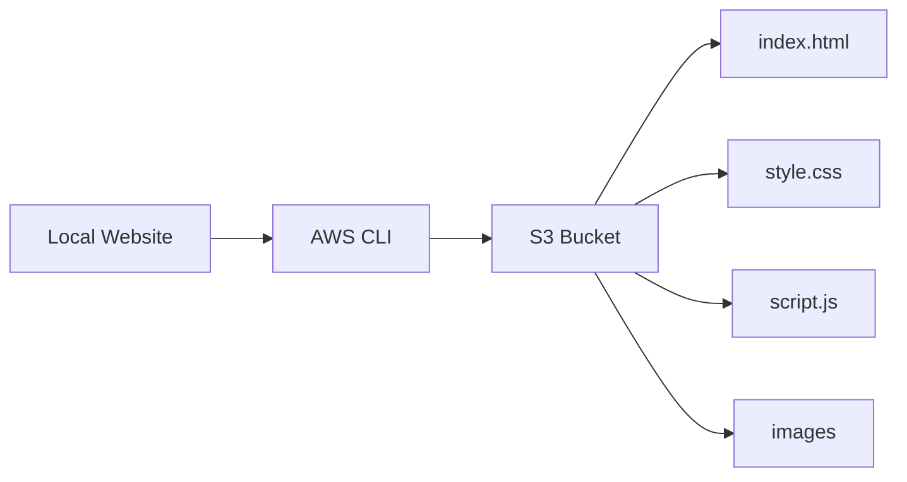

---

# 2. List Objects

Listing objects allows us to view the objects stored inside a bucket.

## AWS CLI

```bash id="n8w5j4"
aws s3 ls s3://my-bucket/
```

Example:

```bash id="k5w0r2"
aws s3 ls s3://bindhusree-devops-s3-practice-2026/
```

Possible output:

```text
2026-08-08 08:30:00       1024 index.html
2026-08-08 08:31:00       2048 style.css
```

---

# List Objects Recursively

```bash id="s6j1p0"
aws s3 ls s3://my-bucket/ --recursive
```

This displays objects under different prefixes.

Example:

```text
website/index.html
website/style.css
images/logo.png
images/banner.jpg
```

---

# 3. Download an Object

Downloading means copying an object from S3 to the local system.

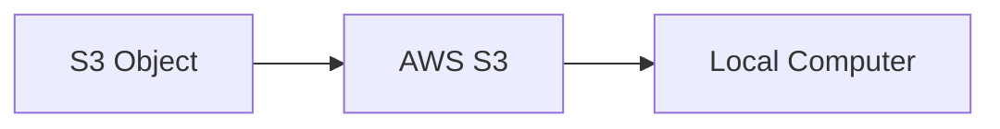

## AWS CLI

```bash id="p1d5k7"
aws s3 cp s3://my-bucket/index.html .
```

The `.` means the current directory.

---

# Download to Specific Location

```bash id="h6q2t1"
aws s3 cp s3://my-bucket/index.html ./downloads/
```

Architecture:

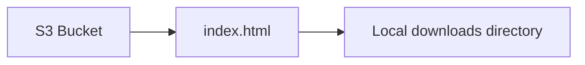

---

# 4. Download Multiple Objects

```bash id="7e0s4r"
aws s3 cp s3://my-bucket/ ./downloads/ --recursive
```

This downloads all objects from the specified S3 location.

---

# 5. Copy an Object

Copying means creating a copy of an object in another S3 location.

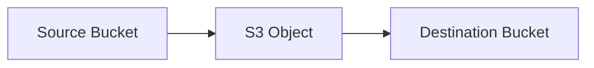

## AWS CLI

```bash id="n0r6k2"
aws s3 cp s3://source-bucket/file.txt s3://destination-bucket/
```

Example:

```bash id="m8v5q2"
aws s3 cp s3://dev-bucket/app.zip s3://backup-bucket/
```

---

# Copy Within the Same Bucket

```bash id="7g4s9d"
aws s3 cp s3://my-bucket/file.txt s3://my-bucket/backup/file.txt
```

Architecture:

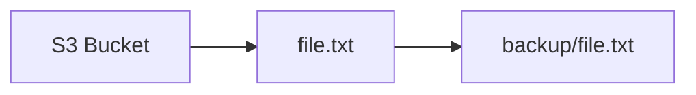

---

# 6. Move an Object

The `mv` command moves an object from one location to another.

```bash id="f2k8r5"
aws s3 mv s3://my-bucket/file.txt s3://my-bucket/archive/file.txt
```

Conceptually:

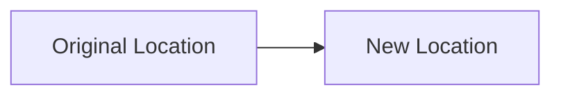

The original object is removed after the move operation succeeds.

---

# 7. Delete an Object

Deleting removes an object from the bucket.

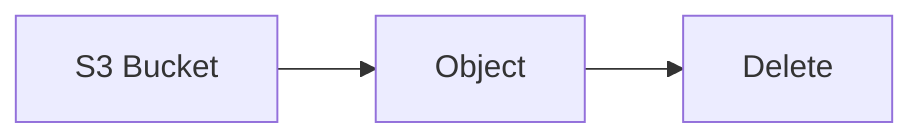

## AWS CLI

```bash id="j8q4m1"
aws s3 rm s3://my-bucket/index.html
```

---

# Delete Multiple Objects

```bash id="e7k3p9"
aws s3 rm s3://my-bucket/ --recursive
```

### Important

Use recursive delete carefully.

It can remove many objects.

---

# 8. Copy vs Move

| Operation | Command     | Result                                  |
| --------- | ----------- | --------------------------------------- |
| Copy      | `aws s3 cp` | Source remains                          |
| Move      | `aws s3 mv` | Source is removed after successful move |

Example:

```text
cp → Copy

mv → Move
```

---

# 9. Object Metadata

Metadata is additional information associated with an object.

Examples:

* Content-Type
* Content-Length
* Last Modified
* ETag
* Encryption information
* Storage Class

Architecture:

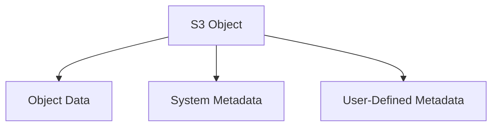

---

# System Metadata

AWS automatically manages many system metadata values.

Examples:

```text
Content-Type
Content-Length
Last-Modified
ETag
Storage-Class
```

---

# User-Defined Metadata

Users can add custom metadata to objects.

Example:

```text
department = devops
project = aws-training
environment = dev
```

Metadata can help applications identify additional information about objects.

---

# View Object Metadata

Using AWS CLI:

```bash id="v4k6p2"
aws s3api head-object \
--bucket my-bucket \
--key index.html
```

This returns metadata associated with the object.

---

# 10. Content-Type

Content-Type tells clients what type of data the object contains.

Examples:

```text
text/html
text/css
application/json
image/png
image/jpeg
application/pdf
```

Example:

```bash id="j2w8m4"
aws s3 cp index.html s3://my-bucket/ \
--content-type text/html
```

For static websites, correct Content-Type values are important.

---

# 11. Object Tags

Object tags are key-value pairs attached to individual objects.

Example:

```text
Environment = Dev
Project = Website
Type = Static
```

Architecture:

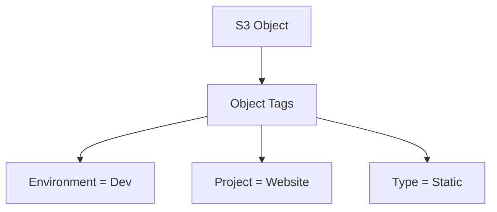

Tags can be used for:

* Object organization
* Lifecycle rules
* Cost management
* Automation

---

# Add Object Tags Using CLI

```bash id="u8m2d6"
aws s3api put-object-tagging \
--bucket my-bucket \
--key index.html \
--tagging 'TagSet=[{Key=Environment,Value=Dev}]'
```

---

# View Object Tags

```bash id="f5r1x8"
aws s3api get-object-tagging \
--bucket my-bucket \
--key index.html
```

---

# 12. Object Storage Class

An object can use a specific S3 Storage Class.

Example:

```text
S3 Standard
S3 Intelligent-Tiering
S3 Standard-IA
S3 Glacier
```

Upload an object using a specific storage class:

```bash id="x7q3m5"
aws s3 cp backup.zip s3://my-bucket/ \
--storage-class STANDARD_IA
```

Architecture:

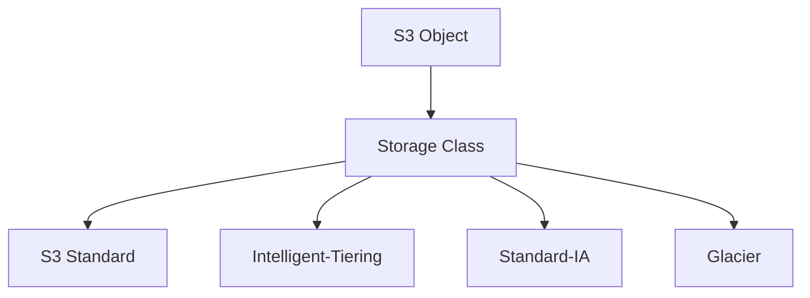

---

# 13. Object URL

An S3 object can have a URL based on its bucket and object key.

Conceptually:

```text
https://<bucket-name>.s3.<region>.amazonaws.com/<object-key>
```

Example:

```text
https://my-bucket.s3.ap-south-1.amazonaws.com/index.html
```

### Important

Having an object URL does **not automatically mean the object is publicly accessible**.

The requester still needs appropriate permission.

---

# 14. Presigned URL

A **presigned URL** provides temporary access to an S3 object without making the bucket or object public.

Architecture:

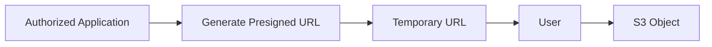

Example use case:

A private application needs to allow a user to download a private file for a limited time.

---

# Generate Presigned URL Using AWS CLI

```bash id="s9k3w1"
aws s3 presign s3://my-bucket/private-file.pdf \
--expires-in 3600
```

`3600` means the URL is valid for approximately **1 hour**.

### Important

Presigned URLs should be generated with an appropriate expiration time and permissions.

---

# Public URL vs Presigned URL

| Feature    | Public URL                    | Presigned URL               |
| ---------- | ----------------------------- | --------------------------- |
| Access     | Public                        | Temporary authorized access |
| Security   | Lower                         | Better for private objects  |
| Expiration | No temporary expiry by itself | Configurable                |
| Use Case   | Public content                | Private downloads/uploads   |

---

# 15. Multipart Upload

Multipart upload divides a large object into multiple parts and uploads them independently.

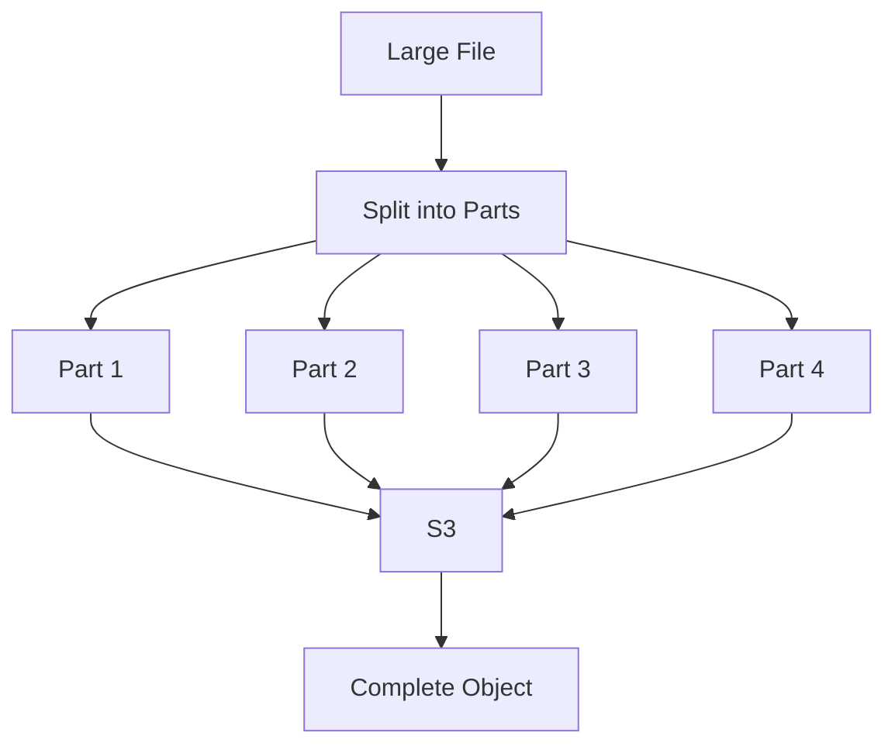

### Benefits

* Better handling of large files
* Parts can be uploaded independently
* Failed parts can be retried
* Parallel uploads can improve performance

Multipart upload is especially useful for large objects.

---

# Multipart Upload with AWS CLI

AWS CLI can automatically use multipart upload for sufficiently large transfers.

For advanced control, the S3 multipart APIs can be used.

The main process is:

```text
Create Multipart Upload
        ↓
Upload Parts
        ↓
Complete Multipart Upload
```

---

# 16. S3 Sync

`aws s3 sync` is useful when synchronizing files between a local directory and S3.

```bash id="j4x8p2"
aws s3 sync ./website s3://my-bucket/
```

Architecture:

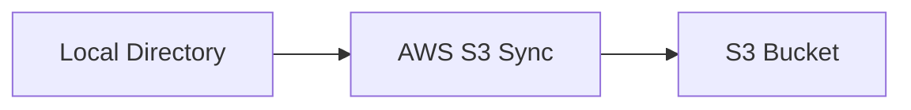

Example:

```text
website/
├── index.html
├── style.css
└── script.js
```

can be synchronized to:

```text
S3 Bucket
├── index.html
├── style.css
└── script.js
```

---

# 17. S3 Sync for Website Deployment

S3 is commonly used for static website deployment.

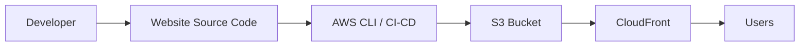

Example deployment command:

```bash id="q7m3x5"
aws s3 sync ./website s3://my-website-bucket/
```

This concept is useful in DevOps because it can later be integrated with CI/CD pipelines.

---

# 18. Object Copy with Storage Class

An object can be copied while changing its storage class.

Example:

```bash id="p8y2w6"
aws s3 cp \
s3://my-bucket/file.zip \
s3://my-bucket/archive/file.zip \
--storage-class GLACIER
```

This can be useful when moving old data into archival storage.

---

# 19. Object Delete and Versioning

When versioning is enabled, deleting an object behaves differently.

A delete operation can create a **delete marker** instead of permanently removing the existing object version.

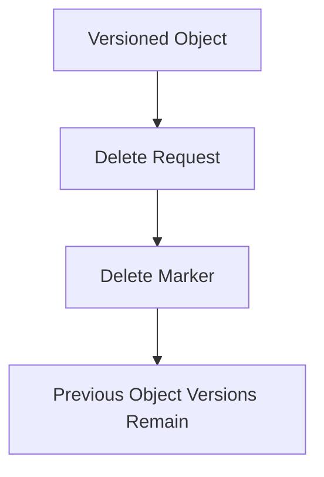

This is one reason versioning is useful for recovery.

---

# 20. Restore Previous Version

When versioning is enabled:

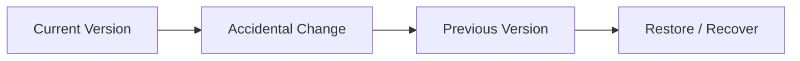

Previous versions can be accessed and restored according to the bucket's versioning configuration.

---

# Object Operations – Complete Architecture

```mermaid id="flowchart-v2"
flowchart TD
    A[S3 Bucket] --> B[Object]

    B --> C[Upload]
    B --> D[Download]
    B --> E[Copy]
    B --> F[Move]
    B --> G[Delete]
    B --> H[Metadata]
    B --> I[Tags]
    B --> J[Storage Class]
    B --> K[Versioning]
    B --> L[Presigned URL]
    B --> M[Multipart Upload]
```

---

# Practical Implementation

## Step 1 – Create a Test File

Create:

```text
index.html
```

Example content:

```html
<!DOCTYPE html>
<html>
<head>
    <title>S3 Practice</title>
</head>
<body>
    <h1>My AWS S3 Practice</h1>
</body>
</html>
```

---

## Step 2 – Upload File

```bash id="c9x4w7"
aws s3 cp index.html s3://my-bucket/
```

---

## Step 3 – Verify Upload

```bash id="t8m2p5"
aws s3 ls s3://my-bucket/
```

---

## Step 4 – Download File

```bash id="r6y3n1"
aws s3 cp s3://my-bucket/index.html ./downloaded-index.html
```

---

## Step 5 – Copy File

```bash id="a7k5v2"
aws s3 cp \
s3://my-bucket/index.html \
s3://my-bucket/backup/index.html
```

---

## Step 6 – Move File

```bash id="m3q8x4"
aws s3 mv \
s3://my-bucket/backup/index.html \
s3://my-bucket/archive/index.html
```

---

## Step 7 – Check Metadata

```bash id="p5w9c2"
aws s3api head-object \
--bucket my-bucket \
--key index.html
```

---

## Step 8 – Generate Presigned URL

```bash id="y8n4k6"
aws s3 presign \
s3://my-bucket/index.html \
--expires-in 3600
```

---

# Real-World Application Example

Suppose an e-commerce application allows users to upload product images.

```mermaid id="x2q7m4"
flowchart LR
    U[User] --> A[Application]
    A --> S3[S3 Bucket]

    S3 --> IMG[Product Images]

    S3 --> E[S3 Event]
    E --> L[Lambda]
    L --> P[Image Processing]
```

### Flow

1. User uploads an image.
2. Application sends the image to S3.
3. S3 stores the image as an object.
4. S3 generates an event.
5. Lambda processes the uploaded image.
6. Processed image can be stored back in S3.

---

# DevOps Use Case

S3 can be used as part of a CI/CD workflow for static website deployment.

```mermaid id="flow-ci"
flowchart LR
    A[Developer] --> B[GitHub]
    B --> C[CI/CD Pipeline]
    C --> D[AWS CLI / Deployment Tool]
    D --> E[S3 Bucket]
    E --> F[CloudFront]
    F --> G[Users]
```

Example deployment command:

```bash id="b6k2v9"
aws s3 sync ./build s3://my-website-bucket/
```

This is a useful foundation for later learning:

* GitHub Actions
* Jenkins
* AWS CodePipeline
* Terraform
* Docker
* CloudFront

---

# Common Errors and Troubleshooting

## AccessDenied

Check:

```text
IAM permissions
Bucket policy
Object permissions
AWS account
IAM Role/User
```

---

## NoSuchKey

The requested object key does not exist.

Check:

```text
Bucket name
Object key
Path
File name
```

Example:

```text
images/logo.png
```

is different from:

```text
logo.png
```

---

## Wrong Content-Type

If a browser does not display a file correctly, check the object's Content-Type.

Example:

```text
HTML → text/html
CSS → text/css
PNG → image/png
JPEG → image/jpeg
```

---

## Presigned URL Not Working

Check:

* URL expiration
* Object key
* Bucket
* Permissions of the identity that generated the URL
* Object existence

---

# Best Practices

* Use meaningful object keys.
* Keep sensitive objects private.
* Use presigned URLs for temporary private access.
* Use versioning for important data.
* Use lifecycle rules for old objects.
* Choose storage classes based on access patterns.
* Use multipart upload for large objects.
* Use IAM Roles instead of hardcoded credentials.
* Set the correct Content-Type.
* Avoid unnecessary public access.
* Use `sync` for deployment and directory synchronization.
* Use encryption for sensitive data.

---

# Important Interview Questions

## 1. What is an S3 object?

An S3 object is the actual data stored in an S3 bucket along with its key, metadata, tags, and other properties.

---

## 2. What is an object key?

An object key is the unique name used to identify an object inside an S3 bucket.

---

## 3. How do you upload a file to S3 using CLI?

```bash
aws s3 cp file.txt s3://my-bucket/
```

---

## 4. How do you download an S3 object?

```bash
aws s3 cp s3://my-bucket/file.txt .
```

---

## 5. What is the difference between `cp` and `mv`?

`cp` copies the object and keeps the source.

`mv` moves the object and removes the source after a successful operation.

---

## 6. What is object metadata?

Metadata is information associated with an object, such as Content-Type, size, ETag, and Last Modified information.

---

## 7. What is an S3 presigned URL?

A presigned URL provides temporary access to a private S3 object without making the object publicly accessible.

---

## 8. Why are presigned URLs useful?

They are useful when an application needs to provide temporary access to private files.

---

## 9. What is multipart upload?

Multipart upload splits a large object into multiple parts that can be uploaded independently and then combined into a single object.

---

## 10. What is the benefit of multipart upload?

It improves the handling of large files, supports parallel uploads, and allows failed parts to be retried independently.

---

## 11. What is the difference between metadata and tags?

Metadata describes an object and can include system or user-defined information.

Tags are key-value pairs attached to an object and are commonly used for organization, lifecycle management, and automation.

---

## 12. Does an S3 object URL automatically make the object public?

No.

The object still requires appropriate permissions for access.

---

## 13. What happens when you delete an object in a versioned bucket?

A delete marker can be created while previous object versions remain available.

---

## 14. Why is Content-Type important?

Content-Type tells clients and browsers how the object should be interpreted.

For example:

```text
index.html → text/html
image.png → image/png
```

---

## 15. What is the difference between S3 `cp` and `sync`?

`cp` copies specific files or directories.

`sync` compares source and destination and transfers the files required to synchronize them.

---

# Quick Revision

```mermaid id="revobj"
mindmap
    root((S3 Object Operations))
        Upload
            Console
            CLI
            SDK
        Download
            Single Object
            Multiple Objects
        Copy
            Same Bucket
            Cross Bucket
        Move
            Archive
            Reorganize
        Delete
            Normal
            Versioned
        Metadata
            Content-Type
            ETag
            Last Modified
        Tags
            Environment
            Project
        Access
            Object URL
            Presigned URL
        Large Files
            Multipart Upload
        Automation
            AWS CLI
            S3 Sync
            CI/CD
```

---

# Practical Outcome

After completing this topic, I should be able to:

* Upload objects to S3.
* Download objects from S3.
* List objects using AWS CLI.
* Copy objects between S3 locations.
* Move objects.
* Delete objects safely.
* Understand object keys.
* Understand object metadata.
* Set and read object tags.
* Set appropriate Content-Type values.
* Understand S3 object URLs.
* Generate presigned URLs.
* Understand multipart uploads.
* Use S3 Sync.
* Deploy static website files to S3.
* Understand object deletion with versioning.
* Troubleshoot common object-operation errors.
* Explain S3 object operations confidently in interviews.

---

# Key Takeaway

```mermaid id="keyobj"
flowchart LR
    A[S3 Object] --> B[Upload]
    A --> C[Download]
    A --> D[Copy]
    A --> E[Move]
    A --> F[Delete]
    A --> G[Metadata]
    A --> H[Tags]
    A --> I[Storage Class]
    A --> J[Versioning]
    A --> K[Presigned URL]
    A --> L[Multipart Upload]
    A --> M[S3 Sync]
```


* Architecture diagrams
* Interview questions
