# AWS S3 – Basics

## Introduction

Amazon S3 (Simple Storage Service) is an **object storage service** provided by AWS.

It is used to store and manage different types of data such as:

* Images
* Videos
* Documents
* Application files
* Backups
* Logs
* Static website files
* Data used by applications

S3 is designed for **high durability, scalability, security, and availability**.

---

# S3 Basic Architecture

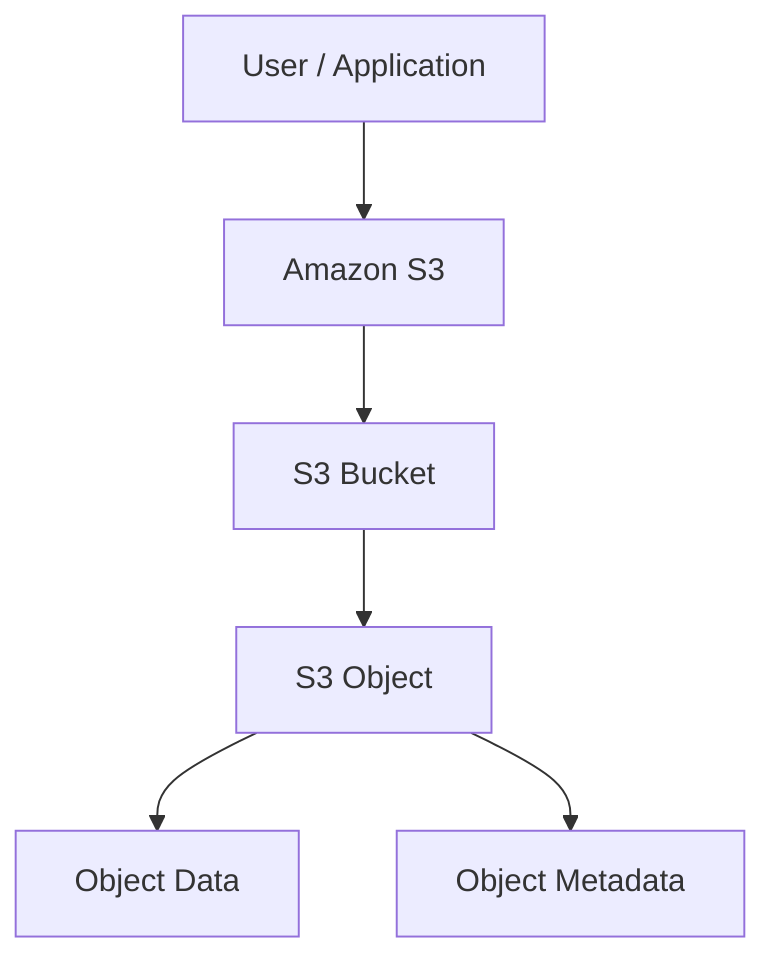

### Basic Flow

A user or application sends a request to Amazon S3.

S3 stores the data inside a **bucket** as an **object**.

Each object contains the actual data along with metadata.

---

# What is Object Storage?

S3 is an **object storage service**.

In object storage, data is stored as individual objects inside buckets.

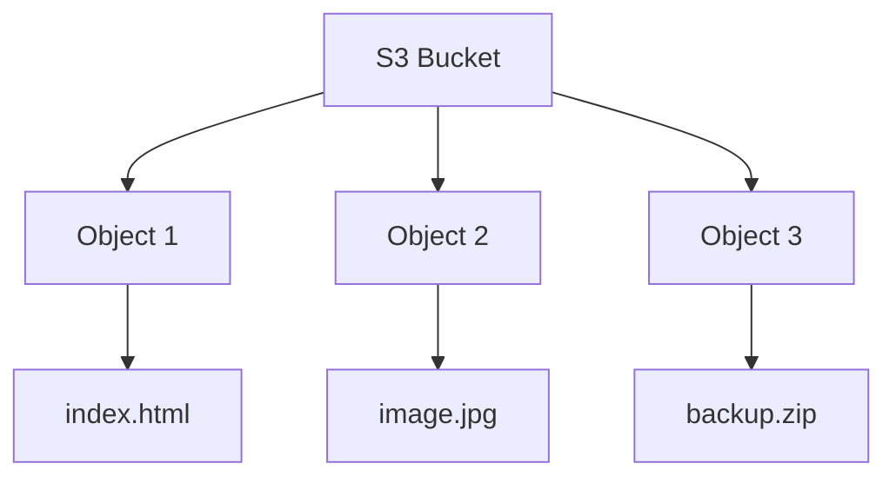

Unlike traditional file systems, S3 does not use a normal directory structure internally.

---

# What is a Bucket?

A **bucket** is a container used to store objects in S3.

Example:

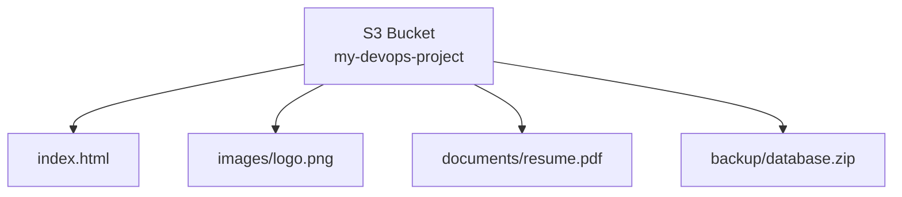

### Important Points

* Bucket names must be **globally unique**.
* A bucket is created in a specific AWS Region.
* Objects are stored inside buckets.
* S3 automatically scales according to the amount of data.
* A bucket can store a very large number of objects.

---

# What is an Object?

An **object** is the actual data stored inside an S3 bucket.

Examples:

* `index.html`
* `image.jpg`
* `backup.zip`
* `application.log`
* `resume.pdf`
* `video.mp4`

An S3 object mainly contains:

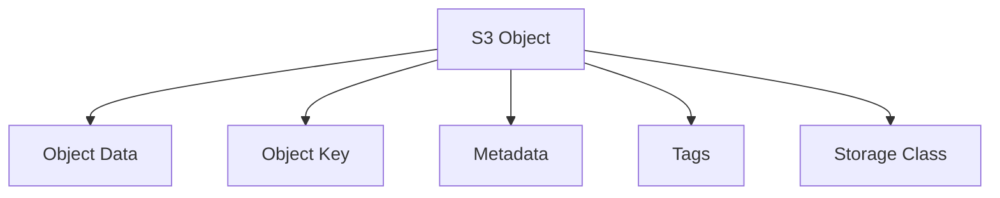

---

# Object Key

An **object key** is the unique name used to identify an object inside a bucket.

Example:

```text
Bucket: my-devops-project

Object Key:
images/logo.png
```

S3 does not actually create traditional folders.

The `/` in:

```text
images/logo.png
```

is part of the object key.

The S3 Console displays prefixes such as `images/` like folders for easier management.

### Example

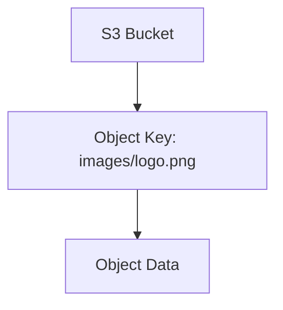

---

# Bucket Name

S3 bucket names must be **globally unique** across AWS.

Example:

```text
my-devops-project
```

If another AWS account already uses that bucket name, it cannot be created again.

A better naming example:

```text
bindhusree-devops-s3-practice-2026
```

---

# S3 Region

A bucket is created in a specific AWS Region.

Example:

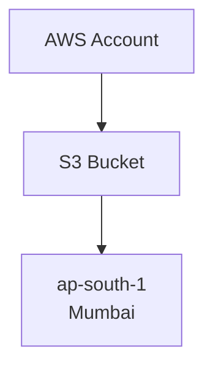

The Region should be selected based on:

* Application location
* Latency
* Compliance requirements
* Data residency
* Cost
* Architecture requirements

For applications primarily used in India, `ap-south-1` may be a suitable choice.

---

# Is S3 Regional or Global?

S3 has an important distinction:

* **Bucket is regional**
* **Bucket name is globally unique**

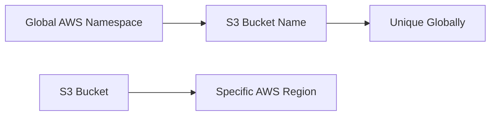

Example:

```text
Bucket Name:
my-company-backup-2026

Region:
ap-south-1
```

---

# S3 Scalability

S3 is designed to scale automatically as data increases.

We do not need to manually provision storage capacity like a traditional disk.

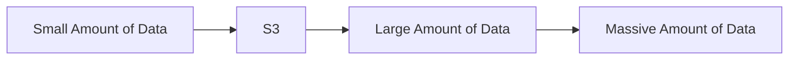

This makes S3 suitable for applications that continuously generate large amounts of data.

---

# S3 Durability

**Durability** means how well stored data is protected from data loss.

S3 Standard is designed for:

**99.999999999% durability (11 nines)**

This means S3 is designed to provide extremely high protection for stored data.

### Interview Point

> Durability is related to protecting data from loss.

---

# S3 Availability

**Availability** means how frequently the service is accessible and usable.

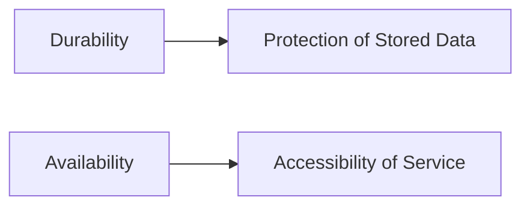

### Simple Difference

| Term         | Meaning                      |
| ------------ | ---------------------------- |
| Durability   | Protection of stored data    |
| Availability | Accessibility of the service |

Do not confuse these two terms in interviews.

---

# S3 Storage Architecture

S3 separates storage from compute.

For example, an application can run on EC2 while storing files in S3.

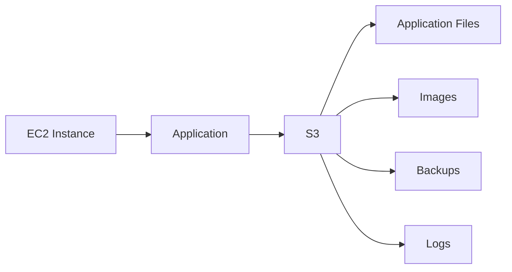

This allows compute resources and storage to scale independently.

---

# S3 Access

S3 access can be controlled using different AWS security mechanisms.

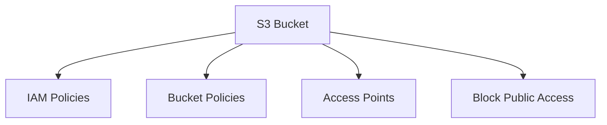

Access should follow the:

**Principle of Least Privilege**

Give users and applications only the permissions they actually require.

---

# S3 Security

Important S3 security features include:

* IAM policies
* Bucket policies
* Block Public Access
* Encryption
* Versioning
* Access control
* Logging and monitoring

Example:

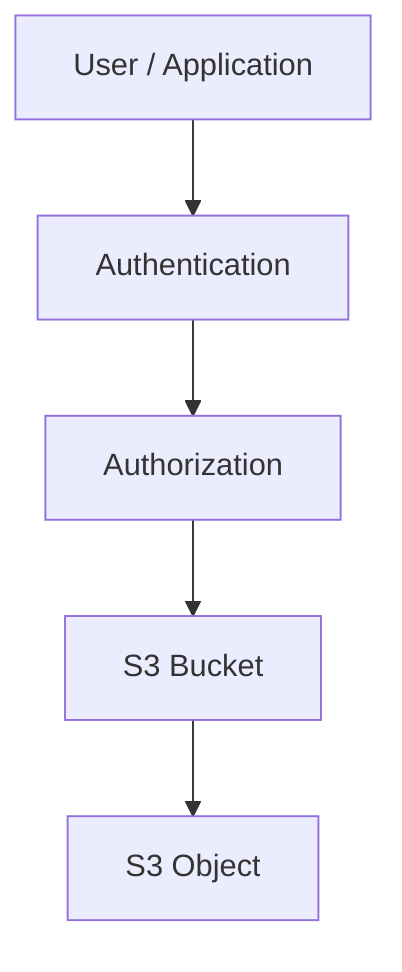

Authentication identifies **who** is requesting access.

Authorization determines **what they are allowed to do**.

---

# S3 Encryption

S3 supports encryption to protect data at rest.

Common encryption options:

* SSE-S3
* SSE-KMS
* SSE-C

Basic flow:

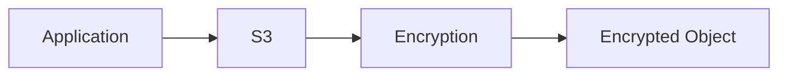

Encryption helps protect stored data from unauthorized access.

---

# S3 Storage Classes

S3 provides different storage classes based on access frequency and cost requirements.

| Storage Class                 | Typical Use                                                    |
| ----------------------------- | -------------------------------------------------------------- |
| S3 Standard                   | Frequently accessed data                                       |
| S3 Intelligent-Tiering        | Data with changing or unknown access patterns                  |
| S3 Standard-IA                | Infrequently accessed data                                     |
| S3 One Zone-IA                | Infrequently accessed data that can tolerate single-AZ storage |
| S3 Glacier Instant Retrieval  | Archive data requiring fast retrieval                          |
| S3 Glacier Flexible Retrieval | Long-term archive                                              |
| S3 Glacier Deep Archive       | Very long-term archive                                         |

### Storage Class Selection

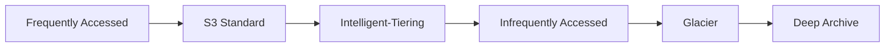

The correct storage class depends on:

* Access frequency
* Retrieval requirements
* Retention period
* Cost

---

# S3 Versioning

Versioning allows multiple versions of an object to be stored.

Example:

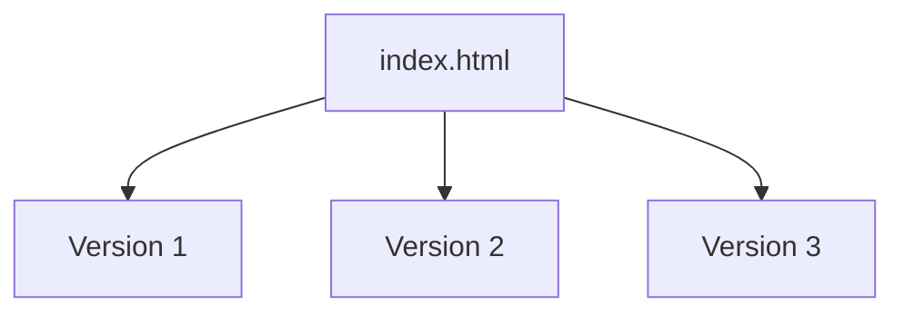

If an object is accidentally overwritten or deleted, previous versions can potentially be recovered.

### Benefits

* Accidental deletion protection
* Object recovery
* Version tracking
* Data protection

---

# S3 Lifecycle Management

Lifecycle rules automatically transition or delete objects based on defined conditions.

Example:

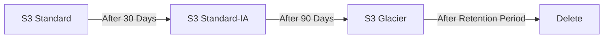

Lifecycle rules help:

* Reduce storage costs
* Automate object management
* Move old data to cheaper storage
* Automatically delete expired data

---

# S3 Static Website Hosting

S3 can host static websites containing:

* HTML
* CSS
* JavaScript
* Images

Basic architecture:

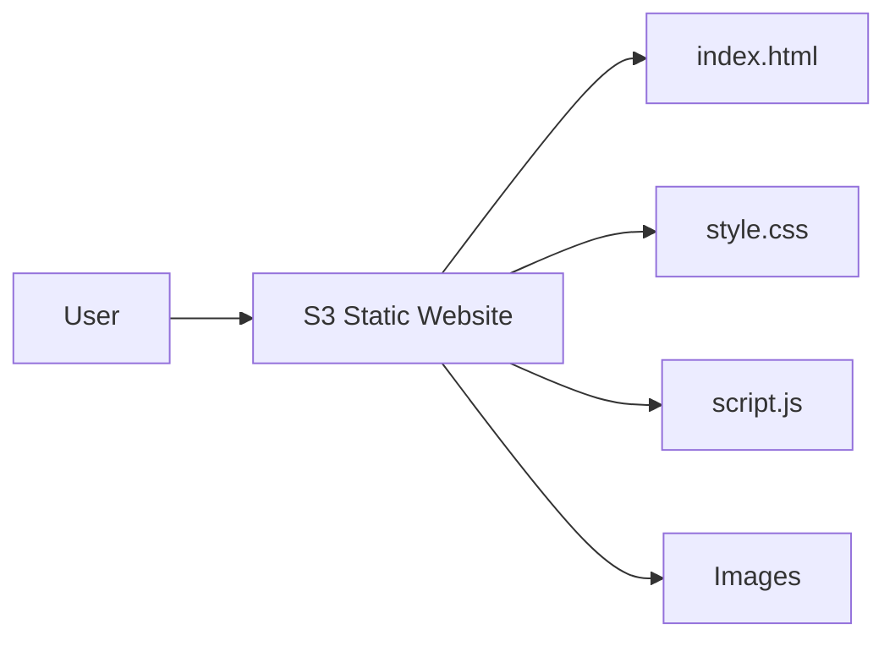

For a more production-oriented architecture, CloudFront can be used in front of S3.

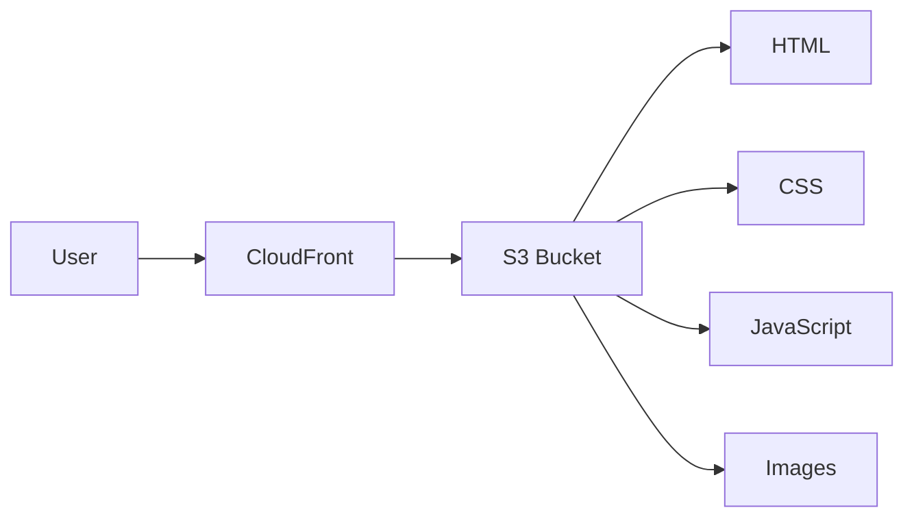

---

# S3 with EC2

An EC2 application can use S3 to store files.

Example:

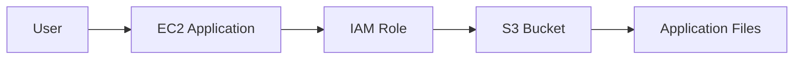

A common real-world example is an application uploading user profile images to S3.

---

# S3 with IAM Role

For AWS workloads such as EC2, it is recommended to use an **IAM Role** instead of storing AWS access keys inside application code.

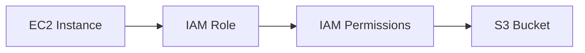

Example:

```text
EC2 Application
      ↓
IAM Role
      ↓
S3 Permissions
      ↓
S3 Bucket
```

This avoids hardcoding credentials inside the application.

---

# S3 Replication

S3 supports replication to automatically copy objects between buckets.

A common architecture is:

```mermaid
flowchart LR
    A[Source S3 Bucket] --> B[S3 Replication]
    B --> C[Destination S3 Bucket]
```

Replication can be useful for:

* Disaster recovery
* Compliance
* Business continuity
* Cross-region data requirements

---

# S3 Event Notifications

S3 can generate events when actions occur on objects.

For example:

```mermaid
flowchart LR
    A[User Uploads Object] --> B[S3 Bucket]
    B --> C[S3 Event Notification]
    C --> D[Lambda]
    C --> E[SQS]
    C --> F[SNS]
```

Example use case:

When an image is uploaded to S3, an event can trigger a Lambda function to process the image.

---

# S3 Common Use Cases

## 1. Static Website Hosting

```mermaid
flowchart LR
    A[User] --> B[CloudFront]
    B --> C[S3]
    C --> D[Website Files]
```

## 2. Backup Storage

```mermaid
flowchart LR
    A[Application] --> B[Backup]
    B --> C[S3]
```

## 3. Log Storage

```mermaid
flowchart LR
    A[Application] --> B[Logs]
    B --> C[S3]
```

## 4. Media Storage

```mermaid
flowchart LR
    A[Application] --> B[S3]
    B --> C[Images]
    B --> D[Videos]
    B --> E[Documents]
```

## 5. Data Lake

```mermaid
flowchart LR
    A[Applications] --> B[S3 Data Lake]
    B --> C[Raw Data]
    B --> D[Processed Data]
    B --> E[Analytics Data]
```

---

# AWS CLI with S3

AWS CLI can be used to manage S3 from the terminal.

## List S3 Buckets

```bash
aws s3 ls
```

## Create a Bucket

```bash
aws s3 mb s3://my-unique-bucket-name --region ap-south-1
```

## Upload a File

```bash
aws s3 cp index.html s3://my-unique-bucket-name/
```

## Download a File

```bash
aws s3 cp s3://my-unique-bucket-name/index.html .
```

## List Objects

```bash
aws s3 ls s3://my-unique-bucket-name/
```

## Upload a Directory

```bash
aws s3 cp ./website s3://my-unique-bucket-name/ --recursive
```

## Sync a Directory

```bash
aws s3 sync ./website s3://my-unique-bucket-name/
```

## Delete an Object

```bash
aws s3 rm s3://my-unique-bucket-name/index.html
```

---

# Practical Implementation

## Step 1 – Open S3

AWS Console → Search for **S3**

## Step 2 – Create Bucket

Go to:

```text
S3 → Create bucket
```

Enter a globally unique bucket name.

Example:

```text
bindhusree-devops-s3-practice-2026
```

Select the required Region.

---

## Step 3 – Configure Public Access

For normal private storage:

**Keep Block all public access enabled.**

Do not make a bucket public unless the architecture specifically requires public access.

---

## Step 4 – Enable Versioning

Enable versioning if object recovery and version tracking are required.

```mermaid
flowchart LR
    A[Bucket] --> B[Versioning Enabled]
    B --> C[Object Version 1]
    B --> D[Object Version 2]
    B --> E[Object Version 3]
```

---

## Step 5 – Create Bucket

Click:

**Create bucket**

---

## Step 6 – Upload an Object

Open:

```text
Bucket → Upload → Add files → Upload
```

Example:

```text
index.html
```

---

## Step 7 – Verify Object

Go to:

```text
Bucket → Objects
```

Verify that the uploaded object is present.

---

# S3 vs EBS vs EFS

| Feature      | S3              | EBS                 | EFS                      |
| ------------ | --------------- | ------------------- | ------------------------ |
| Storage Type | Object          | Block               | File                     |
| Main Use     | Files/Data      | EC2 Disk            | Shared File System       |
| Access       | API/HTTP        | EC2 Attached Volume | File System              |
| Scalability  | Highly Scalable | Volume Based        | Elastic                  |
| Example      | Backup/Image    | OS Disk             | Shared Application Files |

### Simple Difference

```mermaid
flowchart TD
    A[AWS Storage] --> B[S3]
    A --> C[EBS]
    A --> D[EFS]

    B --> B1[Object Storage]
    C --> C1[Block Storage]
    D --> D1[File Storage]
```

---

# S3 Security Best Practices

* Keep Block Public Access enabled unless public access is required.
* Follow the principle of least privilege.
* Use IAM Roles for AWS workloads.
* Use encryption for sensitive data.
* Enable versioning for important objects.
* Use lifecycle rules for cost optimization.
* Avoid hardcoding AWS credentials.
* Review bucket policies regularly.
* Monitor S3 access where required.

---

# Common S3 Errors

## AccessDenied

Possible reasons:

* IAM permission is missing.
* Bucket policy denies access.
* Object permissions are insufficient.
* Block Public Access affects the intended configuration.
* Wrong AWS account or role is being used.

---

## NoSuchBucket

Possible reasons:

* Bucket name is incorrect.
* Wrong AWS Region.
* Bucket was deleted.
* AWS CLI is using the wrong account.

---

## NoSuchKey

Possible reasons:

* Object key is incorrect.
* File path is incorrect.
* Object was deleted.
* Wrong bucket is being accessed.

---

## Static Website Not Working

Check:

* Website configuration
* Index document
* Object name
* Access configuration
* Bucket policy if public access is intentionally required
* CloudFront configuration if CloudFront is being used

---

# Important S3 Terms

| Term               | Meaning                                       |
| ------------------ | --------------------------------------------- |
| Bucket             | Container used to store objects               |
| Object             | Data stored in S3                             |
| Object Key         | Unique identifier/name of an object           |
| Metadata           | Information describing an object              |
| Region             | AWS location associated with the bucket       |
| Storage Class      | Determines storage and access characteristics |
| Versioning         | Maintains multiple versions of objects        |
| Lifecycle          | Automates object transitions and deletion     |
| Bucket Policy      | Resource-based policy for bucket access       |
| IAM Policy         | Identity-based permissions                    |
| Encryption         | Protects data at rest                         |
| Replication        | Copies objects to another bucket              |
| Event Notification | Triggers actions when S3 events occur         |

---

# Interview Questions

## 1. What is Amazon S3?

Amazon S3 is an AWS object storage service used to store and retrieve data such as files, backups, logs, images, videos, and static website content.

---

## 2. What is a bucket?

A bucket is a container in Amazon S3 used to store objects.

---

## 3. What is an object?

An object is the actual data stored in an S3 bucket along with its key, metadata, and other object properties.

---

## 4. What is an object key?

An object key is the unique name used to identify an object inside a bucket.

---

## 5. Is S3 a file storage service?

No.

S3 is an **object storage service**.

---

## 6. What is S3 durability?

Durability represents the protection of stored data against data loss.

S3 Standard is designed for **99.999999999% durability**.

---

## 7. What is the difference between durability and availability?

**Durability** refers to protecting stored data from loss.

**Availability** refers to how accessible the service is.

---

## 8. Is S3 regional or global?

An S3 bucket is associated with a specific AWS Region, while the bucket name must be globally unique.

---

## 9. Why is S3 highly scalable?

S3 automatically scales to store very large amounts of data without requiring manual storage provisioning.

---

## 10. Can S3 host a website?

Yes.

S3 can host static websites containing HTML, CSS, JavaScript, images, and other static content.

---

## 11. How can EC2 securely access S3?

An IAM Role can be attached to the EC2 instance with the required S3 permissions.

---

## 12. Why should we avoid storing AWS access keys in application code?

Hardcoding credentials creates a security risk.

IAM Roles provide temporary credentials and avoid storing long-term credentials inside the application.

---

## 13. What is S3 Versioning?

Versioning keeps multiple versions of an object so that previous versions can potentially be recovered after accidental overwrite or deletion.

---

## 14. What is S3 Lifecycle Management?

Lifecycle Management automatically transitions objects between storage classes or deletes objects based on configured rules.

---

## 15. What are S3 Storage Classes?

S3 Storage Classes provide different storage options based on access frequency, retrieval requirements, and cost.

---

# Real-World S3 Architecture

A common production architecture can look like this:

```mermaid
flowchart LR
    U[Users] --> CF[CloudFront]
    CF --> S3[S3 Bucket]

    S3 --> IMG[Images]
    S3 --> WEB[Static Files]
    S3 --> LOG[Application Data]

    EC2[EC2 Application] --> ROLE[IAM Role]
    ROLE --> S3

    S3 --> EVENT[S3 Event]
    EVENT --> LAMBDA[Lambda]

    S3 --> REP[S3 Replication]
    REP --> DR[DR Bucket]
```

### Architecture Flow

1. Users access the application.
2. CloudFront delivers static content.
3. S3 stores application files.
4. EC2 applications can access S3 through an IAM Role.
5. S3 events can trigger Lambda or other AWS services.
6. Replication can be used for disaster recovery requirements.

---

# S3 Key Takeaways

```mermaid
mindmap
  root((Amazon S3))
    Object Storage
      Bucket
      Object
      Object Key
      Metadata
    Security
      IAM
      Bucket Policy
      Encryption
      Block Public Access
    Data Management
      Versioning
      Lifecycle
      Replication
    Storage Classes
      Standard
      Intelligent-Tiering
      Standard-IA
      Glacier
      Deep Archive
    Integration
      EC2
      Lambda
      CloudFront
      SQS
      SNS
    Operations
      AWS Console
      AWS CLI
```

---

# Practical Outcome

After completing S3 Basics, I should be able to:

* Explain S3 clearly in an interview.
* Explain object storage.
* Create an S3 bucket.
* Upload and download objects.
* Understand buckets, objects, keys, and metadata.
* Understand S3 Regions.
* Explain durability and availability.
* Choose appropriate storage classes.
* Understand versioning.
* Understand lifecycle management.
* Explain S3 security.
* Use IAM Roles with S3.
* Use AWS CLI for S3 operations.
* Explain static website hosting.
* Explain S3 replication.
* Explain S3 event notifications.
* Compare S3 with EBS and EFS.
* Explain a real-world S3 architecture.

---


