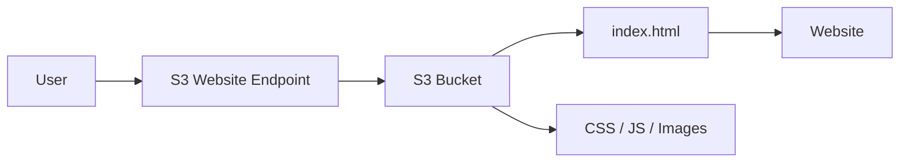
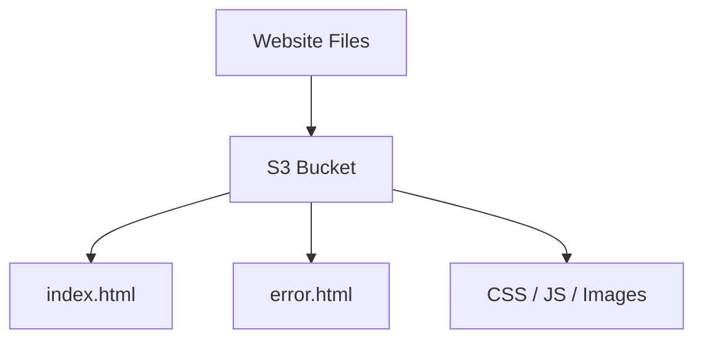
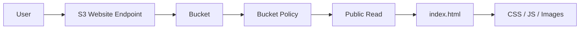
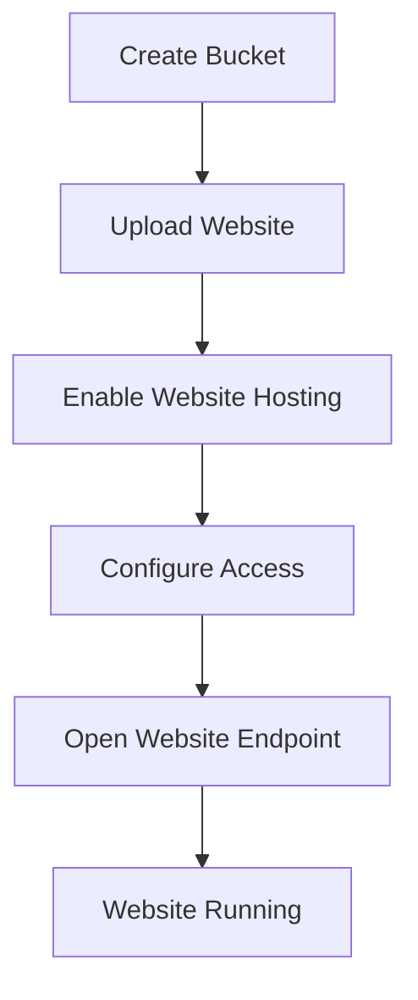
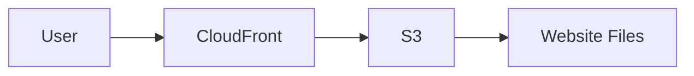
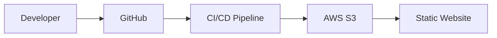
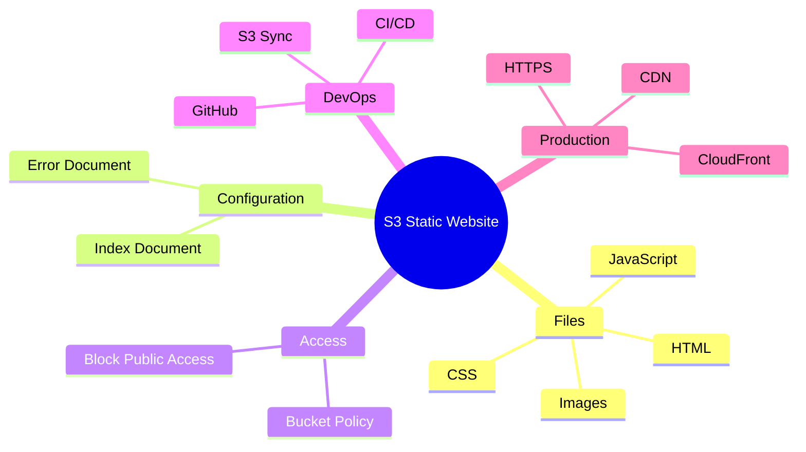

# AWS S3 – Static Website Hosting

## Introduction

Amazon S3 can host **static websites** containing files such as:

* HTML
* CSS
* JavaScript
* Images
* Videos

S3 is suitable for websites that do not require server-side processing.

---

# Basic Architecture

```text
User
  |
  v
S3 Static Website Endpoint
  |
  v
S3 Bucket
  |
  +-- index.html
  +-- style.css
  +-- script.js
  +-- images/
```

---

# Static Website Flow



---

# Static vs Dynamic Website

| Static Website       | Dynamic Website              |
| -------------------- | ---------------------------- |
| HTML/CSS/JS          | Server-side application      |
| No server processing | Requires backend processing  |
| Can use S3           | Usually needs compute        |
| Simple and scalable  | More infrastructure required |

Examples of static websites:

```text
Portfolio
Documentation
Landing Page
Company Website
Frontend Application
```

---

# Required Files

Typical structure:

```text
website/
├── index.html
├── error.html
├── style.css
├── script.js
└── images/
```

---

# Practical Implementation

## Step 1 – Create S3 Bucket

```text
S3
→ Create Bucket
→ Enter Bucket Name
→ Select AWS Region
→ Create Bucket
```

---

## Step 2 – Upload Website Files

Upload:

```text
index.html
error.html
style.css
script.js
images/
```

Architecture:



---

## Step 3 – Enable Static Website Hosting

Go to:

```text
S3
→ Bucket
→ Properties
→ Static website hosting
→ Edit
→ Enable
```

Choose:

```text
Hosting Type:
Host a static website
```

Set:

```text
Index document:
index.html
```

Optional:

```text
Error document:
error.html
```

Save changes.

---

# Website Endpoint

After enabling hosting, AWS provides a website endpoint.

General format:

```text
http://BUCKET-NAME.s3-website-REGION.amazonaws.com
```

The exact endpoint shown in the S3 console should be used.

---

# Public Access

For direct public S3 website hosting, the website objects need to be publicly readable.

A common setup involves:

```text
S3 Block Public Access
        ↓
Allow intended public access
        ↓
Bucket Policy
        ↓
s3:GetObject
        ↓
Website Objects
```

Only use public access when the website content is intentionally public.

---

# Public Read Bucket Policy

Example:

```json id="5f9v2c"
{
  "Version": "2012-10-17",
  "Statement": [
    {
      "Sid": "PublicRead",
      "Effect": "Allow",
      "Principal": "*",
      "Action": "s3:GetObject",
      "Resource": "arn:aws:s3:::my-website-bucket/*"
    }
  ]
}
```

Replace:

```text
my-website-bucket
```

with your bucket name.

---

# Complete Architecture



---

# AWS CLI – Upload Website

Upload a single file:

```bash
aws s3 cp index.html s3://my-website-bucket/
```

Upload complete website:

```bash
aws s3 cp ./website s3://my-website-bucket/ --recursive
```

---

# AWS CLI – Enable Website Hosting

```bash
aws s3 website s3://my-website-bucket/ \
--index-document index.html \
--error-document error.html
```

---

# AWS CLI – Check Bucket

```bash
aws s3 ls s3://my-website-bucket/
```

---

# Practical Flow



---

# S3 Website vs CloudFront

For production websites, a common architecture is:



CloudFront can provide:

* CDN caching
* HTTPS
* Global content delivery
* Lower latency
* Additional security controls

---

# Production Architecture

```text
User
  |
  v
CloudFront
  |
  v
S3 Bucket
  |
  +-- index.html
  +-- CSS
  +-- JavaScript
  +-- Images
```

A production design can keep the S3 bucket private and allow CloudFront to retrieve the content.

---

# DevOps Use Case

A CI/CD pipeline can automatically deploy frontend files to S3.



Example deployment command:

```bash
aws s3 sync ./website s3://my-website-bucket
```

This synchronizes local website files with the S3 bucket.

---

# Common Problems

## 1. AccessDenied

Check:

```text
Bucket Policy
Block Public Access
Object Permissions
Bucket Name
```

---

## 2. 404 Error

Check:

```text
index.html
```

and verify the exact file name and path.

---

## 3. CSS Not Loading

Check:

```text
CSS file path
Object name
HTML references
```

Example:

```html
<link rel="stylesheet" href="style.css">
```

---

## 4. Website Not Opening

Check:

```text
Static Website Hosting = Enabled
Index Document = index.html
Website Endpoint
```

---

# Important Interview Questions

## 1. Can S3 host a website?

Yes. S3 can host static websites containing HTML, CSS, JavaScript, images, and other static files.

---

## 2. What is a static website?

A website where content is served as static files without server-side application processing.

---

## 3. What is the index document?

The default page S3 serves for the website, commonly:

```text
index.html
```

---

## 4. Why is a Bucket Policy used?

To control access to objects in the bucket. For a directly public S3 website, it can grant public `s3:GetObject` access when public access is intentionally configured.

---

## 5. Can S3 run backend code?

No. S3 is object storage and static website hosting. It does not execute server-side application code.

---

## 6. Why use CloudFront with S3?

CloudFront provides CDN caching, HTTPS, global delivery, and improved performance.

---

## 7. What is the DevOps use case?

A CI/CD pipeline can automatically upload or synchronize frontend files to S3 after a code change.

---

# Quick Revision



---

# Practical Outcome

After completing this topic, I should be able to:

* Host a static website using S3.
* Upload website files.
* Configure index and error documents.
* Understand S3 website endpoints.
* Configure required access permissions.
* Deploy websites using AWS CLI.
* Use `aws s3 sync` for deployment.
* Understand S3 + CloudFront architecture.
* Explain S3 static website hosting in interviews.

---

# Key Takeaway

```text
Developer
    |
    v
GitHub
    |
    v
CI/CD
    |
    v
S3 Bucket
    |
    v
Static Website
```

> **S3 Static Website Hosting allows HTML, CSS, JavaScript and other static files to be served as a website without managing servers.**
