# AWS S3 – Storage Classes

## Introduction

Amazon S3 provides different **Storage Classes** for storing objects based on:

* Access frequency
* Retrieval requirements
* Storage cost
* Availability requirements
* Data retention period

Choosing the correct storage class helps optimize **cost without affecting the required access pattern**.

---

# S3 Storage Classes Overview

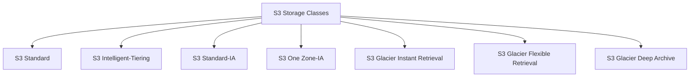

---

# How to Choose a Storage Class

The main question is:

> How frequently will the data be accessed?

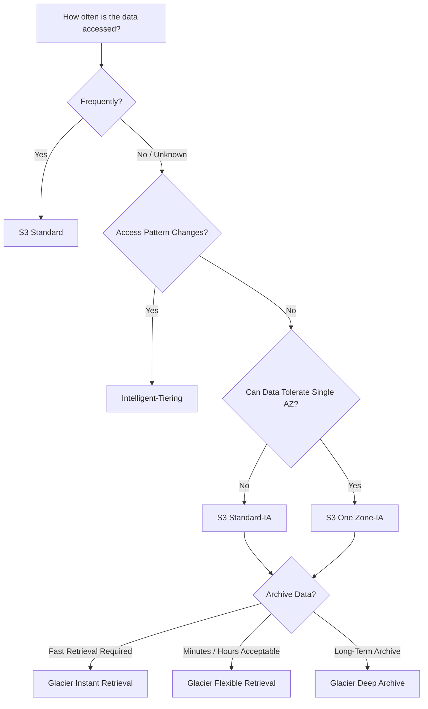

---

# 1. S3 Standard

S3 Standard is designed for **frequently accessed data**.

It provides:

* High availability
* High durability
* Low latency
* No minimum storage duration requirement
* No minimum billable object size requirement

### Typical Use Cases

* Websites
* Mobile applications
* Frequently accessed files
* Dynamic application content
* Images
* Videos
* Frequently used datasets

Architecture:

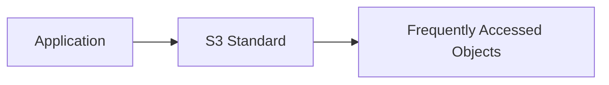

### Example

```text
index.html
product-images/
application-data/
```

If the application accesses these objects frequently, S3 Standard is a suitable choice.

---

# 2. S3 Intelligent-Tiering

S3 Intelligent-Tiering is designed for data where the access pattern is **unknown or changes over time**.

S3 automatically moves objects between access tiers based on access patterns.

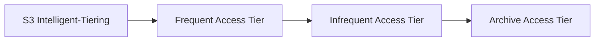

### Typical Use Cases

* Data with unpredictable access
* Long-lived application data
* Data whose access frequency changes
* Analytics data
* User-generated content

### Example

A company stores reports.

Initially:

```text
Reports → Frequently accessed
```

After several months:

```text
Reports → Rarely accessed
```

Intelligent-Tiering can automatically optimize the storage tier based on access behavior.

---

# 3. S3 Standard-IA

IA means:

**Infrequent Access**

S3 Standard-IA is suitable for data that is:

* Stored for long periods
* Accessed less frequently
* Still needs rapid access when requested

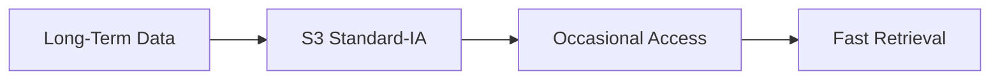

### Typical Use Cases

* Backups
* Disaster recovery data
* Older application data
* Infrequently accessed files

### Important

Standard-IA has a **minimum storage duration requirement** and **retrieval charges**.

Therefore, it is not ideal for temporary files that are frequently deleted.

---

# 4. S3 One Zone-IA

S3 One Zone-IA is designed for **infrequently accessed data** that can be recreated if necessary and does not require multi-AZ resilience.

Objects are stored in a **single Availability Zone**.

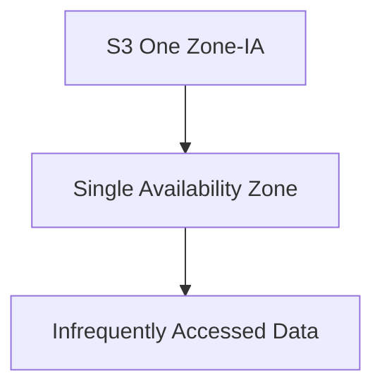

### Typical Use Cases

* Secondary backup copies
* Re-creatable data
* Data that can tolerate AZ-level failure
* Temporary or secondary datasets

### Important

Do not use One Zone-IA for your only copy of critical data.

---

# Standard-IA vs One Zone-IA

| Feature            | Standard-IA               | One Zone-IA                 |
| ------------------ | ------------------------- | --------------------------- |
| Access Pattern     | Infrequent                | Infrequent                  |
| Availability Zones | Multiple AZs              | Single AZ                   |
| Resilience         | Higher                    | Lower                       |
| Cost               | Higher                    | Lower                       |
| Suitable For       | Important infrequent data | Re-creatable/secondary data |

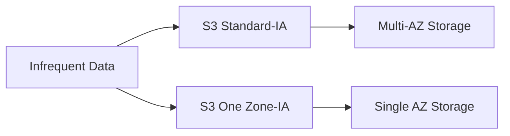

---

# 5. S3 Glacier Instant Retrieval

S3 Glacier Instant Retrieval is designed for **archive data that is rarely accessed but requires immediate access when needed**.

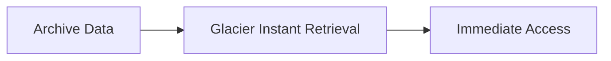

### Typical Use Cases

* Medical images
* Long-term media
* Archived datasets
* Historical records

The data is archived, but retrieval can be performed quickly when required.

---

# 6. S3 Glacier Flexible Retrieval

S3 Glacier Flexible Retrieval is designed for archive data where retrieval can take **minutes to hours**.

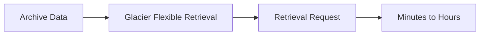

### Typical Use Cases

* Long-term backups
* Disaster recovery archives
* Compliance data
* Historical records

It provides different retrieval options depending on how quickly the data is needed.

---

# 7. S3 Glacier Deep Archive

S3 Glacier Deep Archive is designed for **very long-term data retention** where data is rarely accessed.

It is generally used when the primary goal is minimizing storage cost.

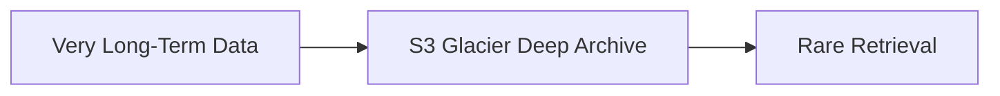

### Typical Use Cases

* Compliance records
* Legal documents
* Historical archives
* Long-term backups
* Regulatory data retention

---

# S3 Storage Class Comparison

| Storage Class              | Access Pattern   | Retrieval      | Main Purpose                  |
| -------------------------- | ---------------- | -------------- | ----------------------------- |
| S3 Standard                | Frequent         | Immediate      | General-purpose storage       |
| Intelligent-Tiering        | Unknown/Changing | Immediate      | Automatic cost optimization   |
| Standard-IA                | Infrequent       | Immediate      | Long-lived infrequent data    |
| One Zone-IA                | Infrequent       | Immediate      | Re-creatable data             |
| Glacier Instant Retrieval  | Rare             | Immediate      | Archive with fast access      |
| Glacier Flexible Retrieval | Rare             | Minutes/Hours  | Flexible archive              |
| Glacier Deep Archive       | Very Rare        | Long retrieval | Lowest-cost long-term archive |

---

# Storage Classes by Access Frequency

```mermaid
flowchart LR
    A[Frequently Accessed] --> B[S3 Standard]
    B --> C[Intelligent-Tiering]
    C --> D[Infrequently Accessed]
    D --> E[Standard-IA]
    E --> F[One Zone-IA]
    F --> G[Rarely Accessed]
    G --> H[Glacier Instant Retrieval]
    H --> I[Glacier Flexible Retrieval]
    I --> J[Very Rarely Accessed]
    J --> K[Glacier Deep Archive]
```

---

# Storage Cost vs Access

Generally:

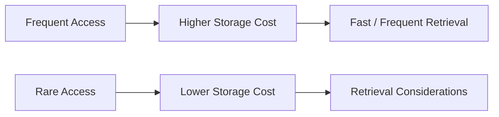

The cheapest storage class is not automatically the best choice.

We must consider:

* Storage cost
* Retrieval cost
* Retrieval time
* Minimum storage duration
* Availability requirements
* Data access pattern

---

# Storage Class Decision Example

Suppose we have:

```text
Application Images
```

They are accessed every day.

Recommended:

```text
S3 Standard
```

---

Suppose we have:

```text
Old application backups
```

They are rarely accessed but need quick retrieval.

Possible choice:

```text
S3 Standard-IA
```

---

Suppose we have:

```text
Data with unpredictable access patterns
```

Recommended:

```text
S3 Intelligent-Tiering
```

---

Suppose we have:

```text
Compliance records
```

They may be accessed only once in several years.

Possible choice:

```text
S3 Glacier Deep Archive
```

---

# Storage Class Decision Tree

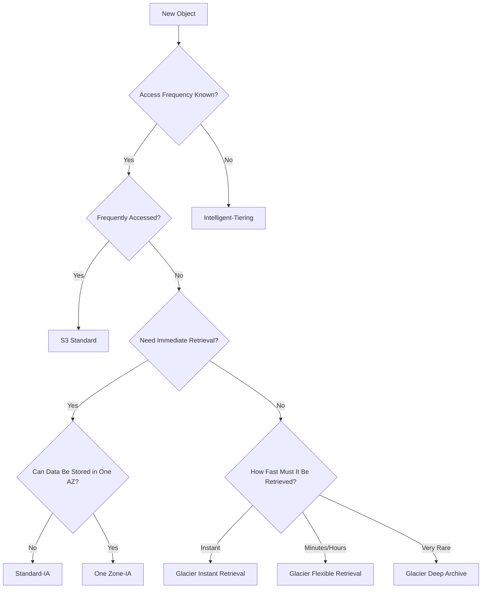

---

# Lifecycle Management with Storage Classes

Instead of manually moving objects between storage classes, we can use **S3 Lifecycle Rules**.

Example:

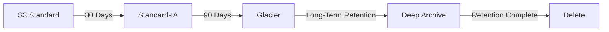

This is useful for automated cost optimization.

---

# Real-World Backup Architecture

A company may store application backups like this:

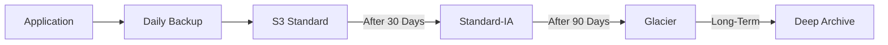

This avoids keeping old backups in expensive frequently accessed storage.

---

# S3 Lifecycle Example

Suppose:

```text
Day 0:
Backup created

Day 30:
Backup becomes infrequently accessed

Day 90:
Backup becomes archive data

After retention period:
Backup can be deleted
```

Architecture:

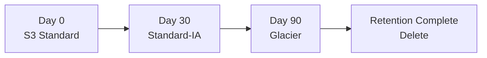

---

# AWS CLI – Upload with Storage Class

## S3 Standard

```bash
aws s3 cp file.txt s3://my-bucket/
```

---

## Standard-IA

```bash
aws s3 cp file.txt s3://my-bucket/ \
--storage-class STANDARD_IA
```

---

## One Zone-IA

```bash
aws s3 cp file.txt s3://my-bucket/ \
--storage-class ONEZONE_IA
```

---

## Intelligent-Tiering

```bash
aws s3 cp file.txt s3://my-bucket/ \
--storage-class INTELLIGENT_TIERING
```

---

## Glacier Flexible Retrieval

```bash
aws s3 cp backup.zip s3://my-bucket/ \
--storage-class GLACIER
```

---

# Check Object Storage Class

Use:

```bash
aws s3api head-object \
--bucket my-bucket \
--key backup.zip
```

The response can contain the object's storage-related information.

You can also list objects with:

```bash
aws s3api list-objects-v2 \
--bucket my-bucket
```

---

# Change Storage Class

An existing object can be copied to itself with a different storage class.

Example:

```bash
aws s3 cp \
s3://my-bucket/file.txt \
s3://my-bucket/file.txt \
--storage-class STANDARD_IA
```

This creates a new copy of the object with the specified storage class.

### Important

For large-scale production workloads, lifecycle policies are usually better than manually changing storage classes.

---

# Storage Class and DevOps

Storage classes are important in DevOps because applications continuously generate:

* Build artifacts
* Logs
* Backups
* Reports
* Application data
* Deployment packages

Example:

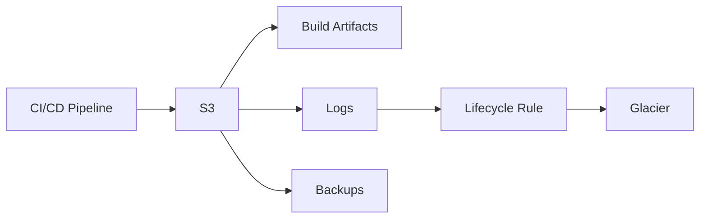

This helps reduce long-term storage costs.

---

# Static Website Example

Website files are frequently accessed:

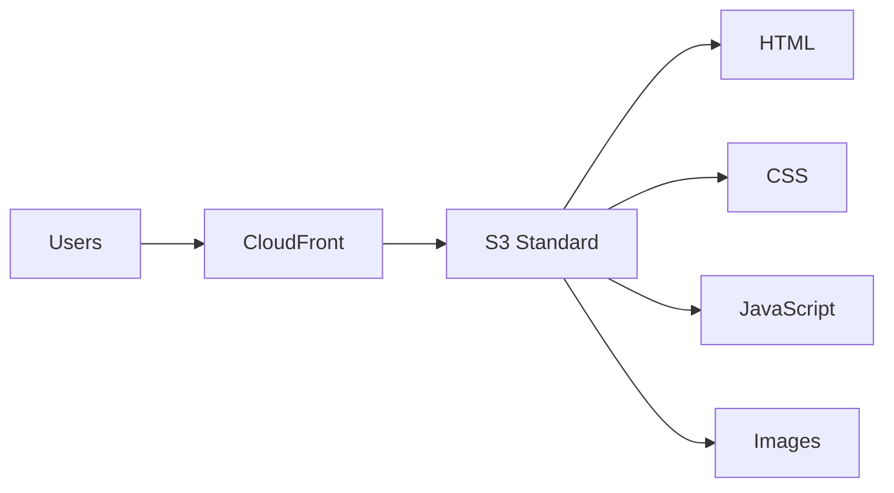

S3 Standard is generally appropriate for frequently accessed website content.

---

# Backup Example

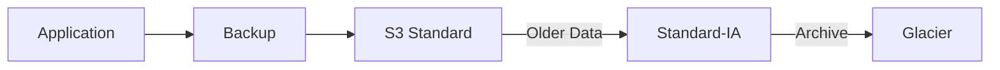

This architecture combines accessibility and cost optimization.

---

# Archive Example

For compliance data:

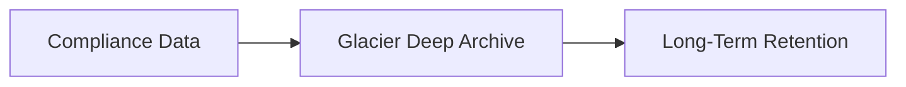

This is appropriate when data is rarely accessed but must be retained for a long period.

---

# Important Storage Class Concepts

## Minimum Storage Duration

Some infrequent-access and archive classes have minimum storage duration considerations.

Deleting or transitioning objects before the minimum duration can result in additional charges.

Always check the current AWS pricing documentation before designing a cost-sensitive production architecture.

---

# Retrieval Charges

Some storage classes charge for retrieving data.

Therefore:

```text
Low Storage Cost
       ≠
Low Total Cost
```

Example:

If an application constantly retrieves data from an archive class, the retrieval costs and latency may make that storage class unsuitable.

---

# Availability Consideration

Storage class selection should also consider availability requirements.

For example:

```text
Critical frequently accessed application data
        ↓
S3 Standard

Re-creatable infrequently accessed data
        ↓
S3 One Zone-IA
```

Do not choose a storage class based only on storage price.

---

# Storage Class Selection – Practical Table

| Data                                | Access Pattern | Suitable Class             |
| ----------------------------------- | -------------- | -------------------------- |
| Website files                       | Frequent       | S3 Standard                |
| Frequently used images              | Frequent       | S3 Standard                |
| Unknown access pattern              | Changing       | Intelligent-Tiering        |
| Old backups                         | Infrequent     | Standard-IA                |
| Re-creatable secondary data         | Infrequent     | One Zone-IA                |
| Archive needing immediate retrieval | Rare           | Glacier Instant Retrieval  |
| Long-term backup                    | Rare           | Glacier Flexible Retrieval |
| Compliance archive                  | Very rare      | Glacier Deep Archive       |

---

# Common Mistakes

## 1. Using Glacier for Frequently Accessed Data

Problem:

```text
Application
   ↓
Glacier
   ↓
Frequent Retrieval
```

This can lead to unnecessary retrieval costs and unsuitable access performance.

---

## 2. Using Standard for Everything

S3 Standard is excellent for frequently accessed data, but keeping all old backups there may increase storage costs.

Better:

```mermaid
flowchart LR
    A[New Data] --> B[S3 Standard]
    B --> C[Lifecycle]
    C --> D[IA]
    D --> E[Glacier]
```

---

## 3. Using One Zone-IA for Critical Only-Copy Data

One Zone-IA is designed for data that can tolerate loss of the Availability Zone.

Do not use it as the only copy of critical data unless the risk is explicitly acceptable.

---

## 4. Ignoring Retrieval Costs

Always consider both:

```text
Storage Cost
+
Retrieval Cost
+
Access Frequency
```

---

## 5. Ignoring Minimum Storage Duration

Before selecting IA or archive classes, consider minimum storage duration and early deletion implications.

---

# Troubleshooting

## Object Retrieval Is Expensive

Check:

* Storage class
* Retrieval frequency
* Object size
* Application access pattern
* Lifecycle rules

---

## Object Retrieval Is Slow

Check whether the object is stored in an archive class.

For archive classes, retrieval time depends on the selected class and retrieval option.

---

## Storage Cost Is Increasing

Check:

```mermaid
flowchart TD
    A[High S3 Cost] --> B[Check Storage Classes]
    B --> C[Check Old Objects]
    C --> D[Check Lifecycle Rules]
    D --> E[Check Object Size]
    E --> F[Check Retrieval Activity]
```

---

# Best Practices

* Select storage class based on actual access patterns.
* Use Intelligent-Tiering when access patterns are unpredictable.
* Use lifecycle rules for automated transitions.
* Use IA classes for appropriate long-lived infrequently accessed data.
* Use archive classes for long-term data.
* Consider retrieval costs.
* Consider minimum storage duration.
* Do not use One Zone-IA for data that cannot tolerate single-AZ loss.
* Monitor storage usage and costs.
* Review storage class selection periodically.

---

# Important Interview Questions

## 1. What are S3 Storage Classes?

S3 Storage Classes are different storage options designed for different access patterns, retrieval requirements, availability needs, and cost requirements.

---

## 2. What is S3 Standard?

S3 Standard is designed for frequently accessed data and provides high availability, durability, and low-latency access.

---

## 3. What is S3 Intelligent-Tiering?

Intelligent-Tiering automatically moves objects between access tiers based on changing access patterns to help optimize storage costs.

---

## 4. What is S3 Standard-IA?

Standard-IA is designed for long-lived data that is accessed less frequently but still requires rapid access when needed.

---

## 5. What is S3 One Zone-IA?

One Zone-IA stores infrequently accessed data in a single Availability Zone and is suitable for data that can be recreated if necessary.

---

## 6. What is the difference between Standard-IA and One Zone-IA?

Standard-IA is designed for infrequently accessed data with multi-AZ resilience, while One Zone-IA stores data in a single Availability Zone and is lower cost but has lower resilience.

---

## 7. What is Glacier Instant Retrieval?

It is an archive storage class designed for rarely accessed data that still requires immediate retrieval.

---

## 8. What is Glacier Flexible Retrieval?

It is an archive class for data where retrieval can take minutes to hours depending on the retrieval option.

---

## 9. What is Glacier Deep Archive?

It is designed for very long-term data retention where data is rarely accessed and minimizing storage cost is a priority.

---

## 10. Which storage class should be used when access patterns are unknown?

**S3 Intelligent-Tiering** is designed for changing or unknown access patterns.

---

## 11. Can we automatically move objects between storage classes?

Yes.

S3 Lifecycle Rules can automatically transition objects between storage classes.

---

## 12. Why should we not use Glacier for frequently accessed data?

Archive classes are optimized for long-term storage. Frequent retrieval can result in additional retrieval costs and may not provide the required access characteristics.

---

## 13. What factors should be considered when choosing a storage class?

Consider:

* Access frequency
* Retrieval time
* Retrieval cost
* Storage cost
* Minimum storage duration
* Availability requirements
* Data retention requirements

---

## 14. How can you upload an object to Standard-IA using CLI?

```bash
aws s3 cp file.txt s3://my-bucket/ \
--storage-class STANDARD_IA
```

---

## 15. How can storage classes help DevOps?

Storage classes can reduce the cost of storing build artifacts, logs, backups, and other application data by automatically moving older data to more cost-effective storage tiers.

---

# Quick Revision

```mermaid
mindmap
    root((S3 Storage Classes))
        S3 Standard
            Frequent Access
            General Purpose
        Intelligent-Tiering
            Unknown Access
            Changing Access
            Automatic Tiering
        Standard-IA
            Infrequent Access
            Fast Retrieval
            Multi-AZ
        One Zone-IA
            Infrequent Access
            Single AZ
            Re-creatable Data
        Glacier Instant Retrieval
            Archive
            Immediate Retrieval
        Glacier Flexible Retrieval
            Archive
            Minutes to Hours
        Glacier Deep Archive
            Very Rare Access
            Long-Term Retention
```

---

# Real-World Storage Strategy

A practical company-wide storage strategy can look like:

```mermaid
flowchart LR
    A[New Application Data] --> B[S3 Standard]
    B -->|Access Decreases| C[Intelligent-Tiering]
    C -->|Older Data| D[Standard-IA]
    D -->|Archive Required| E[Glacier]
    E -->|Long-Term Retention| F[Deep Archive]
    F -->|Retention Complete| G[Delete]
```

The exact transitions should be designed based on the application's access pattern, retention requirements, and current AWS pricing.

---

# Practical Outcome

After completing this topic, I should be able to:

* Explain all major S3 Storage Classes.
* Choose a storage class based on access patterns.
* Understand S3 Standard.
* Understand Intelligent-Tiering.
* Understand Standard-IA.
* Understand One Zone-IA.
* Understand Glacier Instant Retrieval.
* Understand Glacier Flexible Retrieval.
* Understand Glacier Deep Archive.
* Compare storage classes.
* Understand retrieval considerations.
* Understand minimum storage duration considerations.
* Configure storage class using AWS CLI.
* Use Lifecycle Rules for automatic transitions.
* Optimize S3 storage costs.
* Explain storage class decisions in interviews.
* Apply storage classes to real-world DevOps architectures.

---

# Key Takeaway

```mermaid
flowchart TD
    A[Choose S3 Storage Class] --> B[Access Frequency]
    B --> C[Retrieval Requirement]
    C --> D[Availability Requirement]
    D --> E[Retention Period]
    E --> F[Cost]
    F --> G[Select Appropriate Storage Class]
```

> **Do not choose an S3 Storage Class only by looking at storage price. Always consider access frequency, retrieval requirements, availability, retention period, and total cost.**

---

