 # AWS S3 – Versioning

## Introduction

Amazon S3 Versioning is used to keep **multiple versions of the same object** in an S3 bucket.

It helps protect data from:

* Accidental deletion
* Accidental overwrite
* Unwanted changes
* Application errors
* Human mistakes

When Versioning is enabled, S3 keeps previous versions of an object instead of immediately replacing or permanently deleting them.

---

# S3 Versioning Architecture

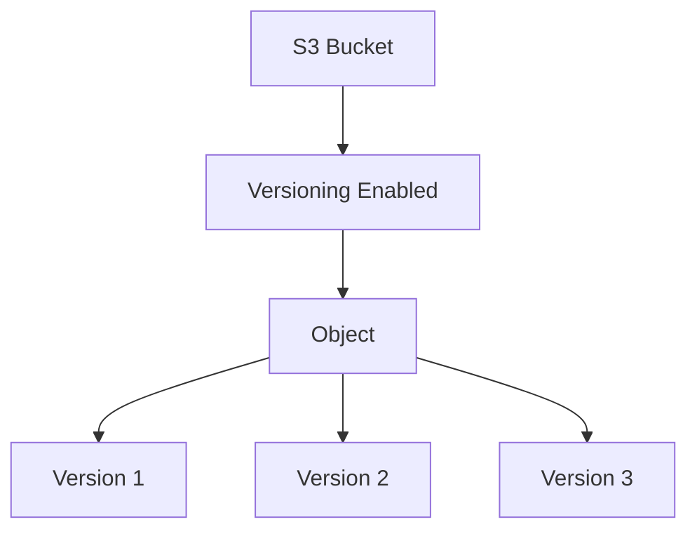

Example:

```text
index.html
    │
    ├── Version 1
    ├── Version 2
    └── Version 3
```

Each version has a unique **Version ID**.

---

# Why S3 Versioning?

Without Versioning:

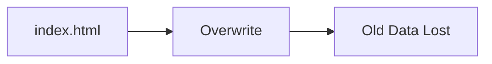

With Versioning:

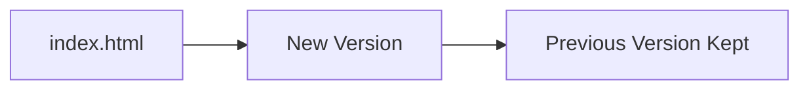

This makes recovery possible.

---

# Example

Suppose the original file is:

```text
index.html
```

Initial content:

```text
Welcome to My Website
```

S3 stores:

```text
Version 1
```

Later, the file is modified:

```text
Welcome to My AWS Website
```

S3 stores:

```text
Version 2
```

The previous version is still available.

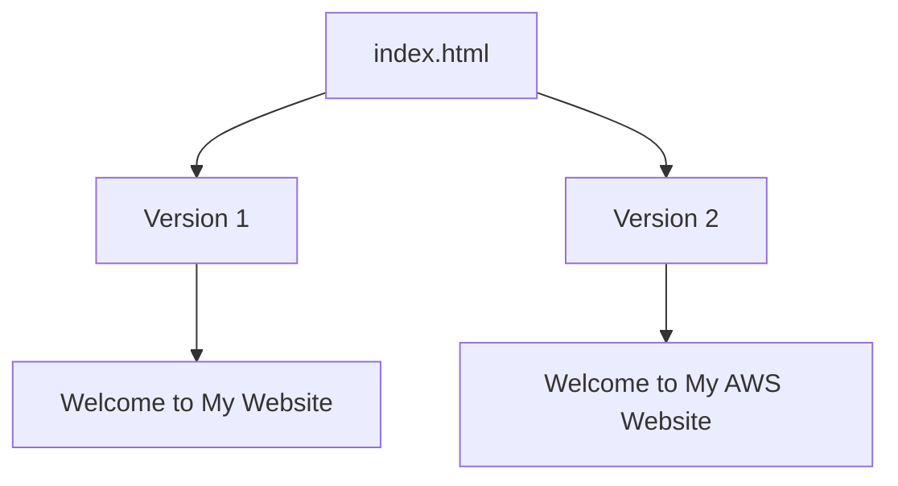

---

# Version ID

Each version of an object gets a unique **Version ID**.

Example:

```text
Object: index.html

Version ID:
abc123xyz
```

Another version may have:

```text
Version ID:
pqr789mno
```

Version IDs allow specific versions of an object to be identified.

---

# Versioning States

S3 Versioning has three important states:

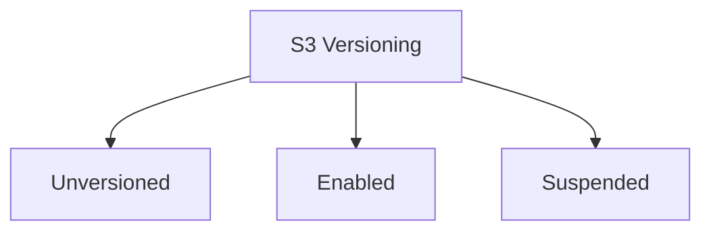

---

# 1. Unversioned

Versioning is not enabled.

```text
Object
  ↓
Latest copy only
```

If the object is overwritten, the previous version is not retained through S3 Versioning.

---

# 2. Enabled

Versioning is enabled.

```text
Object
  ↓
Version 1
Version 2
Version 3
...
```

S3 keeps multiple versions.

---

# 3. Suspended

Versioning is suspended.

Important:

**Suspending Versioning does not delete existing versions.**

Previously created versions remain available.

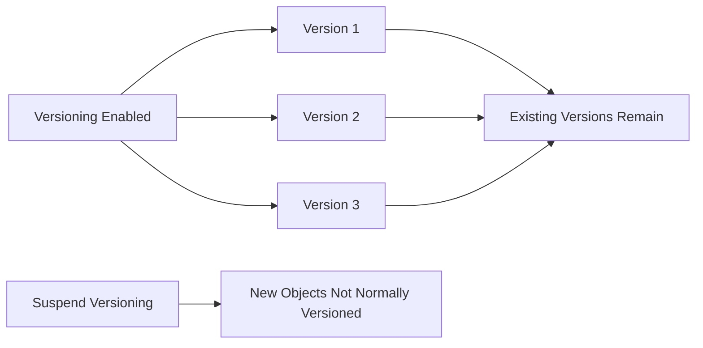

---

# Enable Versioning Using AWS Console

Steps:

```text
S3
→ Select Bucket
→ Properties
→ Bucket Versioning
→ Enable
→ Save Changes
```

---

# Enable Versioning Using AWS CLI

```bash
aws s3api put-bucket-versioning \
--bucket my-bucket \
--versioning-configuration Status=Enabled
```

---

# Check Versioning Status

```bash
aws s3api get-bucket-versioning \
--bucket my-bucket
```

Example output:

```text
Status: Enabled
```

---

# Upload Object with Versioning Enabled

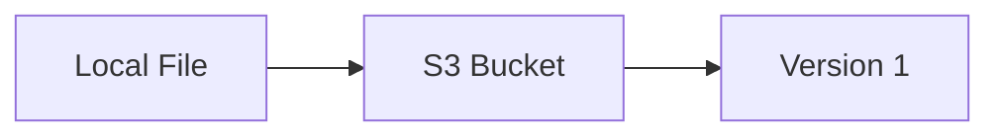

Command:

```bash
aws s3 cp index.html s3://my-bucket/
```

Modify the file and upload again:

```bash
aws s3 cp index.html s3://my-bucket/
```

S3 creates:

```text
Version 1
Version 2
```

---

# Object Overwrite Behavior

Suppose:

```text
index.html → Version 1
```

You upload a modified file with the same key:

```text
index.html → Version 2
```

S3 does not simply destroy Version 1.

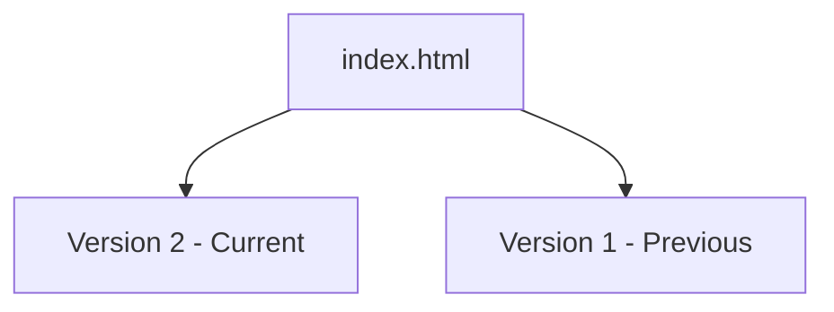

---

# Current Version

The latest uploaded version becomes the **current version**.

Example:

```text
index.html

Version 3 ← Current
Version 2
Version 1
```

The previous versions are still retained.

---

# List Object Versions

Using AWS CLI:

```bash
aws s3api list-object-versions \
--bucket my-bucket
```

This displays:

* Object key
* Version ID
* Last modified time
* IsLatest
* Delete markers

---

# Example Version History

```text
index.html

Version ID        IsLatest
---------------------------
v3                 true
v2                 false
v1                 false
```

---

# Versioning and Delete

Deleting an object in a versioned bucket behaves differently from deleting an object in an unversioned bucket.

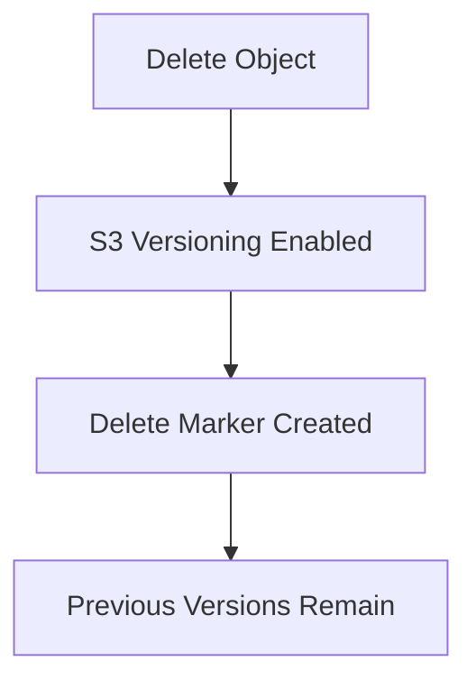

---

# Delete Marker

A **Delete Marker** is a special marker that tells S3 that the current object has been deleted.

It does not represent the actual object data.

Example:

```text
index.html

Delete Marker ← Current
Version 3
Version 2
Version 1
```

---

# Important Difference

```text
Delete Marker
      ≠
Object Version
```

A delete marker does not contain the object's data.

It indicates that the object is currently considered deleted when accessed normally.

---

# Delete Object Using CLI

```bash
aws s3 rm s3://my-bucket/index.html
```

When Versioning is enabled, S3 can create a delete marker.

---

# Recover Deleted Object

If an object was deleted and a delete marker exists, the object can be recovered by removing the delete marker.

First list versions:

```bash
aws s3api list-object-versions \
--bucket my-bucket \
--prefix index.html
```

Find the delete marker's Version ID.

Then delete the delete marker:

```bash
aws s3api delete-object \
--bucket my-bucket \
--key index.html \
--version-id DELETE_MARKER_VERSION_ID
```

The previous object version becomes accessible again.

---

# Recovery Architecture

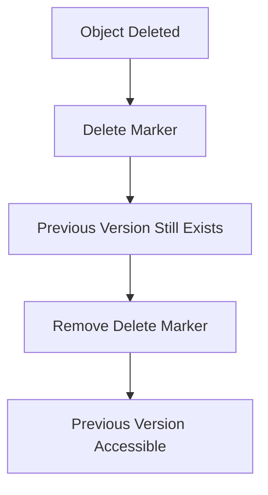

---

# Permanently Delete a Specific Version

If Versioning is enabled, a specific version can be permanently deleted using its Version ID.

```bash
aws s3api delete-object \
--bucket my-bucket \
--key index.html \
--version-id VERSION_ID
```

This removes that specific version.

---

# Important

A normal delete operation does not necessarily permanently remove the object data when Versioning is enabled.

For permanent deletion, the specific version must be deleted.

---

# Versioning Practical Example

## Step 1 – Enable Versioning

```bash
aws s3api put-bucket-versioning \
--bucket my-bucket \
--versioning-configuration Status=Enabled
```

---

## Step 2 – Create File

```text
index.html
```

Content:

```html
<h1>Version 1</h1>
```

---

## Step 3 – Upload

```bash
aws s3 cp index.html s3://my-bucket/
```

S3 creates:

```text
Version 1
```

---

## Step 4 – Modify File

Change content:

```html
<h1>Version 2</h1>
```

Upload again:

```bash
aws s3 cp index.html s3://my-bucket/
```

Now:

```text
Version 2 ← Current
Version 1
```

---

## Step 5 – Modify Again

```html
<h1>Version 3</h1>
```

Upload:

```bash
aws s3 cp index.html s3://my-bucket/
```

Now:

```text
Version 3 ← Current
Version 2
Version 1
```

---

# Complete Versioning Flow

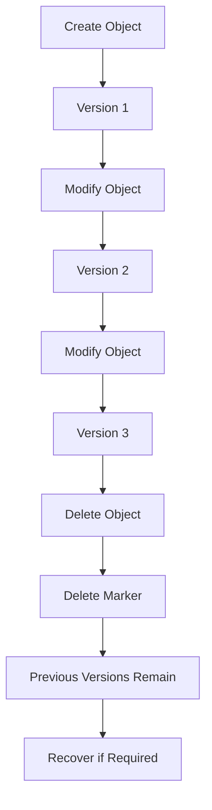

---

# Versioning with Accidental Overwrite

Example:

```text
Production website
        ↓
index.html
        ↓
Developer uploads wrong file
```

Without Versioning:

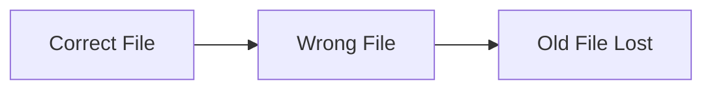

With Versioning:

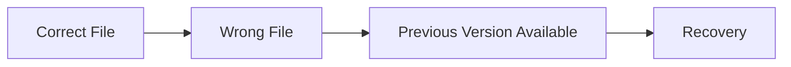

---

# Versioning for Data Protection

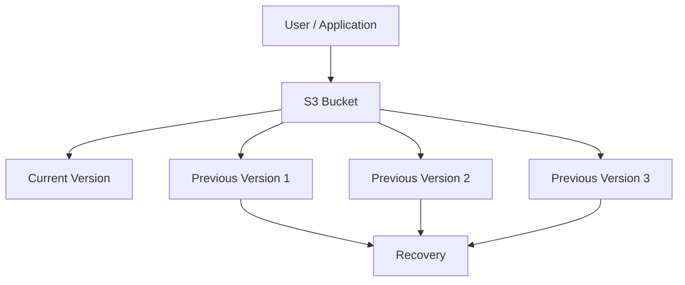

---

# Versioning and Storage Cost

Versioning stores multiple versions.

Therefore:

```text
More Versions
      ↓
More Stored Data
      ↓
Higher Storage Cost
```

Example:

```text
File = 100 MB

Version 1 = 100 MB
Version 2 = 100 MB
Version 3 = 100 MB
Version 4 = 100 MB
```

Total stored data can become approximately:

```text
400 MB
```

Therefore, Versioning should be combined with **Lifecycle Rules** when appropriate.

---

# Versioning + Lifecycle Rules

Old versions can be automatically transitioned or expired using lifecycle rules.

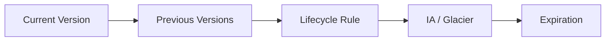

Example:

```text
Current Version
       ↓
Previous Version
       ↓
After retention period
       ↓
Archive
       ↓
Delete
```

This helps control storage costs.

---

# Versioning + Replication

S3 Versioning is commonly required for S3 Replication configurations.

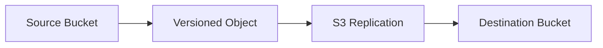

Example:

```text
Production Bucket
       ↓
Versioning
       ↓
Replication
       ↓
Backup / DR Bucket
```

This can be useful for disaster recovery and cross-region architectures.

---

# Versioning + Static Website

For a static website:

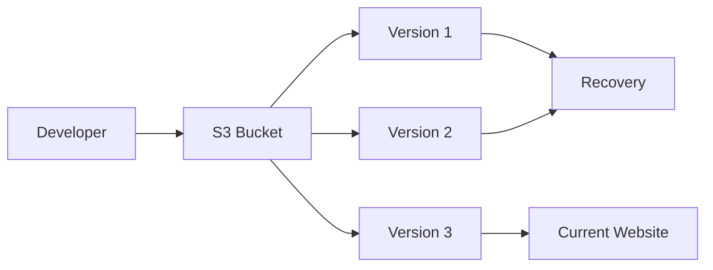

If a wrong deployment overwrites a file, previous versions can help with recovery.

---

# DevOps Use Case

Versioning is useful in DevOps environments for protecting:

* Build artifacts
* Deployment files
* Configuration files
* Application assets
* Backup data
* Static website files

Example:

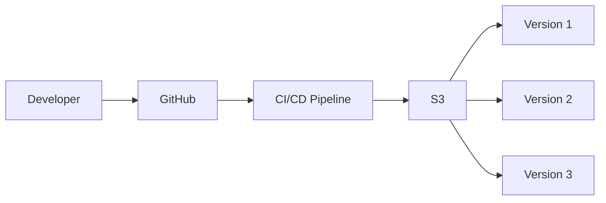

If a bad deployment reaches S3, an older object version can be recovered.

---

# Versioning with CI/CD

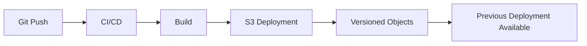

This provides an additional recovery mechanism for S3-hosted artifacts.

---

# Versioning and Object Lock

S3 Versioning works together with **S3 Object Lock** for stronger data protection.

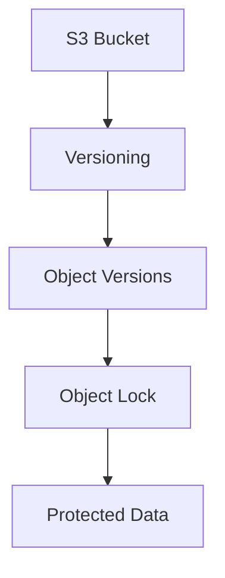

Object Lock can help prevent protected object versions from being deleted or overwritten during the configured retention period.

---

# Versioning Best Practices

* Enable Versioning for important buckets.
* Use Lifecycle Rules to control old versions.
* Monitor storage costs.
* Understand Delete Markers.
* Do not assume normal delete permanently removes versioned data.
* Protect critical data with appropriate access controls.
* Combine Versioning with replication for disaster recovery where required.
* Use Object Lock when immutability requirements exist.
* Regularly review noncurrent object versions.

---

# Common Mistakes

## 1. Assuming Versioning Is Enabled Automatically

Versioning must be explicitly enabled for the bucket.

---

## 2. Thinking Delete Permanently Removes Everything

With Versioning enabled:

```text
Delete
  ↓
Delete Marker
  ↓
Previous Versions Remain
```

---

## 3. Ignoring Old Versions

Keeping thousands of old versions can increase storage costs.

Use lifecycle rules where appropriate.

---

## 4. Confusing Delete Marker with Object Version

```text
Object Version → Contains object data

Delete Marker → Indicates current object deletion
```

---

## 5. Expecting Suspended Versioning to Delete Existing Versions

Suspending Versioning does not remove versions that already exist.

---

# Troubleshooting

## Object Appears Deleted but Still Exists

Check:

```bash
aws s3api list-object-versions \
--bucket my-bucket \
--prefix index.html
```

Look for:

```text
DeleteMarkers
Versions
```

---

## Cannot Recover Deleted Object

Check:

* Bucket Versioning status
* Delete Marker Version ID
* Previous object versions
* IAM permissions

---

## Storage Cost Increased After Enabling Versioning

Check:

```text
Old object versions
Noncurrent versions
Delete markers
Lifecycle configuration
```

---

# Useful AWS CLI Commands

## Enable Versioning

```bash
aws s3api put-bucket-versioning \
--bucket my-bucket \
--versioning-configuration Status=Enabled
```

## Check Versioning

```bash
aws s3api get-bucket-versioning \
--bucket my-bucket
```

## List Versions

```bash
aws s3api list-object-versions \
--bucket my-bucket
```

## List Versions for Specific Object

```bash
aws s3api list-object-versions \
--bucket my-bucket \
--prefix index.html
```

## Delete Specific Version

```bash
aws s3api delete-object \
--bucket my-bucket \
--key index.html \
--version-id VERSION_ID
```

## Suspend Versioning

```bash
aws s3api put-bucket-versioning \
--bucket my-bucket \
--versioning-configuration Status=Suspended
```

---

# Versioning Interview Questions

## 1. What is S3 Versioning?

S3 Versioning keeps multiple versions of the same object in a bucket to protect data from accidental deletion and overwriting.

---

## 2. Why do we use S3 Versioning?

It helps recover previous versions of objects after accidental deletion, overwrite, or modification.

---

## 3. What happens when an object is overwritten?

When Versioning is enabled, S3 creates a new version while keeping the previous version.

---

## 4. What happens when an object is deleted?

S3 can create a delete marker while keeping the previous object versions.

---

## 5. What is a Delete Marker?

A Delete Marker is a special S3 marker that indicates an object has been deleted in a versioned bucket.

---

## 6. Does a Delete Marker contain object data?

No.

It only represents the delete state of the object.

---

## 7. Can we recover a deleted object?

Yes, if previous versions still exist. Removing the delete marker can make the previous version accessible again.

---

## 8. What is a Version ID?

A Version ID is a unique identifier assigned to each object version.

---

## 9. What happens when Versioning is suspended?

New object operations no longer behave as fully versioned operations, but previously stored versions remain available.

---

## 10. Does Versioning increase S3 cost?

Yes. Multiple object versions consume storage, so Versioning can increase storage costs.

---

## 11. How can we control the cost of old versions?

Use S3 Lifecycle Rules to transition or expire noncurrent object versions based on the application's retention requirements.

---

## 12. Is Versioning required for S3 Replication?

S3 Versioning is required on the relevant source and destination buckets for S3 Replication configurations.

---

## 13. Can Versioning protect against every type of data loss?

No.

Versioning protects against certain accidental overwrites and deletions, but it should be combined with appropriate access controls, replication, backups, and other protection mechanisms based on the recovery requirements.

---

## 14. What is the difference between Versioning and Backup?

Versioning keeps multiple versions of objects within the same S3 bucket.

A backup strategy may involve separate copies, accounts, regions, or other storage systems for broader disaster recovery protection.

---

## 15. How do you enable Versioning using AWS CLI?

```bash
aws s3api put-bucket-versioning \
--bucket my-bucket \
--versioning-configuration Status=Enabled
```

---

# Quick Revision

```mermaid
mindmap
    root((S3 Versioning))
        Enable
            Bucket Level
        Object Versions
            Version 1
            Version 2
            Version 3
        Protection
            Accidental Delete
            Accidental Overwrite
        Delete
            Delete Marker
            Previous Versions
        Recovery
            Remove Delete Marker
            Restore Version
        Cost
            Multiple Versions
            Lifecycle Rules
        Advanced
            Replication
            Object Lock
            Disaster Recovery
```

---

# Complete S3 Versioning Architecture

```mermaid
flowchart TD
    A[User / Application] --> B[S3 Versioned Bucket]

    B --> C[Current Version]
    B --> D[Previous Version 1]
    B --> E[Previous Version 2]
    B --> F[Previous Version 3]

    C --> G[Overwrite]
    G --> H[New Version]

    C --> I[Delete]
    I --> J[Delete Marker]

    D --> K[Recovery]
    E --> K
    F --> K

    B --> L[Lifecycle Rules]
    L --> M[Archive / Expire Old Versions]

    B --> N[Replication]
    N --> O[Destination Bucket]
```

---

# Practical Outcome

After completing this topic, I should be able to:

* Explain S3 Versioning.
* Enable and suspend Versioning.
* Understand Version IDs.
* Understand object overwrite behavior.
* Understand Delete Markers.
* Recover deleted objects.
* Permanently delete specific versions.
* List object versions using AWS CLI.
* Understand Versioning and Lifecycle Rules.
* Understand Versioning and Replication.
* Understand Versioning and Object Lock.
* Identify Versioning-related storage costs.
* Use Versioning in DevOps and CI/CD scenarios.
* Troubleshoot common Versioning issues.
* Explain S3 Versioning confidently in interviews.

---

# Key Takeaway

```mermaid
flowchart LR
    A[Object] --> B[Version 1]
    A --> C[Version 2]
    A --> D[Version 3]
    D --> E[Current Version]

    F[Delete] --> G[Delete Marker]
    G --> H[Previous Versions Remain]
    H --> I[Recovery]
```

> **S3 Versioning protects important objects by keeping previous versions, but Lifecycle Rules should be used to manage old versions and control storage costs.**
