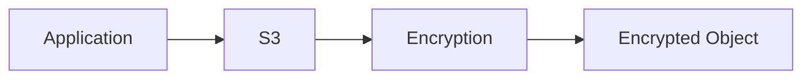
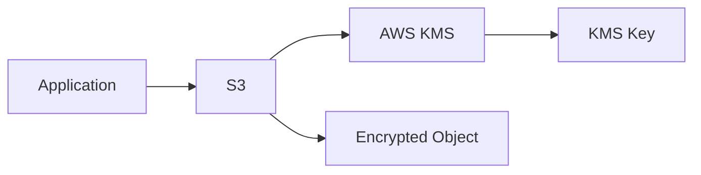
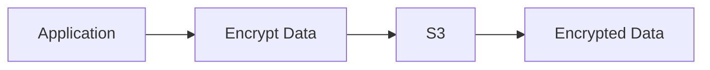
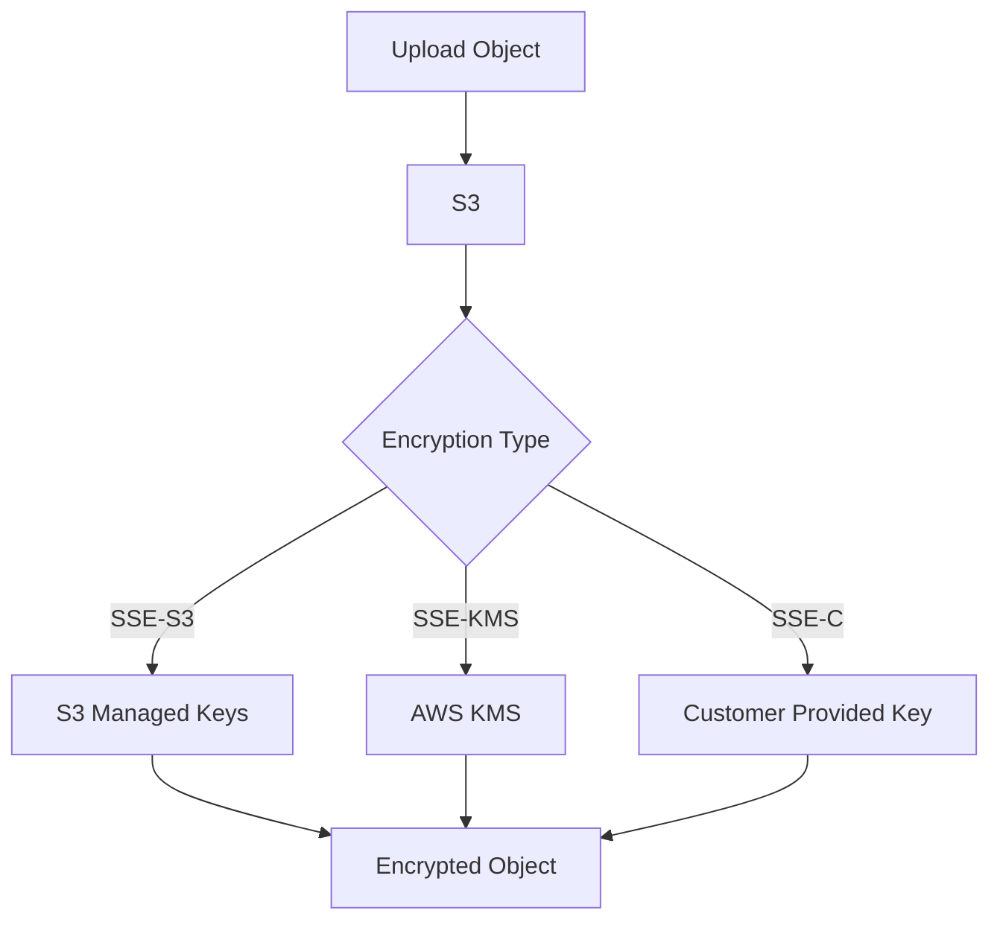
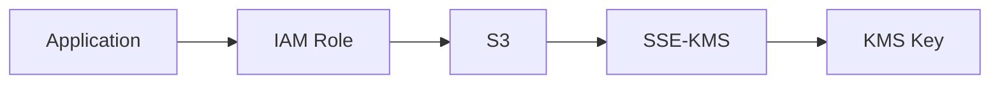

# AWS S3 – Encryption

## Introduction

S3 Encryption protects objects from unauthorized access by encrypting data **at rest**.

S3 supports both **server-side** and **client-side** encryption.

---

# Encryption Architecture

```text
Application
    |
    v
S3 Bucket
    |
    v
Encryption
    |
    v
Encrypted Object
```



---

# Types of S3 Encryption

```text
S3 Encryption
│
├── Server-Side Encryption
│   ├── SSE-S3
│   ├── SSE-KMS
│   └── SSE-C
│
└── Client-Side Encryption
```

---

# 1. SSE-S3

SSE-S3 uses **S3-managed encryption keys**.

```text
Application
    |
    v
S3
    |
    v
SSE-S3
    |
    v
Encrypted Object
```

Use when simple server-side encryption is required.

---

# 2. SSE-KMS

SSE-KMS uses **AWS Key Management Service (KMS)** keys.



Advantages:

* Centralized key management
* Access control through IAM/KMS policies
* Key usage auditing
* Suitable for sensitive workloads

---

# 3. SSE-C

SSE-C allows the customer to provide the encryption key with the request.

```text
Customer
   |
   +-- Encryption Key
   |
   v
S3
```

AWS performs the encryption/decryption, but the customer is responsible for securely managing the key.

---

# 4. Client-Side Encryption

Data is encrypted **before** it is uploaded to S3.



The application/customer manages the encryption process and keys.

---

# SSE-S3 vs SSE-KMS

| SSE-S3                             | SSE-KMS                                   |
| ---------------------------------- | ----------------------------------------- |
| S3-managed keys                    | KMS-managed keys                          |
| Simple                             | More control                              |
| Less key-management responsibility | IAM + KMS permissions                     |
| Suitable for general encryption    | Useful for sensitive/compliance workloads |

---

# Enable Default Encryption

Console:

```text
S3
→ Bucket
→ Properties
→ Default encryption
→ Edit
→ Select SSE-S3 / SSE-KMS
→ Save
```

This automatically encrypts new objects uploaded to the bucket.

---

# AWS CLI

Check bucket encryption:

```bash
aws s3api get-bucket-encryption \
--bucket my-bucket
```

Configure default SSE-S3 encryption:

```bash
aws s3api put-bucket-encryption \
--bucket my-bucket \
--server-side-encryption-configuration \
'{"Rules":[{"ApplyServerSideEncryptionByDefault":{"SSEAlgorithm":"AES256"}}]}'
```

---

# KMS Encryption

For SSE-KMS, specify:

```text
SSE Algorithm:
aws:kms
```

and the required KMS key.

Example CLI upload:

```bash
aws s3 cp file.txt s3://my-bucket/ \
--sse aws:kms \
--sse-kms-key-id <KMS-KEY-ID>
```

---

# S3 Encryption Flow



---

# Important Security Point

Encryption protects data **at rest**.

For data in transit, use:

```text
HTTPS / TLS
```

Recommended architecture:

```text
User
  |
  | HTTPS
  v
S3
  |
  | Encryption at Rest
  v
Encrypted Object
```

---

# DevOps Use Case

For sensitive application data:



Use least-privilege IAM and KMS permissions.

---

# Common Error

With SSE-KMS, an application may have S3 permission but still fail because it lacks the required KMS permissions.

Check:

```text
IAM Policy
+
KMS Key Policy
+
KMS Permissions
```

---

# Interview Questions

## What is S3 Encryption?

It protects S3 objects by encrypting data at rest.

## SSE-S3 vs SSE-KMS?

SSE-S3 uses S3-managed encryption keys, while SSE-KMS uses AWS KMS for key management and access control.

## What is SSE-C?

Server-side encryption where the customer provides the encryption key with the request.

## What is Client-Side Encryption?

Data is encrypted by the client before being uploaded to S3.

## Does encryption protect data in transit?

No. HTTPS/TLS is used to protect data in transit.

## Why use SSE-KMS?

For centralized key management, access control, and auditing requirements.

---

 encryption protects data at rest. SSE-S3 is simple, SSE-KMS provides stronger key-management control, SSE-C uses customer-provided keys, and client-side encryption encrypts data before it reaches S3.**
